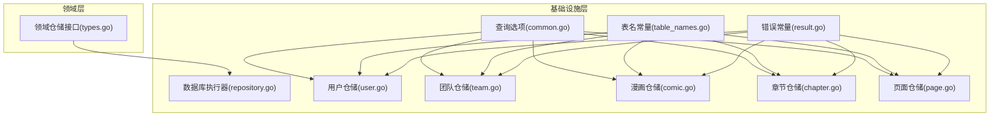
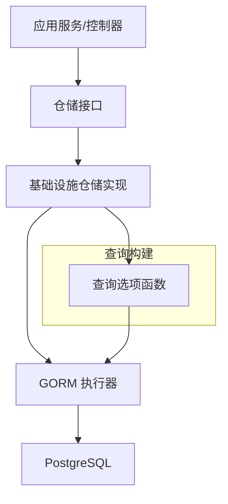
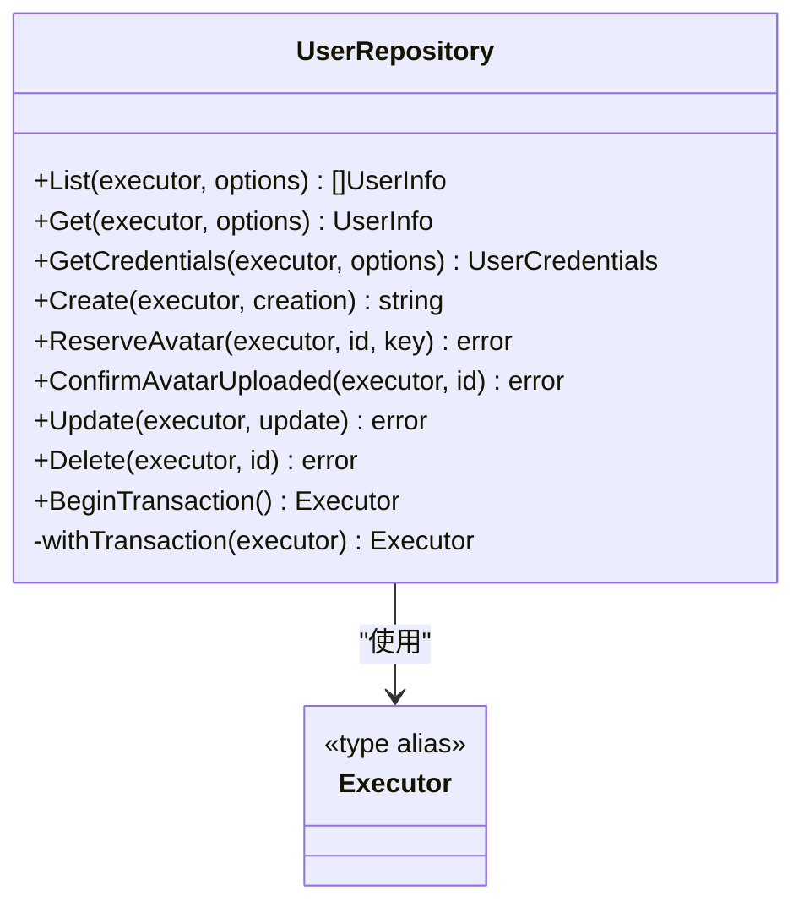
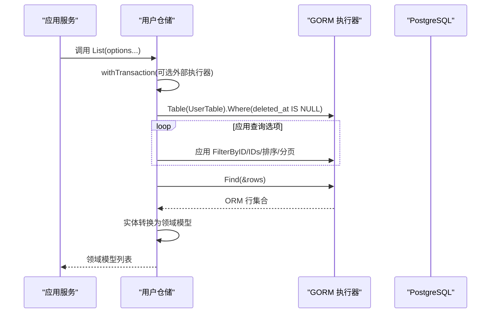
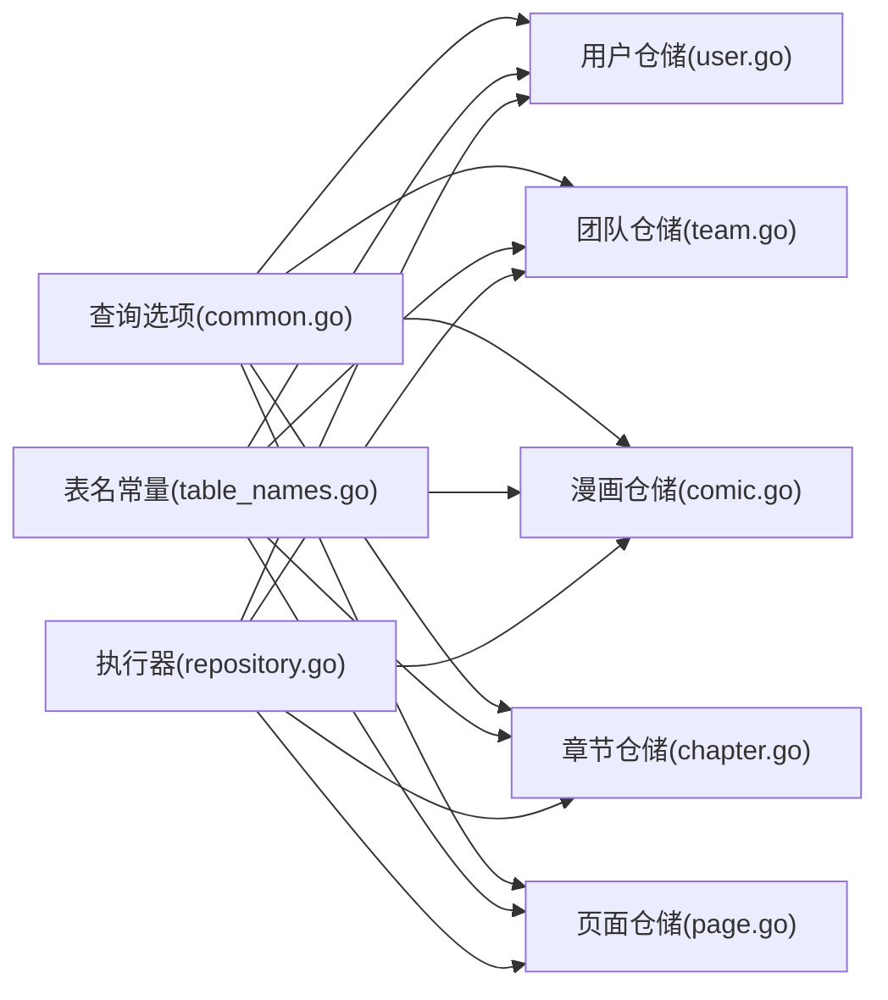

# 数据访问层设计

<cite>
**本文引用的文件**
- [backend/internal/infrastructure/repository/repository.go](file://backend/internal/infrastructure/repository/repository.go)
- [backend/internal/domain/repository/types.go](file://backend/internal/domain/repository/types.go)
- [backend/internal/infrastructure/repository/result.go](file://backend/internal/infrastructure/repository/result.go)
- [backend/internal/infrastructure/repository/table_names.go](file://backend/internal/infrastructure/repository/table_names.go)
- [backend/internal/infrastructure/repository/query_option/common.go](file://backend/internal/infrastructure/repository/query_option/common.go)
- [backend/internal/infrastructure/repository/user.go](file://backend/internal/infrastructure/repository/user.go)
- [backend/internal/infrastructure/repository/team.go](file://backend/internal/infrastructure/repository/team.go)
- [backend/internal/infrastructure/repository/comic.go](file://backend/internal/infrastructure/repository/comic.go)
- [backend/internal/infrastructure/repository/chapter.go](file://backend/internal/infrastructure/repository/chapter.go)
- [backend/internal/infrastructure/repository/page.go](file://backend/internal/infrastructure/repository/page.go)
</cite>

## 目录
1. [引言](#引言)
2. [项目结构](#项目结构)
3. [核心组件](#核心组件)
4. [架构总览](#架构总览)
5. [详细组件分析](#详细组件分析)
6. [依赖分析](#依赖分析)
7. [性能考虑](#性能考虑)
8. [故障排查指南](#故障排查指南)
9. [结论](#结论)
10. [附录](#附录)

## 引言
本设计文档面向 Poprako 的数据访问层，系统性阐述仓储模式的实现与数据访问层的整体架构。重点包括：
- 仓储接口的设计原则与实现模式
- 查询选项与过滤机制
- 结果集处理与转换机制
- 数据库连接管理与事务处理策略
- CRUD 操作的实现与优化
- 性能优化技巧与最佳实践
- 错误处理与异常管理策略
- 缓存策略与数据一致性保障

## 项目结构
数据访问层位于后端内部模块的基础设施层，采用“领域模型 + 仓储接口 + 基础设施实现”的分层设计。核心文件分布如下：
- 连接与执行器：repository.go、types.go
- 查询选项与通用过滤：query_option/common.go
- 表名常量导出：table_names.go
- 结果错误常量：result.go
- 具体实体仓储实现：user.go、team.go、comic.go、chapter.go、page.go

图表来源
- [backend/internal/infrastructure/repository/repository.go:1-30](file://backend/internal/infrastructure/repository/repository.go#L1-L30)
- [backend/internal/domain/repository/types.go:1-12](file://backend/internal/domain/repository/types.go#L1-L12)
- [backend/internal/infrastructure/repository/query_option/common.go:1-51](file://backend/internal/infrastructure/repository/query_option/common.go#L1-L51)
- [backend/internal/infrastructure/repository/table_names.go:1-18](file://backend/internal/infrastructure/repository/table_names.go#L1-L18)
- [backend/internal/infrastructure/repository/result.go:1-6](file://backend/internal/infrastructure/repository/result.go#L1-L6)
- [backend/internal/infrastructure/repository/user.go:1-150](file://backend/internal/infrastructure/repository/user.go#L1-L150)
- [backend/internal/infrastructure/repository/team.go:1-110](file://backend/internal/infrastructure/repository/team.go#L1-L110)
- [backend/internal/infrastructure/repository/comic.go:1-140](file://backend/internal/infrastructure/repository/comic.go#L1-L140)
- [backend/internal/infrastructure/repository/chapter.go:1-190](file://backend/internal/infrastructure/repository/chapter.go#L1-L190)
- [backend/internal/infrastructure/repository/page.go:1-179](file://backend/internal/infrastructure/repository/page.go#L1-L179)

章节来源
- [backend/internal/infrastructure/repository/repository.go:1-30](file://backend/internal/infrastructure/repository/repository.go#L1-L30)
- [backend/internal/domain/repository/types.go:1-12](file://backend/internal/domain/repository/types.go#L1-L12)
- [backend/internal/infrastructure/repository/query_option/common.go:1-51](file://backend/internal/infrastructure/repository/query_option/common.go#L1-L51)
- [backend/internal/infrastructure/repository/table_names.go:1-18](file://backend/internal/infrastructure/repository/table_names.go#L1-L18)
- [backend/internal/infrastructure/repository/result.go:1-6](file://backend/internal/infrastructure/repository/result.go#L1-L6)

## 核心组件
- 执行器与连接管理
  - 使用 GORM 初始化 PostgreSQL 连接，并通过底层 sql.DB 设置最大空闲与最大打开连接数，确保连接池可控。
  - 提供 BeginTransaction 获取事务执行器，统一事务入口。

- 仓储接口与类型
  - Executor 类型别名为 GORM 执行器，屏蔽具体 ORM 实现细节。
  - QueryOption 为函数式查询选项，支持链式组合。
  - Transactor 接口定义事务开始能力，便于在调用层注入或复用。

- 查询选项与过滤
  - 统一规则：FilterByID、FilterByIDs、CreatedAtDesc/Asc、UpdatedAtDesc、Paginate。
  - 跨表过滤使用以 On 前缀命名的变体，避免裸字段与表名拼接错误。
  - 所有字段均使用带表前缀的完整列名，减少歧义与 SQL 注入风险。

- 结果集处理与转换
  - 查询返回 ORM 行结构，再映射到领域模型，实现清晰的 DTO 到 Model 的转换。
  - 针对统计类查询，使用 Select 指定必要列，避免冗余字段传输。

- 错误处理
  - 将底层 gorm.ErrRecordNotFound 映射为可被上层识别的错误常量，便于统一处理。

章节来源
- [backend/internal/infrastructure/repository/repository.go:11-29](file://backend/internal/infrastructure/repository/repository.go#L11-L29)
- [backend/internal/domain/repository/types.go:5-11](file://backend/internal/domain/repository/types.go#L5-L11)
- [backend/internal/infrastructure/repository/query_option/common.go:9-50](file://backend/internal/infrastructure/repository/query_option/common.go#L9-L50)
- [backend/internal/infrastructure/repository/result.go:5-5](file://backend/internal/infrastructure/repository/result.go#L5-L5)

## 架构总览
数据访问层遵循“接口隔离 + 函数式查询 + 明确转换”的设计，确保：
- 领域层不感知存储实现细节
- 查询构建通过函数式组合，具备高可读性与可维护性
- 结果转换集中于实体层，避免业务逻辑散落

图表来源
- [backend/internal/domain/repository/types.go:5-11](file://backend/internal/domain/repository/types.go#L5-L11)
- [backend/internal/infrastructure/repository/query_option/common.go:15-50](file://backend/internal/infrastructure/repository/query_option/common.go#L15-L50)
- [backend/internal/infrastructure/repository/repository.go:11-29](file://backend/internal/infrastructure/repository/repository.go#L11-L29)

## 详细组件分析

### 用户仓储（UserRepository）
- 设计要点
  - 支持 List/Get/GetCredentials/Create/ReserveAvatar/ConfirmAvatarUploaded/Update/Delete。
  - 统一软删除条件：deleted_at IS NULL。
  - 通过 withTransaction 决定是否使用外部传入执行器（支持事务）。
  - 通过 entity 层完成行结构与领域模型的双向转换。

- 查询选项使用
  - 支持按 ID、ID 列表、时间排序、分页等选项组合。
  - 跨表过滤通过 On 前缀选项实现（规则由 query_option/common.go 约束）。

- 事务与连接
  - BeginTransaction 返回新事务执行器；若传入 executor 则优先使用外部事务。

- 错误处理
  - 未找到记录时返回统一错误常量，便于上层分支处理。

图表来源
- [backend/internal/infrastructure/repository/user.go:12-150](file://backend/internal/infrastructure/repository/user.go#L12-L150)
- [backend/internal/domain/repository/types.go:5-11](file://backend/internal/domain/repository/types.go#L5-L11)

章节来源
- [backend/internal/infrastructure/repository/user.go:32-150](file://backend/internal/infrastructure/repository/user.go#L32-L150)
- [backend/internal/infrastructure/repository/query_option/common.go:15-50](file://backend/internal/infrastructure/repository/query_option/common.go#L15-L50)

### 团队仓储（TeamRepository）
- 设计要点
  - 与用户仓储类似，提供 List/创建/头像预留与确认/更新/删除。
  - 同样遵循软删除与 withTransaction 事务策略。

- 统一性
  - 与用户仓储保持一致的查询选项与错误处理风格，便于上层抽象。

章节来源
- [backend/internal/infrastructure/repository/team.go:31-110](file://backend/internal/infrastructure/repository/team.go#L31-L110)
- [backend/internal/infrastructure/repository/query_option/common.go:15-50](file://backend/internal/infrastructure/repository/query_option/common.go#L15-L50)

### 漫画仓储（ComicRepository）
- 设计要点
  - 提供 List/Get/Count/Create/Update/Delete。
  - LockByWorksetID 使用数据库锁（UPDATE）锁定相关记录，防止并发冲突。
  - 统一软删除与 withTransaction。

- 并发控制
  - 使用 GORM Locking 子句进行悲观锁，确保批量锁定与原子性。

章节来源
- [backend/internal/infrastructure/repository/comic.go:34-140](file://backend/internal/infrastructure/repository/comic.go#L34-L140)
- [backend/internal/infrastructure/repository/query_option/common.go:15-50](file://backend/internal/infrastructure/repository/query_option/common.go#L15-L50)

### 章节仓储（ChapterRepository）
- 设计要点
  - 提供 LockByID/LockByComicID、List/Get/GetStatsByID/Count/Create/Update/UpdateStats/Delete。
  - UpdateStats 与 GetStatsByID 专门用于统计字段的读写，避免非必要字段污染。
  - withTransaction 与软删除策略同上。

- 统计字段
  - 仅选择需要的统计列，降低网络与序列化开销。

章节来源
- [backend/internal/infrastructure/repository/chapter.go:34-190](file://backend/internal/infrastructure/repository/chapter.go#L34-L190)
- [backend/internal/infrastructure/repository/query_option/common.go:15-50](file://backend/internal/infrastructure/repository/query_option/common.go#L15-L50)

### 页面仓储（PageRepository）
- 设计要点
  - 提供 LockByID/LockByChapterID、List/Get/GetStatsByID/CreateBatch/UpdateStats/Update/Delete/DeleteBatch。
  - CreateBatch 与 DeleteBatch 支持批量插入与删除，减少往返次数。
  - UpdateStats 与 GetStatsByID 用于统计字段的读写。

- 批量操作
  - 批量插入与删除在长度为 0 时直接返回，避免无效请求。

章节来源
- [backend/internal/infrastructure/repository/page.go:55-179](file://backend/internal/infrastructure/repository/page.go#L55-L179)
- [backend/internal/infrastructure/repository/query_option/common.go:15-50](file://backend/internal/infrastructure/repository/query_option/common.go#L15-L50)

### 查询流程时序图（以用户查询为例）

图表来源
- [backend/internal/infrastructure/repository/user.go:32-52](file://backend/internal/infrastructure/repository/user.go#L32-L52)
- [backend/internal/infrastructure/repository/query_option/common.go:15-50](file://backend/internal/infrastructure/repository/query_option/common.go#L15-L50)
- [backend/internal/infrastructure/repository/table_names.go:6-17](file://backend/internal/infrastructure/repository/table_names.go#L6-L17)

## 依赖分析
- 组件耦合
  - 仓储实现依赖领域模型与实体层转换函数，但不直接依赖具体 ORM，通过 Executor 抽象解耦。
  - 查询选项与表名常量作为共享工具，被各仓储复用，提升一致性与可维护性。

- 外部依赖
  - GORM 作为 ORM 与连接管理，PostgreSQL 作为存储后端。
  - clause.Locking 用于数据库级悲观锁。

图表来源
- [backend/internal/infrastructure/repository/query_option/common.go:1-51](file://backend/internal/infrastructure/repository/query_option/common.go#L1-L51)
- [backend/internal/infrastructure/repository/table_names.go:1-18](file://backend/internal/infrastructure/repository/table_names.go#L1-L18)
- [backend/internal/infrastructure/repository/repository.go:1-30](file://backend/internal/infrastructure/repository/repository.go#L1-L30)
- [backend/internal/infrastructure/repository/user.go:1-150](file://backend/internal/infrastructure/repository/user.go#L1-L150)
- [backend/internal/infrastructure/repository/team.go:1-110](file://backend/internal/infrastructure/repository/team.go#L1-L110)
- [backend/internal/infrastructure/repository/comic.go:1-140](file://backend/internal/infrastructure/repository/comic.go#L1-L140)
- [backend/internal/infrastructure/repository/chapter.go:1-190](file://backend/internal/infrastructure/repository/chapter.go#L1-L190)
- [backend/internal/infrastructure/repository/page.go:1-179](file://backend/internal/infrastructure/repository/page.go#L1-L179)

## 性能考虑
- 连接池配置
  - 在初始化阶段设置最大空闲与最大打开连接数，避免连接争用与资源耗尽。
- 查询优化
  - 使用 Select 精准投影统计字段，减少网络与序列化成本。
  - 通过 Paginate 限制结果集大小，结合排序字段建立合适索引。
- 批量操作
  - CreateBatch 与 DeleteBatch 降低往返次数，提高吞吐。
- 锁与并发
  - 对关键写入路径使用数据库锁（UPDATE），避免竞态条件。
- 转换成本
  - 集中在实体层进行 DTO 到 Model 的转换，避免在循环中重复构造对象。

## 故障排查指南
- 记录不存在
  - 使用统一错误常量标识未找到记录，便于上层区分业务错误与系统错误。
- 事务问题
  - 确保 BeginTransaction 正确提交或回滚；在仓储方法中优先使用外部传入执行器以复用事务上下文。
- 查询异常
  - 检查查询选项组合是否正确（如跨表过滤使用 On 前缀），以及表名与列名是否带完整前缀。
- 批量操作边界
  - 空数组场景应直接返回，避免发送无效 SQL。

章节来源
- [backend/internal/infrastructure/repository/result.go:5-5](file://backend/internal/infrastructure/repository/result.go#L5-L5)
- [backend/internal/infrastructure/repository/user.go:83-86](file://backend/internal/infrastructure/repository/user.go#L83-L86)
- [backend/internal/infrastructure/repository/query_option/common.go:9-13](file://backend/internal/infrastructure/repository/query_option/common.go#L9-L13)

## 结论
Poprako 的数据访问层通过明确的仓储接口、函数式查询选项与严格的表名/字段前缀规范，实现了高内聚、低耦合且易于扩展的数据访问层。配合连接池、批量操作与数据库锁等手段，能够在保证数据一致性的同时获得良好的性能表现。建议在后续迭代中持续完善索引策略与监控埋点，进一步提升可观测性与稳定性。

## 附录
- 最佳实践清单
  - 统一使用 QueryOption 组合查询，避免手写裸 SQL。
  - 跨表过滤一律使用 On 前缀选项，严格遵守字段前缀规范。
  - 对写入密集路径引入数据库锁，确保并发安全。
  - 对大结果集使用分页与精准投影，降低网络与内存压力。
  - 批量操作前检查输入长度，避免空批量请求。
  - 事务边界清晰，尽量在应用服务层统一开启与提交。