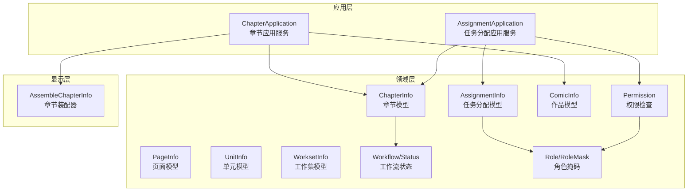
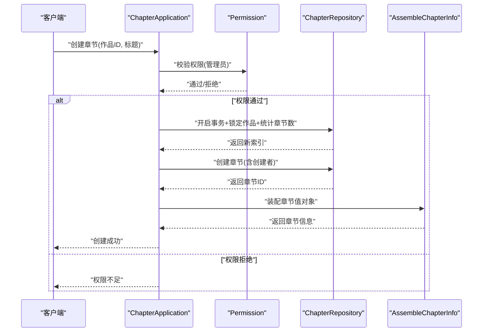
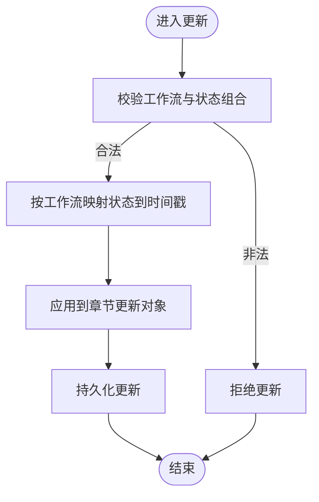
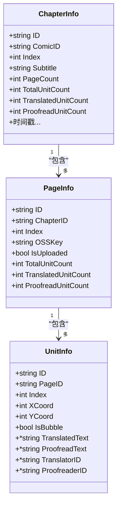
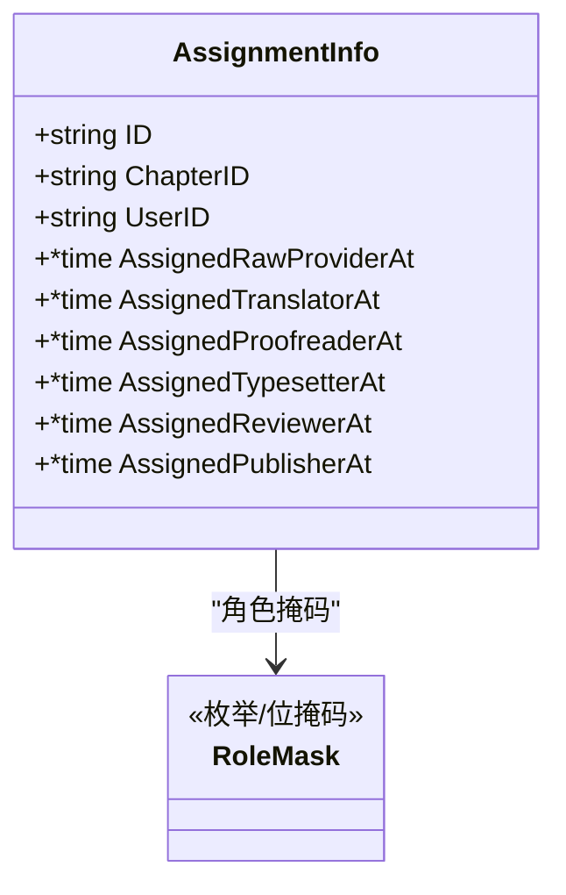
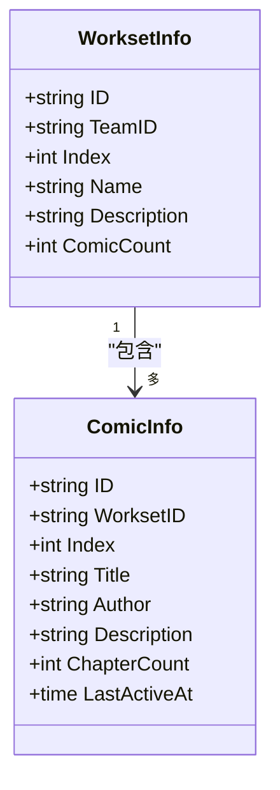
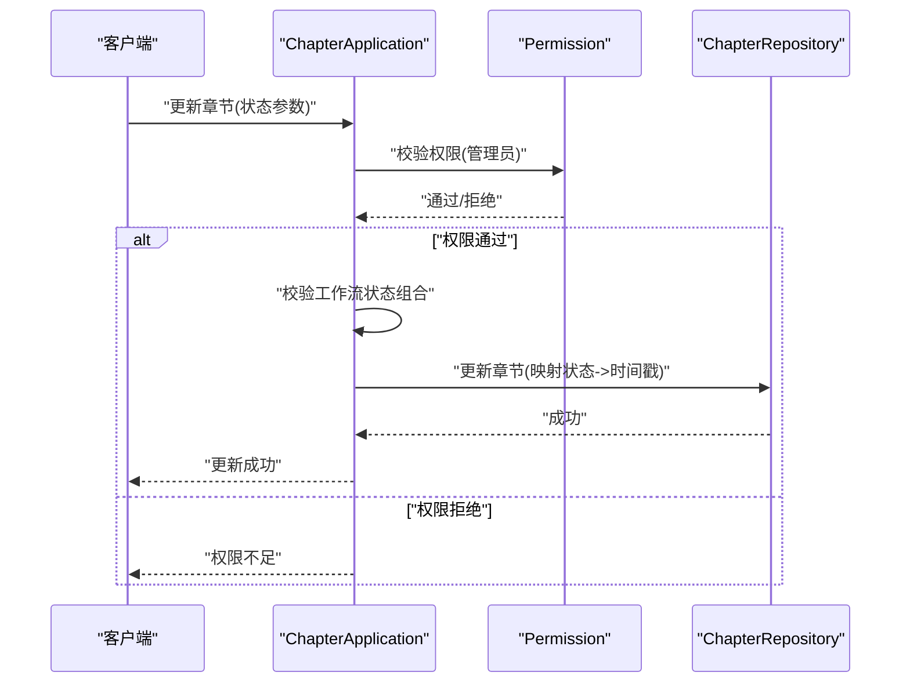
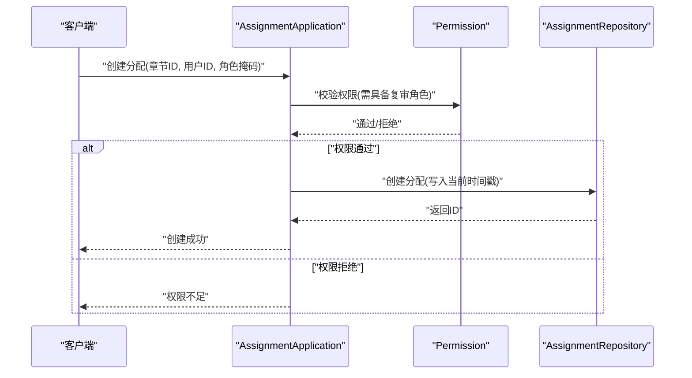
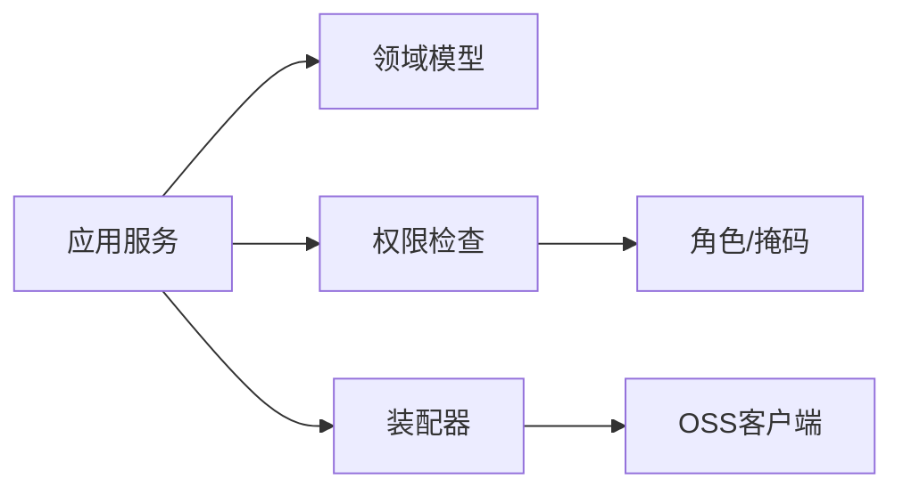
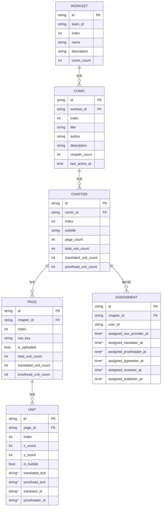

# 内容管理模型

<cite>
**本文引用的文件**
- [chapter.go](file://backend/backend-v1/internal/domain/model/chapter.go)
- [page.go](file://backend/backend-v1/internal/domain/model/page.go)
- [assignment.go](file://backend/backend-v1/internal/domain/model/assignment.go)
- [workset.go](file://backend/backend-v1/internal/domain/model/workset.go)
- [unit.go](file://backend/backend-v1/internal/domain/model/unit.go)
- [comic.go](file://backend/backend-v1/internal/domain/model/comic.go)
- [workflow.go](file://backend/backend-v1/internal/domain/model/workflow.go)
- [role.go](file://backend/backend-v1/internal/domain/model/role.go)
- [permission.go](file://backend/backend-v1/internal/domain/model/permission.go)
- [chapter.go](file://backend/backend-v1/internal/application/chapter.go)
- [assignment.go](file://backend/backend-v1/internal/application/assignment.go)
- [chapter.go](file://backend/backend-v1/internal/application/assembler/chapter.go)
</cite>

## 目录
1. [简介](#简介)
2. [项目结构](#项目结构)
3. [核心组件](#核心组件)
4. [架构总览](#架构总览)
5. [详细组件分析](#详细组件分析)
6. [依赖分析](#依赖分析)
7. [性能考虑](#性能考虑)
8. [故障排查指南](#故障排查指南)
9. [结论](#结论)
10. [附录](#附录)

## 简介
本文件系统性梳理 Poprako 的内容管理模型，围绕章节(ChapterInfo)、页面(PageInfo)、任务分配(AssignmentInfo)、工作集(WorksetInfo)、单元(UnitInfo)等实体，解释漫画内容的层级结构与组织方式（作品-章节-页面），并详述任务分配的工作流程与状态管理（分工角色、完成状态、时间戳）。同时给出内容从创建、编辑到删除的完整生命周期，以及版本控制、草稿与发布流程的设计思路，并说明内容与用户权限的关联关系与访问控制机制。

## 项目结构
后端采用分层架构：
- 领域层(domain/model)：定义核心数据模型与业务规则
- 应用层(application)：编排业务流程，执行权限校验与事务控制
- 显示层(assembler/value)：负责领域模型与对外值对象之间的转换
- 基础设施层：仓储与外部接口（如 OSS）

图表来源
- [chapter.go:1-330](file://backend/backend-v1/internal/application/chapter.go#L1-L330)
- [assignment.go:1-358](file://backend/backend-v1/internal/application/assignment.go#L1-L358)
- [chapter.go:1-40](file://backend/backend-v1/internal/application/assembler/chapter.go#L1-L40)
- [chapter.go:1-260](file://backend/backend-v1/internal/domain/model/chapter.go#L1-L260)
- [page.go:1-134](file://backend/backend-v1/internal/domain/model/page.go#L1-L134)
- [assignment.go:1-190](file://backend/backend-v1/internal/domain/model/assignment.go#L1-L190)
- [unit.go:1-149](file://backend/backend-v1/internal/domain/model/unit.go#L1-L149)
- [workset.go:1-82](file://backend/backend-v1/internal/domain/model/workset.go#L1-L82)
- [comic.go:1-107](file://backend/backend-v1/internal/domain/model/comic.go#L1-L107)
- [workflow.go:1-36](file://backend/backend-v1/internal/domain/model/workflow.go#L1-L36)
- [role.go:1-56](file://backend/backend-v1/internal/domain/model/role.go#L1-L56)
- [permission.go:1-845](file://backend/backend-v1/internal/domain/model/permission.go#L1-L845)

章节来源
- [chapter.go:1-330](file://backend/backend-v1/internal/application/chapter.go#L1-L330)
- [assignment.go:1-358](file://backend/backend-v1/internal/application/assignment.go#L1-L358)
- [chapter.go:1-40](file://backend/backend-v1/internal/application/assembler/chapter.go#L1-L40)

## 核心组件
- 作品(ComicInfo)：属于某个工作集，包含章节数量、作者、标题等元数据
- 章节(ChapterInfo)：属于某部作品，包含页面数、单元统计、多阶段工作流时间戳
- 页面(PageInfo)：属于某章节，包含索引、OSS 存储键、上传状态与单元统计
- 单元(UnitInfo)：属于某页面，包含坐标、气泡标记、翻译与校对状态及人员信息
- 任务分配(AssignmentInfo)：将用户与章节绑定，记录各分工角色的分配时间戳
- 工作集(WorksetInfo)：团队维度的内容集合，承载多个作品
- 角色与权限：基于 RoleMask 的角色掩码与权限检查策略

章节来源
- [comic.go:1-107](file://backend/backend-v1/internal/domain/model/comic.go#L1-L107)
- [chapter.go:1-260](file://backend/backend-v1/internal/domain/model/chapter.go#L1-L260)
- [page.go:1-134](file://backend/backend-v1/internal/domain/model/page.go#L1-L134)
- [unit.go:1-149](file://backend/backend-v1/internal/domain/model/unit.go#L1-L149)
- [assignment.go:1-190](file://backend/backend-v1/internal/domain/model/assignment.go#L1-L190)
- [workset.go:1-82](file://backend/backend-v1/internal/domain/model/workset.go#L1-L82)
- [role.go:1-56](file://backend/backend-v1/internal/domain/model/role.go#L1-L56)
- [permission.go:1-845](file://backend/backend-v1/internal/domain/model/permission.go#L1-L845)

## 架构总览
内容管理遵循“作品-章节-页面-单元”的树形层级，配合任务分配与工作流状态驱动内容推进。应用层在执行业务操作前进行权限校验，并通过事务保证一致性；装配器将领域模型转换为对外值对象，统一时间戳与包含关系。

图表来源
- [chapter.go:82-165](file://backend/backend-v1/internal/application/chapter.go#L82-L165)
- [permission.go:496-539](file://backend/backend-v1/internal/domain/model/permission.go#L496-L539)
- [chapter.go:9-39](file://backend/backend-v1/internal/application/assembler/chapter.go#L9-L39)

章节来源
- [chapter.go:1-330](file://backend/backend-v1/internal/application/chapter.go#L1-L330)
- [permission.go:496-539](file://backend/backend-v1/internal/domain/model/permission.go#L496-L539)
- [chapter.go:1-40](file://backend/backend-v1/internal/application/assembler/chapter.go#L1-L40)

## 详细组件分析

### 章节(ChapterInfo)与工作流
- 结构要点
  - 属于某作品，有序索引，副标题
  - 页面数与单元统计：总单元数、已翻译单元数、已校对单元数
  - 多阶段工作流时间戳：上传、翻译、校对、排版、复审、发布等
  - 创建者与时间戳
- 工作流状态
  - 支持状态：待处理、进行中、已完成、未设置
  - 不同工作流允许的状态不同：上传/复审/发布仅支持待处理/已完成；翻译/校对/排版支持三态
- 更新逻辑
  - 通过 NewChapterUpdate 将传入状态映射为对应时间戳，保持已有时间戳不变或重置

图表来源
- [workflow.go:24-35](file://backend/backend-v1/internal/domain/model/workflow.go#L24-L35)
- [chapter.go:141-258](file://backend/backend-v1/internal/domain/model/chapter.go#L141-L258)

章节来源
- [chapter.go:1-260](file://backend/backend-v1/internal/domain/model/chapter.go#L1-L260)
- [workflow.go:1-36](file://backend/backend-v1/internal/domain/model/workflow.go#L1-L36)

### 页面(PageInfo)与单元(UnitInfo)
- 页面
  - 属于某章节，0 基索引，OSSKey 与上传标志
  - 单元统计：总单元数、已翻译单元数、已校对单元数
- 单元
  - 属于某页面，坐标与气泡标记
  - 翻译态：文本、译者ID、评论；校对态：文本、校对者ID、评论
  - Patch 更新：仅修改指定字段，避免覆盖无关内容

图表来源
- [chapter.go:5-35](file://backend/backend-v1/internal/domain/model/chapter.go#L5-L35)
- [page.go:5-22](file://backend/backend-v1/internal/domain/model/page.go#L5-L22)
- [unit.go:7-29](file://backend/backend-v1/internal/domain/model/unit.go#L7-L29)

章节来源
- [page.go:1-134](file://backend/backend-v1/internal/domain/model/page.go#L1-L134)
- [unit.go:1-149](file://backend/backend-v1/internal/domain/model/unit.go#L1-L149)

### 任务分配(AssignmentInfo)与角色
- 分配记录
  - 将用户与章节绑定，记录各角色的分配时间戳
  - 支持查询是否拥有任一分工角色、计算角色掩码
- 角色与掩码
  - 角色：原画提供、翻译、校对、排版、复审、发布、管理员
  - 掩码：位掩码表示多角色集合
- 分配变更
  - 新建：按目标角色集合写入当前时间戳
  - 更新：PUT 语义，保留已有角色时间戳，新增角色写入当前时间，移除角色置空

图表来源
- [assignment.go:5-25](file://backend/backend-v1/internal/domain/model/assignment.go#L5-L25)
- [role.go:3-17](file://backend/backend-v1/internal/domain/model/role.go#L3-L17)

章节来源
- [assignment.go:1-190](file://backend/backend-v1/internal/domain/model/assignment.go#L1-L190)
- [role.go:1-56](file://backend/backend-v1/internal/domain/model/role.go#L1-L56)

### 工作集(WorksetInfo)与作品(ComicInfo)
- 工作集
  - 团队维度的内容集合，包含索引、名称、描述、作品数
- 作品
  - 属于工作集，包含作者、标题、描述、章节数、最后活跃时间

图表来源
- [workset.go:5-18](file://backend/backend-v1/internal/domain/model/workset.go#L5-L18)
- [comic.go:5-26](file://backend/backend-v1/internal/domain/model/comic.go#L5-L26)

章节来源
- [workset.go:1-82](file://backend/backend-v1/internal/domain/model/workset.go#L1-L82)
- [comic.go:1-107](file://backend/backend-v1/internal/domain/model/comic.go#L1-L107)

### 生命周期与工作流程

#### 内容创建、编辑、删除
- 创建章节
  - 权限：仅管理员可创建
  - 流程：锁定作品、统计章节数、生成新索引、创建章节、提交事务
- 编辑章节
  - 权限：仅管理员可更新
  - 流程：校验工作流状态组合，映射状态到时间戳，持久化
- 删除章节
  - 权限：仅管理员可删除
  - 流程：获取目标章节，权限校验，删除

图表来源
- [chapter.go:223-281](file://backend/backend-v1/internal/application/chapter.go#L223-L281)
- [permission.go:496-539](file://backend/backend-v1/internal/domain/model/permission.go#L496-L539)
- [workflow.go:24-35](file://backend/backend-v1/internal/domain/model/workflow.go#L24-L35)

章节来源
- [chapter.go:1-330](file://backend/backend-v1/internal/application/chapter.go#L1-L330)
- [permission.go:496-539](file://backend/backend-v1/internal/domain/model/permission.go#L496-L539)
- [workflow.go:1-36](file://backend/backend-v1/internal/domain/model/workflow.go#L1-L36)

#### 任务分配工作流程与状态管理
- 列表/我的分配
  - 权限：所属团队成员可查看
- 创建分配
  - 权限：仅具备复审角色的用户可创建
  - 行为：按角色掩码写入当前时间戳
- 更新分配
  - 权限：仅具备复审角色的用户可更新
  - 行为：PUT 语义，保留已有角色时间戳，新增角色写入当前时间，移除角色置空
- 删除分配
  - 权限：仅具备复审角色的用户可删除

图表来源
- [assignment.go:214-265](file://backend/backend-v1/internal/application/assignment.go#L214-L265)
- [permission.go:581-593](file://backend/backend-v1/internal/domain/model/permission.go#L581-L593)

章节来源
- [assignment.go:1-358](file://backend/backend-v1/internal/application/assignment.go#L1-L358)
- [permission.go:548-621](file://backend/backend-v1/internal/domain/model/permission.go#L548-L621)

### 版本控制、草稿与发布流程设计
- 版本控制
  - 采用章节级工作流时间戳作为“版本”依据：上传、翻译、校对、排版、复审、发布
  - 通过状态组合校验确保流程合规
- 草稿状态
  - 未设置(WorkflowUnset)用于保留当前值，适合草稿态的“暂存”场景
- 发布流程
  - 发布状态仅支持待处理/已完成，完成后写入发布时间戳
  - 发布前需完成复审与排版等前置流程

章节来源
- [workflow.go:1-36](file://backend/backend-v1/internal/domain/model/workflow.go#L1-L36)
- [chapter.go:141-258](file://backend/backend-v1/internal/domain/model/chapter.go#L141-L258)

### 访问控制与权限关联
- 权限类型
  - 邀请、用户、团队、成员、作品、章节、分配、页面、单元、工作集等
- 权限判定
  - 基于用户角色与团队/作品/章节上下文，结合角色掩码进行判定
  - 示例：页面增删改需要用户具备复审或原画提供角色；单元列表/保存需要用户具备翻译或校对角色

章节来源
- [permission.go:1-845](file://backend/backend-v1/internal/domain/model/permission.go#L1-L845)
- [role.go:1-56](file://backend/backend-v1/internal/domain/model/role.go#L1-L56)

## 依赖分析
- 组件耦合
  - 应用层依赖领域模型与装配器，通过适配器加载上下文信息
  - 权限检查贯穿应用层入口，确保最小权限原则
- 外部依赖
  - OSS 客户端用于生成预签名URL，装配章节信息时使用
- 循环依赖
  - 未发现循环依赖迹象，分层清晰

图表来源
- [chapter.go:1-330](file://backend/backend-v1/internal/application/chapter.go#L1-L330)
- [assignment.go:1-358](file://backend/backend-v1/internal/application/assignment.go#L1-L358)
- [permission.go:1-845](file://backend/backend-v1/internal/domain/model/permission.go#L1-L845)
- [role.go:1-56](file://backend/backend-v1/internal/domain/model/role.go#L1-L56)

章节来源
- [chapter.go:1-330](file://backend/backend-v1/internal/application/chapter.go#L1-L330)
- [assignment.go:1-358](file://backend/backend-v1/internal/application/assignment.go#L1-L358)
- [permission.go:1-845](file://backend/backend-v1/internal/domain/model/permission.go#L1-L845)

## 性能考虑
- 并发与锁
  - 创建章节时对作品加锁并统计数量，避免并发冲突
- 查询优化
  - 列表接口支持包含关系与分页，减少不必要的数据传输
- 时间戳与状态
  - 使用时间戳精确记录工作流节点，便于审计与统计

## 故障排查指南
- 权限不足
  - 确认用户角色与团队/作品/章节上下文是否满足要求
- 参数校验失败
  - 检查工作流状态组合是否合法，索引与ID是否正确
- 事务失败
  - 关注创建/更新过程中的回滚日志，确认唯一约束与并发控制

章节来源
- [chapter.go:82-165](file://backend/backend-v1/internal/application/chapter.go#L82-L165)
- [assignment.go:214-265](file://backend/backend-v1/internal/application/assignment.go#L214-L265)
- [permission.go:1-845](file://backend/backend-v1/internal/domain/model/permission.go#L1-L845)

## 结论
Poprako 的内容管理模型以清晰的层级结构与角色驱动的权限体系为核心，通过工作流状态与时间戳精确追踪内容进展，配合应用层的权限校验与事务控制，实现了从创建到发布的完整生命周期管理。建议在实际部署中重点关注并发控制、权限边界与审计日志，以保障系统的稳定性与安全性。

## 附录
- 数据模型关系图

图表来源
- [workset.go:5-18](file://backend/backend-v1/internal/domain/model/workset.go#L5-L18)
- [comic.go:5-26](file://backend/backend-v1/internal/domain/model/comic.go#L5-L26)
- [chapter.go:5-35](file://backend/backend-v1/internal/domain/model/chapter.go#L5-L35)
- [page.go:5-22](file://backend/backend-v1/internal/domain/model/page.go#L5-L22)
- [unit.go:7-29](file://backend/backend-v1/internal/domain/model/unit.go#L7-L29)
- [assignment.go:5-25](file://backend/backend-v1/internal/domain/model/assignment.go#L5-L25)