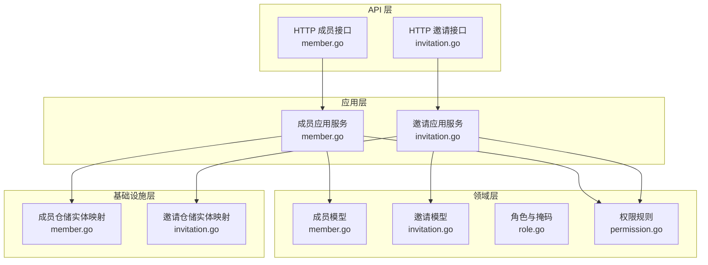
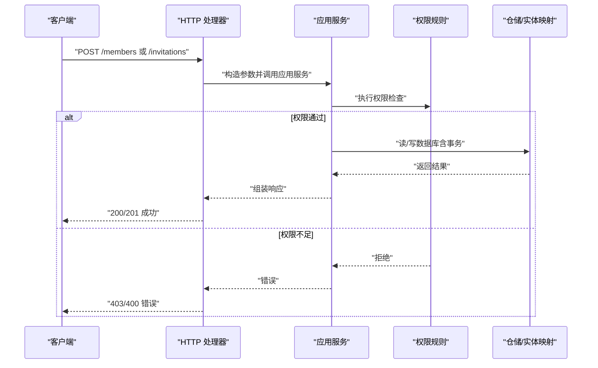
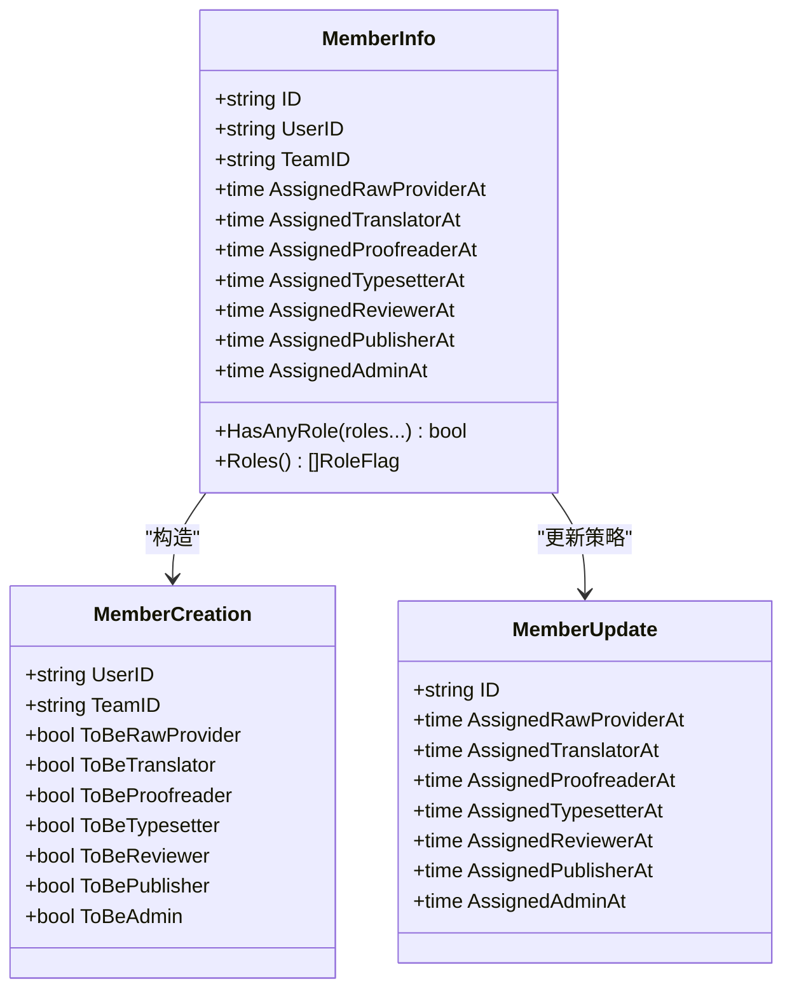
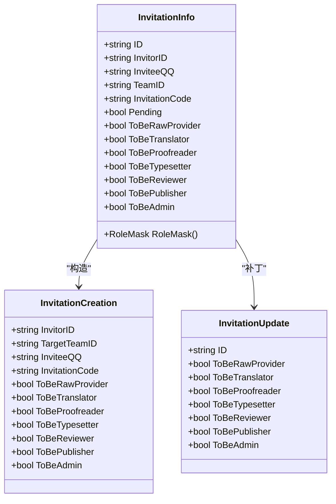
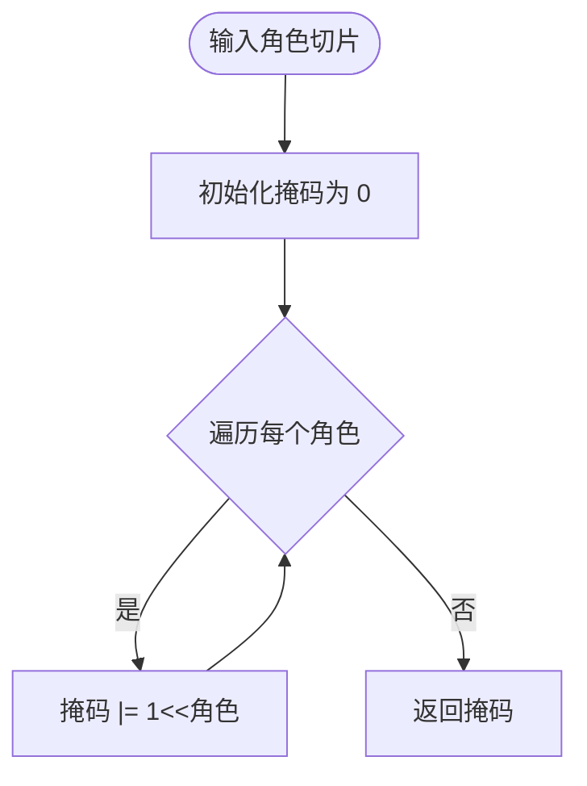
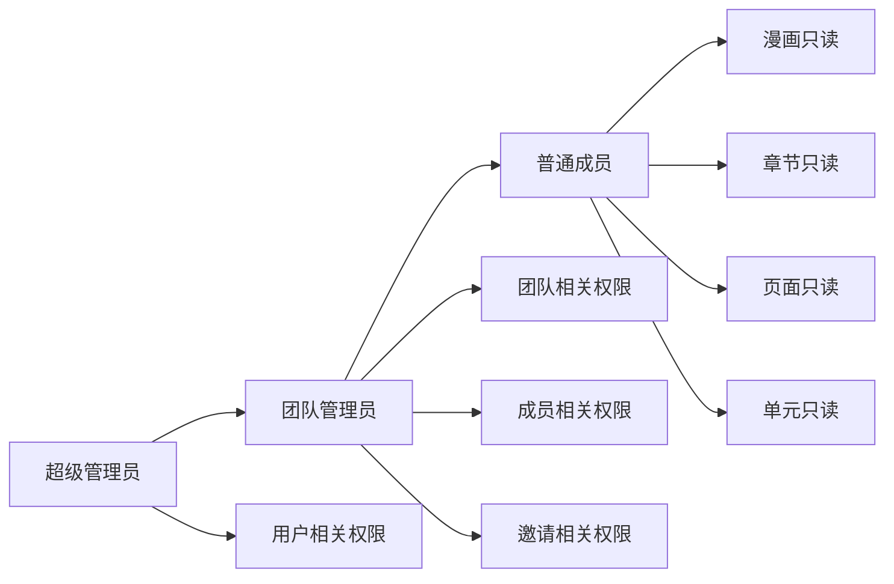
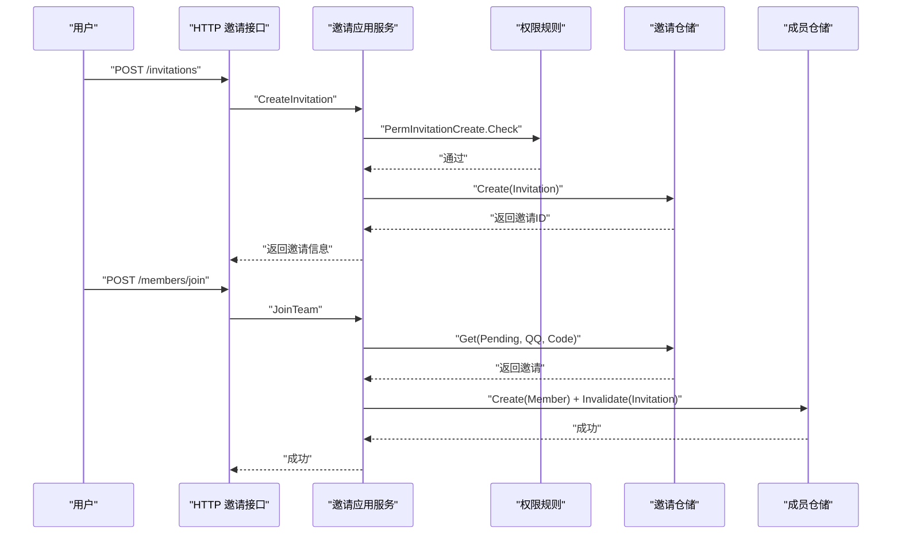
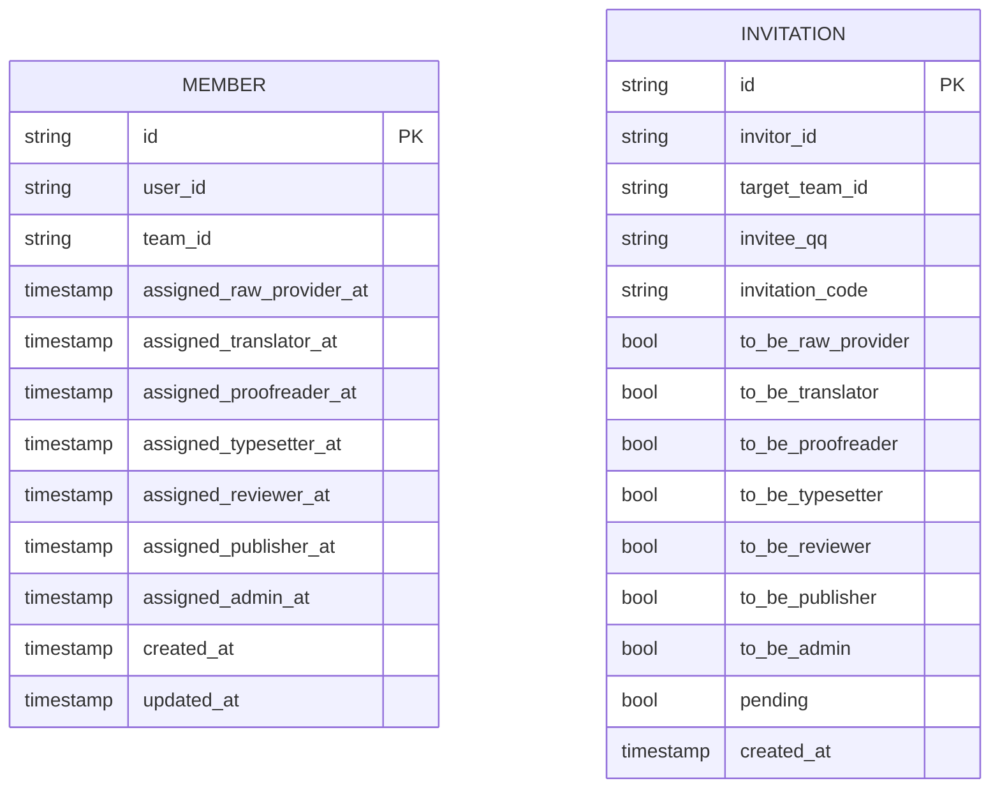
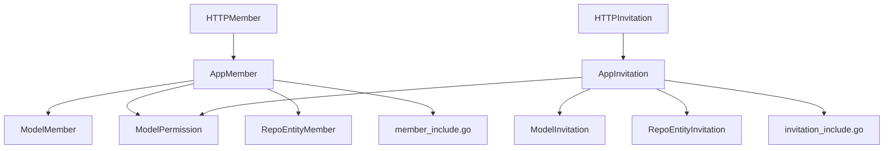

# 团队协作模型

<cite>
**本文引用的文件**
- [member.go](file://backend/backend-v1/internal/domain/model/member.go)
- [invitation.go](file://backend/backend-v1/internal/domain/model/invitation.go)
- [role.go](file://backend/backend-v1/internal/domain/model/role.go)
- [permission.go](file://backend/backend-v1/internal/domain/model/permission.go)
- [member.go](file://backend/backend-v1/internal/application/member.go)
- [invitation.go](file://backend/backend-v1/internal/application/invitation.go)
- [member.go](file://backend/backend-v1/internal/api/http/member.go)
- [invitation.go](file://backend/backend-v1/internal/api/http/invitation.go)
- [member.go](file://backend/backend-v1/internal/infrastructure/repository/entity/member.go)
- [invitation.go](file://backend/backend-v1/internal/infrastructure/repository/entity/invitation.go)
- [member_include.go](file://backend/backend-v1/internal/domain/service/member_include.go)
- [invitation_include.go](file://backend/backend-v1/internal/domain/service/invitation_include.go)
</cite>

## 目录
1. [简介](#简介)
2. [项目结构](#项目结构)
3. [核心组件](#核心组件)
4. [架构总览](#架构总览)
5. [详细组件分析](#详细组件分析)
6. [依赖分析](#依赖分析)
7. [性能考虑](#性能考虑)
8. [故障排查指南](#故障排查指南)
9. [结论](#结论)
10. [附录](#附录)

## 简介
本文件面向 Poprako 的团队协作模型，围绕成员(MemberInfo)与邀请(InvitationInfo)两大实体，系统性阐述以下内容：
- 成员关系的建立、角色分配与权限继承机制
- 邀请系统的完整流程（发送、接受、拒绝与过期处理）
- 团队管理最佳实践（添加、移除、角色变更）
- 权限体系设计原理（基于角色掩码的灵活控制）
- 成员状态管理、活跃度统计与团队贡献度计算的实现思路

## 项目结构
后端采用分层架构：API 层负责路由与参数解析；应用层封装业务流程；领域层定义模型与权限规则；基础设施层负责仓储与数据映射。

图表来源
- [member.go:1-272](file://backend/backend-v1/internal/api/http/member.go#L1-L272)
- [invitation.go:1-185](file://backend/backend-v1/internal/api/http/invitation.go#L1-L185)
- [member.go:1-448](file://backend/backend-v1/internal/application/member.go#L1-L448)
- [invitation.go:1-304](file://backend/backend-v1/internal/application/invitation.go#L1-L304)
- [member.go:1-205](file://backend/backend-v1/internal/domain/model/member.go#L1-L205)
- [invitation.go:1-158](file://backend/backend-v1/internal/domain/model/invitation.go#L1-L158)
- [role.go:1-56](file://backend/backend-v1/internal/domain/model/role.go#L1-L56)
- [permission.go:1-845](file://backend/backend-v1/internal/domain/model/permission.go#L1-L845)
- [member.go:1-143](file://backend/backend-v1/internal/infrastructure/repository/entity/member.go#L1-L143)
- [invitation.go:1-98](file://backend/backend-v1/internal/infrastructure/repository/entity/invitation.go#L1-L98)

章节来源
- [member.go:1-272](file://backend/backend-v1/internal/api/http/member.go#L1-L272)
- [invitation.go:1-185](file://backend/backend-v1/internal/api/http/invitation.go#L1-L185)
- [member.go:1-448](file://backend/backend-v1/internal/application/member.go#L1-L448)
- [invitation.go:1-304](file://backend/backend-v1/internal/application/invitation.go#L1-L304)
- [member.go:1-205](file://backend/backend-v1/internal/domain/model/member.go#L1-L205)
- [invitation.go:1-158](file://backend/backend-v1/internal/domain/model/invitation.go#L1-L158)
- [role.go:1-56](file://backend/backend-v1/internal/domain/model/role.go#L1-L56)
- [permission.go:1-845](file://backend/backend-v1/internal/domain/model/permission.go#L1-L845)
- [member.go:1-143](file://backend/backend-v1/internal/infrastructure/repository/entity/member.go#L1-L143)
- [invitation.go:1-98](file://backend/backend-v1/internal/infrastructure/repository/entity/invitation.go#L1-L98)

## 核心组件
- 成员模型（MemberInfo）：承载成员在团队中的角色分配与时间戳，支持角色集合查询与更新策略。
- 邀请模型（InvitationInfo）：承载邀请发起人、受邀者、目标团队、邀请码与角色集合，并提供角色掩码转换能力。
- 角色与掩码（RoleFlag/RoleMask）：以位掩码形式表达多角色组合，便于高效判断与序列化。
- 权限规则（permission.go）：以“类型化权限”封装各类资源的访问控制，统一由领域层判定。
- 应用服务（MemberApplication/InvitationApplication）：编排鉴权、参数校验、仓储交互与事务处理。
- API 接口（HTTP handlers）：暴露 REST 端点，绑定参数与响应。

章节来源
- [member.go:48-205](file://backend/backend-v1/internal/domain/model/member.go#L48-L205)
- [invitation.go:63-158](file://backend/backend-v1/internal/domain/model/invitation.go#L63-L158)
- [role.go:3-56](file://backend/backend-v1/internal/domain/model/role.go#L3-L56)
- [permission.go:198-845](file://backend/backend-v1/internal/domain/model/permission.go#L198-L845)
- [member.go:20-82](file://backend/backend-v1/internal/application/member.go#L20-L82)
- [invitation.go:19-69](file://backend/backend-v1/internal/application/invitation.go#L19-L69)
- [member.go:1-272](file://backend/backend-v1/internal/api/http/member.go#L1-L272)
- [invitation.go:1-185](file://backend/backend-v1/internal/api/http/invitation.go#L1-L185)

## 架构总览
下图展示从 HTTP 请求到仓储持久化的整体流程，以及权限判定的关键节点。

图表来源
- [member.go:23-51](file://backend/backend-v1/internal/api/http/member.go#L23-L51)
- [invitation.go:68-96](file://backend/backend-v1/internal/api/http/invitation.go#L68-L96)
- [member.go:84-139](file://backend/backend-v1/internal/application/member.go#L84-L139)
- [invitation.go:133-213](file://backend/backend-v1/internal/application/invitation.go#L133-L213)
- [permission.go:212-246](file://backend/backend-v1/internal/domain/model/permission.go#L212-L246)

## 详细组件分析

### 成员模型（MemberInfo）与角色分配
- 角色字段：每个角色对应一个带时间戳的字段，用于记录角色授予的时间点。
- 角色集合：提供 HasAnyRole 与 Roles 方法，便于快速判断与枚举成员所拥有的角色。
- 更新策略：NewMemberUpdate 基于目标角色掩码与当前状态，决定保留旧时间还是写入当前时间，确保“全量替换”的语义。

图表来源
- [member.go:7-46](file://backend/backend-v1/internal/domain/model/member.go#L7-L46)
- [member.go:48-164](file://backend/backend-v1/internal/domain/model/member.go#L48-L164)
- [member.go:166-205](file://backend/backend-v1/internal/domain/model/member.go#L166-L205)

章节来源
- [member.go:7-205](file://backend/backend-v1/internal/domain/model/member.go#L7-L205)

### 邀请模型（InvitationInfo）与角色掩码
- 邀请创建：NewInvitationCreation 支持一次性声明多个角色，内部通过 setRoles 将 RoleFlag 映射到布尔字段。
- 角色掩码：RoleMask() 将 ToBeXxx 字段还原为 RoleMask，便于后续权限判断与应用层组装。
- 更新补丁：NewInvitationUpdate 提供按需覆盖的角色补丁，避免全量写入。

图表来源
- [invitation.go:7-61](file://backend/backend-v1/internal/domain/model/invitation.go#L7-L61)
- [invitation.go:63-112](file://backend/backend-v1/internal/domain/model/invitation.go#L63-L112)
- [invitation.go:114-157](file://backend/backend-v1/internal/domain/model/invitation.go#L114-L157)

章节来源
- [invitation.go:1-158](file://backend/backend-v1/internal/domain/model/invitation.go#L1-L158)

### 角色与掩码（RoleFlag/RoleMask）
- 角色常量：以 2 的幂次表示不同角色，天然构成互斥集合。
- 掩码工具：MaskRoles/UnmaskRoles 实现 RoleFlag 切片与 RoleMask 的双向转换，支撑灵活的角色组合与持久化。

图表来源
- [role.go:19-27](file://backend/backend-v1/internal/domain/model/role.go#L19-L27)

章节来源
- [role.go:1-56](file://backend/backend-v1/internal/domain/model/role.go#L1-L56)

### 权限体系与继承机制
- 类型化权限：为每类资源定义 Check 方法，集中处理“是否拥有权限”的判定逻辑。
- 继承链路：
  - 超级管理员（IsSuperAdmin）拥有全局最高权限。
  - 汉化组管理员（HasAnyRole(RoleAdmin)）在团队内拥有特定资源的完全控制权。
  - 普通成员仅凭“属于该团队”即可获得部分只读权限。
- 示例：
  - 邀请列表/创建/删除/更新：仅团队管理员可操作。
  - 成员列表/创建/更新/删除：仅团队管理员可操作。
  - 页面/单元等细粒度资源：结合 AssignmentInfo 中的角色集合进行判定。

图表来源
- [permission.go:15-80](file://backend/backend-v1/internal/domain/model/permission.go#L15-L80)
- [permission.go:212-246](file://backend/backend-v1/internal/domain/model/permission.go#L212-L246)
- [permission.go:363-395](file://backend/backend-v1/internal/domain/model/permission.go#L363-L395)
- [permission.go:409-461](file://backend/backend-v1/internal/domain/model/permission.go#L409-L461)
- [permission.go:635-727](file://backend/backend-v1/internal/domain/model/permission.go#L635-L727)

章节来源
- [permission.go:1-845](file://backend/backend-v1/internal/domain/model/permission.go#L1-L845)

### 邀请系统完整流程
- 发送邀请：应用层校验权限与目标用户不在团队内，生成唯一邀请码，写入邀请记录。
- 接受邀请：用户使用邀请码与自身 QQ 查找待消耗邀请，事务内创建成员并使邀请失效。
- 拒绝/过期：邀请默认 Pending=true，未使用即视为过期；删除邀请可视为拒绝。

图表来源
- [invitation.go:133-213](file://backend/backend-v1/internal/application/invitation.go#L133-L213)
- [invitation.go:261-303](file://backend/backend-v1/internal/application/invitation.go#L261-L303)
- [member.go:340-447](file://backend/backend-v1/internal/application/member.go#L340-L447)
- [permission.go:221-246](file://backend/backend-v1/internal/domain/model/permission.go#L221-L246)

章节来源
- [invitation.go:1-304](file://backend/backend-v1/internal/application/invitation.go#L1-L304)
- [member.go:1-448](file://backend/backend-v1/internal/application/member.go#L1-L448)
- [invitation.go:1-185](file://backend/backend-v1/internal/api/http/invitation.go#L1-L185)
- [member.go:1-272](file://backend/backend-v1/internal/api/http/member.go#L1-L272)

### 成员管理最佳实践
- 添加成员：
  - 仅超级管理员可直接创建成员记录，避免越权。
  - 使用应用层参数校验与权限检查，确保 TeamID/UserID 合法。
- 移除成员：
  - 仅团队管理员可删除成员，应用层先查询可信 TeamID 再鉴权。
- 角色变更：
  - 使用 PUT 语义进行全量替换，NewMemberUpdate 保持已有角色时间不变，新增角色写入当前时间，保证历史可追溯。

章节来源
- [member.go:84-139](file://backend/backend-v1/internal/application/member.go#L84-L139)
- [member.go:296-338](file://backend/backend-v1/internal/application/member.go#L296-L338)
- [member.go:245-294](file://backend/backend-v1/internal/application/member.go#L245-L294)

### 数据模型与仓储映射
- 成员表（member_table）：包含各角色的时间戳字段，支持 IncludeUserInfo/IncludeTeamInfo 的 JOIN 聚合。
- 邀请表（invitation_table）：包含邀请码、Pending 标志与 ToBeXxx 角色布尔字段，支持 IncludeInvitorInfo 的 JOIN 聚合。

图表来源
- [member.go:11-47](file://backend/backend-v1/internal/infrastructure/repository/entity/member.go#L11-L47)
- [invitation.go:11-62](file://backend/backend-v1/internal/infrastructure/repository/entity/invitation.go#L11-L62)

章节来源
- [member.go:1-143](file://backend/backend-v1/internal/infrastructure/repository/entity/member.go#L1-L143)
- [invitation.go:1-98](file://backend/backend-v1/internal/infrastructure/repository/entity/invitation.go#L1-L98)

## 依赖分析
- API 层依赖应用层；应用层依赖领域模型与权限规则；仓储实体映射提供数据结构与转换函数。
- 权限规则通过回调加载用户/成员信息，避免在领域层引入外部依赖。
- include 参数解析服务（member_include/invitation_include）将 HTTP 查询参数映射为仓储查询选项，提升灵活性。

图表来源
- [member.go:1-272](file://backend/backend-v1/internal/api/http/member.go#L1-L272)
- [invitation.go:1-185](file://backend/backend-v1/internal/api/http/invitation.go#L1-L185)
- [member.go:1-448](file://backend/backend-v1/internal/application/member.go#L1-L448)
- [invitation.go:1-304](file://backend/backend-v1/internal/application/invitation.go#L1-L304)
- [member.go:1-38](file://backend/backend-v1/internal/domain/service/member_include.go#L1-L38)
- [invitation.go:1-21](file://backend/backend-v1/internal/domain/service/invitation_include.go#L1-L21)

章节来源
- [member.go:1-38](file://backend/backend-v1/internal/domain/service/member_include.go#L1-L38)
- [invitation.go:1-21](file://backend/backend-v1/internal/domain/service/invitation_include.go#L1-L21)

## 性能考虑
- 角色掩码与 HasAnyRole：基于位运算，时间复杂度 O(k)（k 为角色数），空间复杂度 O(1)，适合高频权限判断。
- 分页与条件查询：应用层统一使用 QueryOption 进行分页与过滤，避免一次性加载全量数据。
- Include 关联：按需展开 user/team/invitor 等关联，减少不必要的 JOIN 与序列化开销。
- 事务边界：JoinTeam 采用事务确保“创建成员+失效邀请”的原子性，降低并发冲突风险。

## 故障排查指南
- 权限不足：
  - 检查当前用户是否具备团队管理员或超级管理员身份。
  - 确认应用层传入的 TeamID 是否来自可信来源（如数据库查询结果）。
- 参数错误：
  - 校验请求体与路径参数格式，确保 ID 匹配与必填字段齐全。
- 记录不存在：
  - 邀请码无效或已被使用；成员已加入团队；邀请不存在。
- 事务异常：
  - JoinTeam 的回滚日志可用于定位具体失败步骤。

章节来源
- [member.go:105-111](file://backend/backend-v1/internal/application/member.go#L105-L111)
- [invitation.go:154-161](file://backend/backend-v1/internal/application/invitation.go#L154-L161)
- [member.go:370-385](file://backend/backend-v1/internal/application/member.go#L370-L385)
- [invitation.go:276-283](file://backend/backend-v1/internal/application/invitation.go#L276-L283)

## 结论
Poprako 的团队协作模型以“角色掩码 + 类型化权限 + 应用层编排”为核心，实现了：
- 清晰的成员关系与角色分配
- 安全可控的邀请生命周期
- 可扩展的权限继承与细粒度控制
- 可维护的数据模型与仓储映射

建议在生产环境中持续关注：
- 权限规则的审计与最小权限原则
- 并发场景下的事务与锁策略
- 日志与监控对关键流程（邀请、加入、角色变更）的覆盖

## 附录
- 成员状态管理：通过各角色时间戳记录“授予时刻”，支持活跃度统计与贡献度计算的基线。
- 贡献度计算思路：以“完成任务（章节/页面/单元）”为事件，结合 AssignmentInfo 中的角色与时间范围，统计各成员在团队内的参与度与产出量。