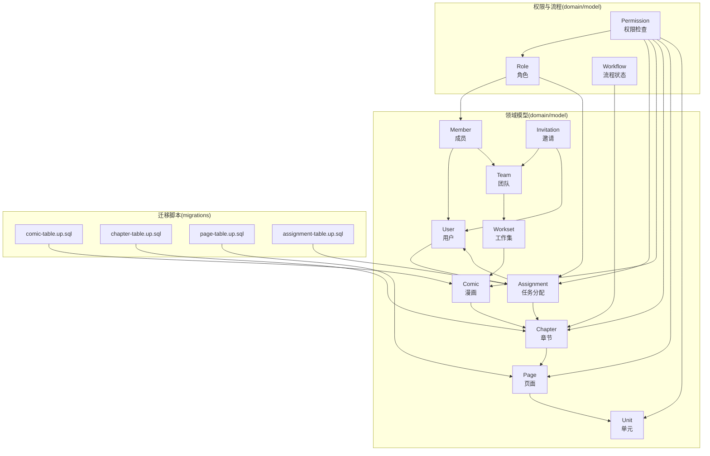
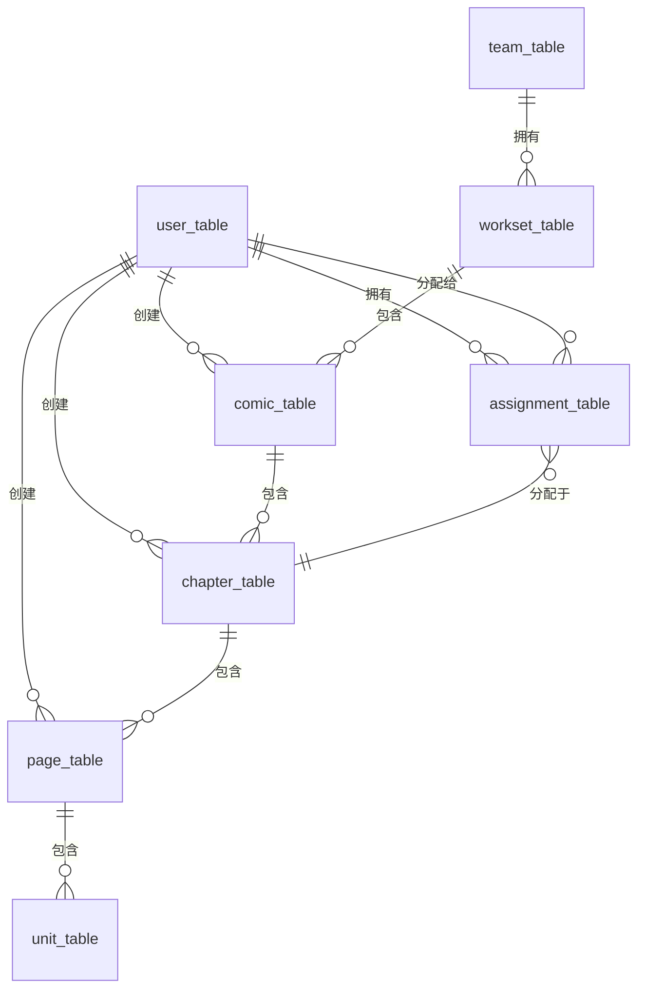
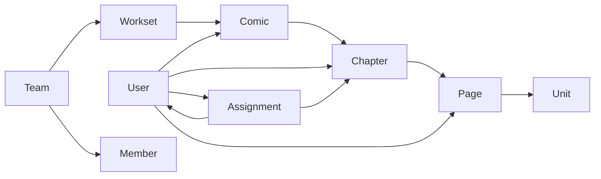
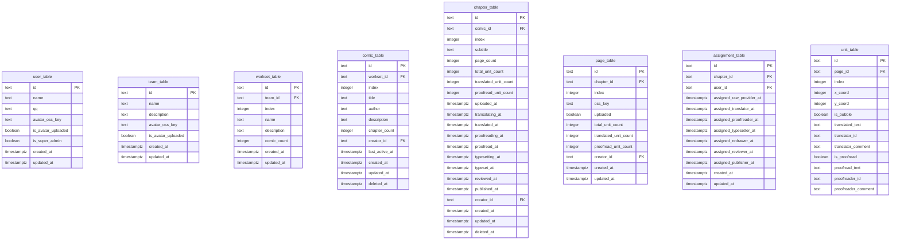

# 数据模型

<cite>
**本文引用的文件**
- [backend/backend-v1/internal/domain/model/user.go](file://backend/backend-v1/internal/domain/model/user.go)
- [backend/backend-v1/internal/domain/model/team.go](file://backend/backend-v1/internal/domain/model/team.go)
- [backend/backend-v1/internal/domain/model/workset.go](file://backend/backend-v1/internal/domain/model/workset.go)
- [backend/backend-v1/internal/domain/model/comic.go](file://backend/backend-v1/internal/domain/model/comic.go)
- [backend/backend-v1/internal/domain/model/chapter.go](file://backend/backend-v1/internal/domain/model/chapter.go)
- [backend/backend-v1/internal/domain/model/page.go](file://backend/backend-v1/internal/domain/model/page.go)
- [backend/backend-v1/internal/domain/model/assignment.go](file://backend/backend-v1/internal/domain/model/assignment.go)
- [backend/backend-v1/internal/domain/model/member.go](file://backend/backend-v1/internal/domain/model/member.go)
- [backend/backend-v1/internal/domain/model/invitation.go](file://backend/backend-v1/internal/domain/model/invitation.go)
- [backend/backend-v1/internal/domain/model/unit.go](file://backend/backend-v1/internal/domain/model/unit.go)
- [backend/backend-v1/internal/domain/model/role.go](file://backend/backend-v1/internal/domain/model/role.go)
- [backend/backend-v1/internal/domain/model/workflow.go](file://backend/backend-v1/internal/domain/model/workflow.go)
- [backend/backend-v1/internal/domain/model/permission.go](file://backend/backend-v1/internal/domain/model/permission.go)
- [backend/backend-v1/migrations/20260306101212_comic-table.up.sql](file://backend/backend-v1/migrations/20260306101212_comic-table.up.sql)
- [backend/backend-v1/migrations/20260306101213_chapter-table.up.sql](file://backend/backend-v1/migrations/20260306101213_chapter-table.up.sql)
- [backend/backend-v1/migrations/20260306101214_page-table.up.sql](file://backend/backend-v1/migrations/20260306101214_page-table.up.sql)
- [backend/backend-v1/migrations/20260306101215_assignment-table.up.sql](file://backend/backend-v1/migrations/20260306101215_assignment-table.up.sql)
</cite>

## 目录
1. [简介](#简介)
2. [项目结构](#项目结构)
3. [核心组件](#核心组件)
4. [架构总览](#架构总览)
5. [详细组件分析](#详细组件分析)
6. [依赖分析](#依赖分析)
7. [性能考量](#性能考量)
8. [故障排查指南](#故障排查指南)
9. [结论](#结论)
10. [附录](#附录)

## 简介
本文件系统性梳理 Poprako 的数据模型，覆盖用户(User)、团队(Team)、工作集(Workset)、漫画(Comic)、章节(Chapter)、页面(Page)、任务分配(Assignment)、成员(Member)、邀请(Invitation)以及单元(Unit)等核心实体。文档从实体关系、字段定义与数据类型、主键/外键关系、索引策略与约束条件入手，解释数据验证与业务规则，并给出数据库模式图、示例数据与数据访问模式、缓存策略、性能优化建议、数据生命周期与归档规则、以及迁移路径与版本管理策略。

## 项目结构
后端采用分层架构，数据模型位于 domain/model 层，迁移脚本位于 migrations 目录。各领域模型通过结构体与构造函数表达实体与值对象，配合权限模型(permission.go)与角色/流程状态模型(role.go、workflow.go)实现细粒度的业务规则控制。

图表来源
- [backend/backend-v1/internal/domain/model/user.go:1-100](file://backend/backend-v1/internal/domain/model/user.go#L1-L100)
- [backend/backend-v1/internal/domain/model/team.go:1-63](file://backend/backend-v1/internal/domain/model/team.go#L1-L63)
- [backend/backend-v1/internal/domain/model/workset.go:1-82](file://backend/backend-v1/internal/domain/model/workset.go#L1-L82)
- [backend/backend-v1/internal/domain/model/comic.go:1-107](file://backend/backend-v1/internal/domain/model/comic.go#L1-L107)
- [backend/backend-v1/internal/domain/model/chapter.go:1-260](file://backend/backend-v1/internal/domain/model/chapter.go#L1-L260)
- [backend/backend-v1/internal/domain/model/page.go:1-134](file://backend/backend-v1/internal/domain/model/page.go#L1-L134)
- [backend/backend-v1/internal/domain/model/assignment.go:1-190](file://backend/backend-v1/internal/domain/model/assignment.go#L1-L190)
- [backend/backend-v1/internal/domain/model/member.go:1-205](file://backend/backend-v1/internal/domain/model/member.go#L1-L205)
- [backend/backend-v1/internal/domain/model/invitation.go:1-158](file://backend/backend-v1/internal/domain/model/invitation.go#L1-L158)
- [backend/backend-v1/internal/domain/model/unit.go:1-149](file://backend/backend-v1/internal/domain/model/unit.go#L1-L149)
- [backend/backend-v1/internal/domain/model/role.go:1-56](file://backend/backend-v1/internal/domain/model/role.go#L1-L56)
- [backend/backend-v1/internal/domain/model/workflow.go:1-36](file://backend/backend-v1/internal/domain/model/workflow.go#L1-L36)
- [backend/backend-v1/internal/domain/model/permission.go:1-845](file://backend/backend-v1/internal/domain/model/permission.go#L1-L845)
- [backend/backend-v1/migrations/20260306101212_comic-table.up.sql:1-37](file://backend/backend-v1/migrations/20260306101212_comic-table.up.sql#L1-L37)
- [backend/backend-v1/migrations/20260306101213_chapter-table.up.sql:1-38](file://backend/backend-v1/migrations/20260306101213_chapter-table.up.sql#L1-L38)
- [backend/backend-v1/migrations/20260306101214_page-table.up.sql:1-25](file://backend/backend-v1/migrations/20260306101214_page-table.up.sql#L1-L25)
- [backend/backend-v1/migrations/20260306101215_assignment-table.up.sql:1-26](file://backend/backend-v1/migrations/20260306101215_assignment-table.up.sql#L1-L26)

章节来源
- [backend/backend-v1/internal/domain/model/user.go:1-100](file://backend/backend-v1/internal/domain/model/user.go#L1-L100)
- [backend/backend-v1/internal/domain/model/team.go:1-63](file://backend/backend-v1/internal/domain/model/team.go#L1-L63)
- [backend/backend-v1/internal/domain/model/workset.go:1-82](file://backend/backend-v1/internal/domain/model/workset.go#L1-L82)
- [backend/backend-v1/internal/domain/model/comic.go:1-107](file://backend/backend-v1/internal/domain/model/comic.go#L1-L107)
- [backend/backend-v1/internal/domain/model/chapter.go:1-260](file://backend/backend-v1/internal/domain/model/chapter.go#L1-L260)
- [backend/backend-v1/internal/domain/model/page.go:1-134](file://backend/backend-v1/internal/domain/model/page.go#L1-L134)
- [backend/backend-v1/internal/domain/model/assignment.go:1-190](file://backend/backend-v1/internal/domain/model/assignment.go#L1-L190)
- [backend/backend-v1/internal/domain/model/member.go:1-205](file://backend/backend-v1/internal/domain/model/member.go#L1-L205)
- [backend/backend-v1/internal/domain/model/invitation.go:1-158](file://backend/backend-v1/internal/domain/model/invitation.go#L1-L158)
- [backend/backend-v1/internal/domain/model/unit.go:1-149](file://backend/backend-v1/internal/domain/model/unit.go#L1-L149)
- [backend/backend-v1/internal/domain/model/role.go:1-56](file://backend/backend-v1/internal/domain/model/role.go#L1-L56)
- [backend/backend-v1/internal/domain/model/workflow.go:1-36](file://backend/backend-v1/internal/domain/model/workflow.go#L1-L36)
- [backend/backend-v1/internal/domain/model/permission.go:1-845](file://backend/backend-v1/internal/domain/model/permission.go#L1-L845)
- [backend/backend-v1/migrations/20260306101212_comic-table.up.sql:1-37](file://backend/backend-v1/migrations/20260306101212_comic-table.up.sql#L1-L37)
- [backend/backend-v1/migrations/20260306101213_chapter-table.up.sql:1-38](file://backend/backend-v1/migrations/20260306101213_chapter-table.up.sql#L1-L38)
- [backend/backend-v1/migrations/20260306101214_page-table.up.sql:1-25](file://backend/backend-v1/migrations/20260306101214_page-table.up.sql#L1-L25)
- [backend/backend-v1/migrations/20260306101215_assignment-table.up.sql:1-26](file://backend/backend-v1/migrations/20260306101215_assignment-table.up.sql#L1-L26)

## 核心组件
- 用户(User): 基础身份信息与凭证载体，支撑登录与权限判定。
- 团队(Team): 组织单位，承载成员与工作集。
- 工作集(Workset): 团队内的分类容器，聚合多部漫画。
- 漫画(Comic): 具体作品，关联工作集与创建者。
- 章节(Chapter): 漫画的分卷/分章，记录工作流状态与统计。
- 页面(Page): 章节中的单页图像，关联 OSS 存储键与上传状态。
- 任务分配(Assignment): 用户在章节上的角色分配，驱动权限与流程。
- 成员(Member): 用户在团队中的角色与加入时间，支持管理员角色。
- 邀请(Invitation): 向外部用户发出的角色邀请，支持批量角色标记。
- 单元(Unit): 页面中的可翻译/校对区域，支持增量更新。

章节来源
- [backend/backend-v1/internal/domain/model/user.go:1-100](file://backend/backend-v1/internal/domain/model/user.go#L1-L100)
- [backend/backend-v1/internal/domain/model/team.go:1-63](file://backend/backend-v1/internal/domain/model/team.go#L1-L63)
- [backend/backend-v1/internal/domain/model/workset.go:1-82](file://backend/backend-v1/internal/domain/model/workset.go#L1-L82)
- [backend/backend-v1/internal/domain/model/comic.go:1-107](file://backend/backend-v1/internal/domain/model/comic.go#L1-L107)
- [backend/backend-v1/internal/domain/model/chapter.go:1-260](file://backend/backend-v1/internal/domain/model/chapter.go#L1-L260)
- [backend/backend-v1/internal/domain/model/page.go:1-134](file://backend/backend-v1/internal/domain/model/page.go#L1-L134)
- [backend/backend-v1/internal/domain/model/assignment.go:1-190](file://backend/backend-v1/internal/domain/model/assignment.go#L1-L190)
- [backend/backend-v1/internal/domain/model/member.go:1-205](file://backend/backend-v1/internal/domain/model/member.go#L1-L205)
- [backend/backend-v1/internal/domain/model/invitation.go:1-158](file://backend/backend-v1/internal/domain/model/invitation.go#L1-L158)
- [backend/backend-v1/internal/domain/model/unit.go:1-149](file://backend/backend-v1/internal/domain/model/unit.go#L1-L149)

## 架构总览
以下 ER 图展示核心实体之间的主外键关系与命名规范（表名与列名均来自迁移脚本）：

图表来源
- [backend/backend-v1/migrations/20260306101212_comic-table.up.sql:1-37](file://backend/backend-v1/migrations/20260306101212_comic-table.up.sql#L1-L37)
- [backend/backend-v1/migrations/20260306101213_chapter-table.up.sql:1-38](file://backend/backend-v1/migrations/20260306101213_chapter-table.up.sql#L1-L38)
- [backend/backend-v1/migrations/20260306101214_page-table.up.sql:1-25](file://backend/backend-v1/migrations/20260306101214_page-table.up.sql#L1-L25)
- [backend/backend-v1/migrations/20260306101215_assignment-table.up.sql:1-26](file://backend/backend-v1/migrations/20260306101215_assignment-table.up.sql#L1-L26)

## 详细组件分析

### 用户(User)
- 字段与类型
  - id: 文本主键
  - name: 文本
  - qq: 文本
  - avatar_oss_key: 文本
  - is_avatar_uploaded: 布尔
  - is_super_admin: 布尔
  - created_at/updated_at: 时间戳
- 关键点
  - 凭证结构体仅包含用户标识与密码哈希，不暴露完整信息。
  - 注册时可携带角色掩码，后续通过成员或分配模型映射到具体角色。
- 索引与约束
  - 主键 id；迁移脚本未显式创建额外索引，通常按需在查询路径上补充。

章节来源
- [backend/backend-v1/internal/domain/model/user.go:1-100](file://backend/backend-v1/internal/domain/model/user.go#L1-L100)

### 团队(Team)
- 字段与类型
  - id: 文本主键
  - name/description: 文本
  - avatar_oss_key: 文本
  - is_avatar_uploaded: 布尔
  - created_at/updated_at: 时间戳
- 关键点
  - 作为工作集的容器，成员与权限围绕团队展开。

章节来源
- [backend/backend-v1/internal/domain/model/team.go:1-63](file://backend/backend-v1/internal/domain/model/team.go#L1-L63)

### 工作集(Workset)
- 字段与类型
  - id: 文本主键
  - team_id: 外键引用 team_table
  - index/name/description: 文本
  - comic_count: 整数
  - created_at/updated_at: 时间戳
- 约束与索引
  - 外键约束: workset_table.team_id -> team_table.id (级联删除)
  - 唯一索引: (team_id, index) 且 deleted_at IS NULL
  - 索引: team_id

章节来源
- [backend/backend-v1/internal/domain/model/workset.go:1-82](file://backend/backend-v1/internal/domain/model/workset.go#L1-L82)
- [backend/backend-v1/migrations/20260306101212_comic-table.up.sql:1-37](file://backend/backend-v1/migrations/20260306101212_comic-table.up.sql#L1-L37)

### 漫画(Comic)
- 字段与类型
  - id: 文本主键
  - workset_id: 外键引用 workset_table
  - index/title/author/description: 文本
  - chapter_count: 整数
  - creator_id: 外键引用 user_table
  - last_active_at: 时间戳
  - created_at/updated_at/deleted_at: 时间戳
- 约束与索引
  - 外键: comic_table.workset_id -> workset_table.id (级联删除)
  - 外键: comic_table.creator_id -> user_table.id (限制删除)
  - 唯一索引: (workset_id, index) 且 deleted_at IS NULL
  - 索引: workset_id, creator_id, last_active_at, (workset_id, created_at DESC)

章节来源
- [backend/backend-v1/internal/domain/model/comic.go:1-107](file://backend/backend-v1/internal/domain/model/comic.go#L1-L107)
- [backend/backend-v1/migrations/20260306101212_comic-table.up.sql:1-37](file://backend/backend-v1/migrations/20260306101212_comic-table.up.sql#L1-L37)

### 章节(Chapter)
- 字段与类型
  - id: 文本主键
  - comic_id: 外键引用 comic_table
  - index/subtitle: 整数/文本
  - page_count/total_unit_count/translated_unit_count/proofread_unit_count: 整数
  - 上传/翻译/校对/排版/复审/发布等时间戳字段
  - creator_id: 外键引用 user_table
  - created_at/updated_at/deleted_at: 时间戳
- 约束与索引
  - 外键: chapter_table.comic_id -> comic_table.id (级联删除)
  - 外键: chapter_table.creator_id -> user_table.id (限制删除)
  - 唯一索引: (comic_id, index DESC) 且 deleted_at IS NULL
  - 索引: comic_id

章节来源
- [backend/backend-v1/internal/domain/model/chapter.go:1-260](file://backend/backend-v1/internal/domain/model/chapter.go#L1-L260)
- [backend/backend-v1/migrations/20260306101213_chapter-table.up.sql:1-38](file://backend/backend-v1/migrations/20260306101213_chapter-table.up.sql#L1-L38)

### 页面(Page)
- 字段与类型
  - id: 文本主键
  - chapter_id: 外键引用 chapter_table
  - index/oss_key: 整数/文本
  - uploaded: 布尔
  - total_unit_count/translated_unit_count/proofread_unit_count: 整数
  - creator_id: 外键引用 user_table
  - created_at/updated_at: 时间戳
- 约束与索引
  - 外键: page_table.chapter_id -> chapter_table.id (级联删除)
  - 外键: page_table.creator_id -> user_table.id (限制删除)
  - 唯一索引: (chapter_id, index)
  - 索引: chapter_id

章节来源
- [backend/backend-v1/internal/domain/model/page.go:1-134](file://backend/backend-v1/internal/domain/model/page.go#L1-L134)
- [backend/backend-v1/migrations/20260306101214_page-table.up.sql:1-25](file://backend/backend-v1/migrations/20260306101214_page-table.up.sql#L1-L25)

### 任务分配(Assignment)
- 字段与类型
  - id: 文本主键
  - chapter_id/user_id: 外键引用 chapter_table/user_table
  - 各角色分配时间戳字段（raw_provider, translator, proofreader, typesetter, redrawer, reviewer, publisher）
  - created_at/updated_at: 时间戳
- 约束与索引
  - 外键: assignment_table.chapter_id -> chapter_table.id (级联删除)
  - 外键: assignment_table.user_id -> user_table.id (级联删除)
  - 唯一索引: (chapter_id, user_id)
  - 索引: chapter_id, user_id

章节来源
- [backend/backend-v1/internal/domain/model/assignment.go:1-190](file://backend/backend-v1/internal/domain/model/assignment.go#L1-L190)
- [backend/backend-v1/migrations/20260306101215_assignment-table.up.sql:1-26](file://backend/backend-v1/migrations/20260306101215_assignment-table.up.sql#L1-L26)

### 成员(Member)
- 字段与类型
  - id: 文本主键
  - user_id/team_id: 外键引用 user_table/team_table
  - 各角色分配时间戳字段（raw_provider, translator, proofreader, typesetter, reviewer, publisher, admin）
  - created_at/updated_at: 时间戳
- 关键点
  - 角色掩码与角色集合可通过 HasAnyRole/Roles 方法判断与枚举。
- 约束与索引
  - 与用户/团队存在外键关系；与 Assignment 类似，用于权限判定。

章节来源
- [backend/backend-v1/internal/domain/model/member.go:1-205](file://backend/backend-v1/internal/domain/model/member.go#L1-L205)

### 邀请(Invitation)
- 字段与类型
  - id: 文本主键
  - invitor_id/target_team_id/invitee_qq: 文本
  - invitation_code: 文本
  - pending: 布尔
  - 各角色 ToBeXxx 标记位
  - created_at: 时间戳
- 关键点
  - 通过角色标记位表达目标角色集合，便于后续成员创建与角色赋予。

章节来源
- [backend/backend-v1/internal/domain/model/invitation.go:1-158](file://backend/backend-v1/internal/domain/model/invitation.go#L1-L158)

### 单元(Unit)
- 字段与类型
  - id: 文本主键
  - page_id: 外键引用 page_table
  - index/x_coord/y_coord: 整数
  - is_bubble: 布尔
  - translated_text/translator_id/translator_comment: 文本可空
  - is_proofread/proofread_text/proofreader_id/proofreader_comment: 文本可空
- 关键点
  - 提供 UnitPatch 结构体支持增量更新，避免非必要字段变更。

章节来源
- [backend/backend-v1/internal/domain/model/unit.go:1-149](file://backend/backend-v1/internal/domain/model/unit.go#L1-L149)

### 角色与流程状态
- 角色(RoleFlag/RoleMask)
  - raw_provider, translator, proofreader, typesetter, reviewer, publisher, admin
  - 支持掩码组合与解码
- 流程状态(Workflow/WorkflowStatus)
  - 工作流类型: uploading, translating, proofreading, typesetting, reviewing, publishing
  - 状态: pending, in_progress, completed, unset
  - 提供有效性校验，确保状态与工作流类型匹配

章节来源
- [backend/backend-v1/internal/domain/model/role.go:1-56](file://backend/backend-v1/internal/domain/model/role.go#L1-L56)
- [backend/backend-v1/internal/domain/model/workflow.go:1-36](file://backend/backend-v1/internal/domain/model/workflow.go#L1-L36)

### 权限模型
- 权限类型化封装，针对不同资源提供 Check 方法
- 示例要点
  - 邀请: 仅管理员可列出/创建/删除/更新
  - 用户: 列表/移除仅超级管理员；更新允许本人或超级管理员
  - 团队: 列表/创建仅超级管理员；更新允许超级管理员或团队管理员
  - 成员: 仅管理员可创建/列出/更新/删除
  - 漫画: 成员可列表；管理员可创建/更新/删除
  - 章节: 成员可列表；管理员可创建/更新/删除
  - 分配: 成员可列表；仅 reviewer 可创建/更新/删除
  - 页面: 成员可列表；reviewer/raw_provider 可创建/更新/删除
  - 单元: 仅 translator/proofreader 可列表与保存
- 加载器回调 OnLoadXxx 用于惰性加载上下文信息，保证权限判断的准确性

章节来源
- [backend/backend-v1/internal/domain/model/permission.go:1-845](file://backend/backend-v1/internal/domain/model/permission.go#L1-L845)

## 依赖分析
- 实体间依赖
  - Team -> Workset
  - Workset -> Comic
  - Comic -> Chapter
  - Chapter -> Page
  - Page -> Unit
  - User -> Assignment/Page/Chapter/Comic
  - Team -> Member
  - Assignment -> Chapter/User
- 权限依赖
  - Permission.Check 依赖 Role/Workflow 与 OnLoadXxx 回调
- 迁移脚本依赖
  - 各表的外键与索引定义严格遵循上述依赖关系

图表来源
- [backend/backend-v1/migrations/20260306101212_comic-table.up.sql:1-37](file://backend/backend-v1/migrations/20260306101212_comic-table.up.sql#L1-L37)
- [backend/backend-v1/migrations/20260306101213_chapter-table.up.sql:1-38](file://backend/backend-v1/migrations/20260306101213_chapter-table.up.sql#L1-L38)
- [backend/backend-v1/migrations/20260306101214_page-table.up.sql:1-25](file://backend/backend-v1/migrations/20260306101214_page-table.up.sql#L1-L25)
- [backend/backend-v1/migrations/20260306101215_assignment-table.up.sql:1-26](file://backend/backend-v1/migrations/20260306101215_assignment-table.up.sql#L1-L26)

## 性能考量
- 索引策略
  - 按层级查询热点建立复合索引：如 comic(workset_id, index)、chapter(comic_id, index DESC)、page(chapter_id, index)、assignment(chapter_id, user_id)
  - 时间倒序索引：comic(workset_id, created_at DESC)、comic(workset_id, last_active_at DESC)
- 删除策略
  - 使用 deleted_at 字段实现软删除，避免物理删除带来的级联代价
- 缓存策略
  - 对频繁读取的用户、团队、工作集、漫画、章节信息使用短时缓存
  - 对权限判定结果按用户+资源维度进行缓存，结合失效策略
- 查询优化
  - 使用 includes 懒加载关联实体，避免 N+1 查询
  - 对统计字段(total_unit_count 等)在写入路径上维护，减少运行时聚合成本

## 故障排查指南
- 外键约束错误
  - 现象：插入/更新失败，提示违反外键约束
  - 排查：确认父实体是否存在，特别是 workset_id、comic_id、chapter_id、user_id
- 唯一索引冲突
  - 现象：重复的 (workset_id, index) 或 (chapter_id, index)
  - 排查：检查排序/索引列是否正确，确认 deleted_at 条件下的唯一性
- 权限拒绝
  - 现象：接口返回无权限
  - 排查：确认用户角色与团队/漫画/章节的绑定关系，检查 Assignment 与 Member 的角色分配

章节来源
- [backend/backend-v1/internal/domain/model/permission.go:1-845](file://backend/backend-v1/internal/domain/model/permission.go#L1-L845)

## 结论
本数据模型以清晰的层级关系与严格的外键约束为基础，结合角色/流程状态与权限检查机制，实现了对漫画制作全流程的精细化管理。通过合理的索引与软删除策略，兼顾了查询性能与数据安全。建议在生产环境中持续监控查询计划与权限命中率，并根据业务增长迭代索引与缓存策略。

## 附录

### 数据库模式图（基于迁移脚本）

图表来源
- [backend/backend-v1/migrations/20260306101212_comic-table.up.sql:1-37](file://backend/backend-v1/migrations/20260306101212_comic-table.up.sql#L1-L37)
- [backend/backend-v1/migrations/20260306101213_chapter-table.up.sql:1-38](file://backend/backend-v1/migrations/20260306101213_chapter-table.up.sql#L1-L38)
- [backend/backend-v1/migrations/20260306101214_page-table.up.sql:1-25](file://backend/backend-v1/migrations/20260306101214_page-table.up.sql#L1-L25)
- [backend/backend-v1/migrations/20260306101215_assignment-table.up.sql:1-26](file://backend/backend-v1/migrations/20260306101215_assignment-table.up.sql#L1-L26)

### 示例数据（示意）
- 用户
  - id: "u_001", name: "Alice", qq: "123456", is_super_admin: true
- 团队
  - id: "t_001", name: "汉化组 Alpha", description: "专注轻小说"
- 工作集
  - id: "w_001", team_id: "t_001", index: 0, name: "轻小说合集", description: "合集A"
- 漫画
  - id: "c_001", workset_id: "w_001", index: 0, title: "某作品", author: "作者A", chapter_count: 0, creator_id: "u_001"
- 章节
  - id: "ch_001", comic_id: "c_001", index: 0, subtitle: "第1话", page_count: 0
- 页面
  - id: "p_001", chapter_id: "ch_001", index: 0, oss_key: "bucket/c_001/ch_001/p_001.png", uploaded: false
- 任务分配
  - id: "a_001", chapter_id: "ch_001", user_id: "u_001", assigned_reviewer_at: "2025-01-01T10:00:00Z"

### 数据访问模式
- 读取模式
  - 通过 OnLoadXxx 回调按需加载上下文实体，避免一次性全量加载
  - 使用 includes 参数在需要时填充关联实体（如 ComicInfo.Workset、ChapterInfo.Creator 等）
- 写入模式
  - 使用 Creation/Update 结构体表达创建与更新意图，保持字段最小化
  - Assignment/Member 的角色更新采用“保留已有时间戳”的策略，确保历史轨迹可追溯

### 缓存策略
- L1: 请求内缓存（同一请求内避免重复加载）
- L2: 进程内缓存（用户/团队/工作集/漫画/章节信息）
- L3: 外部缓存（Redis/Memcached），按用户+资源维度设置 TTL

### 性能优化建议
- 为高频查询添加复合索引：(workset_id, index)、(comic_id, index DESC)、(chapter_id, index)
- 将时间倒序查询（如最新活动）利用索引覆盖
- 对统计字段在写入路径维护，减少运行时聚合

### 数据生命周期、保留策略与归档规则
- 软删除
  - 通过 deleted_at 字段标记删除，保留审计与恢复能力
- 归档
  - 建议对超过一定周期（如 1 年）未活跃的漫画/章节进行归档，迁移至冷存储
- 清理
  - 定期清理过期邀请与无效分配记录

### 数据迁移路径与版本管理策略
- 迁移脚本
  - 采用时间戳前缀的 up/down 脚本，确保迁移顺序与回滚能力
  - 新增表与索引时，同步添加唯一索引与时间倒序索引
- 版本管理
  - 迁移脚本命名与数据库版本强绑定，升级时按顺序执行 up
  - 回滚时按相反顺序执行 down，确保一致性