# 核心实体模型

<cite>
**本文引用的文件**
- [backend/backend-v1/internal/domain/model/user.go](file://backend/backend-v1/internal/domain/model/user.go)
- [backend/backend-v1/internal/domain/model/team.go](file://backend/backend-v1/internal/domain/model/team.go)
- [backend/backend-v1/internal/domain/model/comic.go](file://backend/backend-v1/internal/domain/model/comic.go)
- [backend/backend-v1/internal/domain/model/member.go](file://backend/backend-v1/internal/domain/model/member.go)
- [backend/backend-v1/internal/domain/model/workset.go](file://backend/backend-v1/internal/domain/model/workset.go)
- [backend/backend-v1/internal/domain/model/chapter.go](file://backend/backend-v1/internal/domain/model/chapter.go)
- [backend/backend-v1/internal/domain/model/page.go](file://backend/backend-v1/internal/domain/model/page.go)
- [backend/backend-v1/internal/domain/model/assignment.go](file://backend/backend-v1/internal/domain/model/assignment.go)
- [backend/backend-v1/internal/domain/model/permission.go](file://backend/backend-v1/internal/domain/model/permission.go)
- [backend/backend-v1/internal/domain/model/role.go](file://backend/backend-v1/internal/domain/model/role.go)
- [backend/backend-v1/internal/domain/model/workflow.go](file://backend/backend-v1/internal/domain/model/workflow.go)
- [backend/backend-v1/migrations/20260306101212_comic-table.up.sql](file://backend/backend-v1/migrations/20260306101212_comic-table.up.sql)
- [backend/backend-v1/migrations/20260306101213_chapter-table.up.sql](file://backend/backend-v1/migrations/20260306101213_chapter-table.up.sql)
- [backend/backend-v1/migrations/20260306101214_page-table.up.sql](file://backend/backend-v1/migrations/20260306101214_page-table.up.sql)
- [backend/backend-v1/migrations/20260306101215_assignment-table.up.sql](file://backend/backend-v1/migrations/20260306101215_assignment-table.up.sql)
</cite>

## 目录
1. [简介](#简介)
2. [项目结构](#项目结构)
3. [核心组件](#核心组件)
4. [架构总览](#架构总览)
5. [详细组件分析](#详细组件分析)
6. [依赖分析](#依赖分析)
7. [性能考虑](#性能考虑)
8. [故障排查指南](#故障排查指南)
9. [结论](#结论)
10. [附录](#附录)

## 简介
本文件系统性梳理 Poprako 的核心实体模型，围绕用户(UserInfo)、团队(TeamInfo)、漫画(ComicInfo)、权限(Permission)、角色(Role)等关键领域模型展开，覆盖字段定义、数据类型、约束条件、业务含义、实体间关联关系、主键外键设计与索引策略，并通过序列图与类图展示典型操作流程（创建、更新、查询）。同时总结业务规则在数据模型中的体现，如超级管理员权限、团队成员关系、分工角色与工作流状态等。

## 项目结构
后端采用分层清晰的领域驱动设计（DDD）组织方式：
- domain/model：承载核心领域模型与值对象
- domain/repository：仓储接口与查询选项
- application/service：应用服务编排
- infrastructure/repository：仓储实现与数据库映射
- internal/value：值对象与通用工具
- migrations：数据库迁移脚本

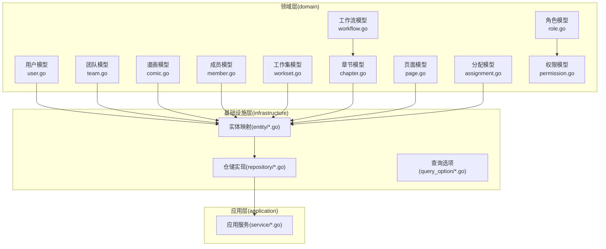

图表来源
- [backend/backend-v1/internal/domain/model/user.go:1-100](file://backend/backend-v1/internal/domain/model/user.go#L1-L100)
- [backend/backend-v1/internal/domain/model/team.go:1-63](file://backend/backend-v1/internal/domain/model/team.go#L1-L63)
- [backend/backend-v1/internal/domain/model/comic.go:1-107](file://backend/backend-v1/internal/domain/model/comic.go#L1-L107)
- [backend/backend-v1/internal/domain/model/member.go:1-205](file://backend/backend-v1/internal/domain/model/member.go#L1-L205)
- [backend/backend-v1/internal/domain/model/workset.go:1-82](file://backend/backend-v1/internal/domain/model/workset.go#L1-L82)
- [backend/backend-v1/internal/domain/model/chapter.go:1-260](file://backend/backend-v1/internal/domain/model/chapter.go#L1-L260)
- [backend/backend-v1/internal/domain/model/page.go:1-134](file://backend/backend-v1/internal/domain/model/page.go#L1-L134)
- [backend/backend-v1/internal/domain/model/assignment.go:1-190](file://backend/backend-v1/internal/domain/model/assignment.go#L1-L190)
- [backend/backend-v1/internal/domain/model/role.go:1-56](file://backend/backend-v1/internal/domain/model/role.go#L1-L56)
- [backend/backend-v1/internal/domain/model/permission.go:1-845](file://backend/backend-v1/internal/domain/model/permission.go#L1-L845)
- [backend/backend-v1/internal/domain/model/workflow.go:1-36](file://backend/backend-v1/internal/domain/model/workflow.go#L1-L36)

章节来源
- [backend/backend-v1/internal/domain/model/user.go:1-100](file://backend/backend-v1/internal/domain/model/user.go#L1-L100)
- [backend/backend-v1/internal/domain/model/team.go:1-63](file://backend/backend-v1/internal/domain/model/team.go#L1-L63)
- [backend/backend-v1/internal/domain/model/comic.go:1-107](file://backend/backend-v1/internal/domain/model/comic.go#L1-L107)
- [backend/backend-v1/internal/domain/model/member.go:1-205](file://backend/backend-v1/internal/domain/model/member.go#L1-L205)
- [backend/backend-v1/internal/domain/model/workset.go:1-82](file://backend/backend-v1/internal/domain/model/workset.go#L1-L82)
- [backend/backend-v1/internal/domain/model/chapter.go:1-260](file://backend/backend-v1/internal/domain/model/chapter.go#L1-L260)
- [backend/backend-v1/internal/domain/model/page.go:1-134](file://backend/backend-v1/internal/domain/model/page.go#L1-L134)
- [backend/backend-v1/internal/domain/model/assignment.go:1-190](file://backend/backend-v1/internal/domain/model/assignment.go#L1-L190)
- [backend/backend-v1/internal/domain/model/role.go:1-56](file://backend/backend-v1/internal/domain/model/role.go#L1-L56)
- [backend/backend-v1/internal/domain/model/permission.go:1-845](file://backend/backend-v1/internal/domain/model/permission.go#L1-L845)
- [backend/backend-v1/internal/domain/model/workflow.go:1-36](file://backend/backend-v1/internal/domain/model/workflow.go#L1-L36)

## 核心组件
本节对核心实体模型进行逐项解析，包括字段、类型、约束与业务含义。

- 用户(UserInfo)
  - 字段与类型：ID(string)、名称、QQ、头像OSS键、是否已上传头像(bool)、是否超级管理员(bool)、创建/更新时间(time.Time)
  - 约束：ID为主键；QQ可用于登录凭证绑定；IsSuperAdmin用于全局权限豁免
  - 业务含义：代表系统中的用户身份，支持登录凭据分离存储，避免泄露完整信息
  - 关联：作为漫画、章节、页面的创建者；作为成员与分配的关联方

- 团队(TeamInfo)
  - 字段与类型：ID(string)、名称、描述、头像OSS键、是否已上传头像(bool)、创建/更新时间(time.Time)
  - 约束：ID为主键
  - 业务含义：组织单位，成员在此内按角色分工协作；工作集归属团队

- 漫画(ComicInfo)
  - 字段与类型：ID(string)、WorksetID(string)、序号、标题、作者、描述、章节数量、创建者ID、最后活跃时间、创建/更新时间
  - 约束：WorksetID+Index唯一；CreatorID外键；索引覆盖WorksetID、创建时间、最后活跃时间
  - 业务含义：作品集合，承载章节与页面；统计章节数量，追踪最后活跃时间

- 成员(MemberInfo)
  - 字段与类型：ID(string)、用户ID、团队ID、各角色分配时间戳、创建/更新时间
  - 约束：ID为主键；Unique(团队ID, 用户ID)；角色分配以非空时间戳表示
  - 业务含义：记录用户在团队内的角色分工与生效时间；支持HasAnyRole查询

- 工作集(WorksetInfo)
  - 字段与类型：ID(string)、团队ID、序号、名称、描述、漫画数量、创建/更新时间
  - 约束：ID为主键；TeamID外键
  - 业务含义：团队内作品分组容器；ComicInfo归属Workset

- 章节(ChapterInfo)
  - 字段与类型：ID(string)、ComicID、序号、副标题、页面数量、单元统计、多阶段时间戳、创建者ID、创建/更新时间
  - 约束：ComicID+Index唯一；各阶段时间戳支持工作流状态推进
  - 业务含义：漫画分章；承载页面与单元统计；记录工作流各阶段完成时间

- 页面(PageInfo)
  - 字段与类型：ID(string)、ChapterID、索引、OSSKey、是否已上传、创建者ID、统计信息、创建/更新时间
  - 约束：ChapterID+Index唯一；OSSKey用于图片资源定位
  - 业务含义：章节内单页；单元编辑与校对的基础单元

- 分配(AssignmentInfo)
  - 字段与类型：ID(string)、ChapterID、UserID、各角色分配时间戳、创建/更新时间
  - 约束：Unique(ChapterID, UserID)；角色以时间戳标记生效
  - 业务含义：用户在章节上的角色授权；决定页面操作权限

- 角色(Role)
  - 角色枚举：原画提供、翻译、二校、排版、审阅、发布、团队管理员
  - 掩码机制：RoleMask位掩码；支持MaskRoles/UnmaskRoles转换

- 权限(Permission)
  - 设计：以“权限对象”封装Check方法，结合加载器函数OnLoadXxx进行上下文数据加载
  - 超级管理员：IsSuperAdmin豁免所有权限检查
  - 团队管理员：基于成员信息HasAnyRole(RoleAdmin)判定
  - 业务规则：不同资源的操作权限与团队成员关系强相关

- 工作流(Workflow/WorkflowStatus)
  - 工作流阶段：上传、翻译、二校、排版、审阅、发布
  - 状态：待处理、进行中、已完成、未设置
  - 校验：部分阶段仅允许特定状态组合

章节来源
- [backend/backend-v1/internal/domain/model/user.go:7-41](file://backend/backend-v1/internal/domain/model/user.go#L7-L41)
- [backend/backend-v1/internal/domain/model/team.go:5-35](file://backend/backend-v1/internal/domain/model/team.go#L5-L35)
- [backend/backend-v1/internal/domain/model/comic.go:5-58](file://backend/backend-v1/internal/domain/model/comic.go#L5-L58)
- [backend/backend-v1/internal/domain/model/member.go:48-99](file://backend/backend-v1/internal/domain/model/member.go#L48-L99)
- [backend/backend-v1/internal/domain/model/workset.go:5-42](file://backend/backend-v1/internal/domain/model/workset.go#L5-L42)
- [backend/backend-v1/internal/domain/model/chapter.go:5-81](file://backend/backend-v1/internal/domain/model/chapter.go#L5-L81)
- [backend/backend-v1/internal/domain/model/page.go:5-52](file://backend/backend-v1/internal/domain/model/page.go#L5-L52)
- [backend/backend-v1/internal/domain/model/assignment.go:5-55](file://backend/backend-v1/internal/domain/model/assignment.go#L5-L55)
- [backend/backend-v1/internal/domain/model/role.go:9-27](file://backend/backend-v1/internal/domain/model/role.go#L9-L27)
- [backend/backend-v1/internal/domain/model/permission.go:15-80](file://backend/backend-v1/internal/domain/model/permission.go#L15-L80)
- [backend/backend-v1/internal/domain/model/workflow.go:3-35](file://backend/backend-v1/internal/domain/model/workflow.go#L3-L35)

## 架构总览
下图展示实体模型在数据库层面的主外键关系与典型查询路径：

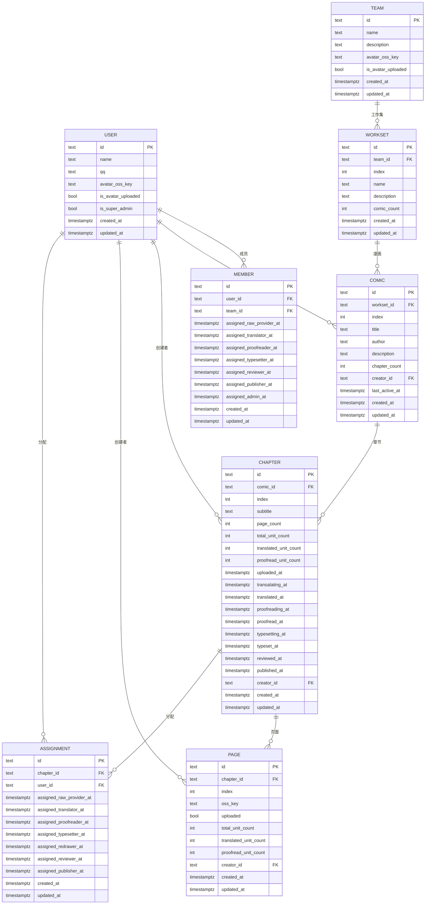

图表来源
- [backend/backend-v1/migrations/20260306101212_comic-table.up.sql:1-37](file://backend/backend-v1/migrations/20260306101212_comic-table.up.sql#L1-L37)
- [backend/backend-v1/migrations/20260306101213_chapter-table.up.sql:1-38](file://backend/backend-v1/migrations/20260306101213_chapter-table.up.sql#L1-L38)
- [backend/backend-v1/migrations/20260306101214_page-table.up.sql:1-25](file://backend/backend-v1/migrations/20260306101214_page-table.up.sql#L1-L25)
- [backend/backend-v1/migrations/20260306101215_assignment-table.up.sql:1-26](file://backend/backend-v1/migrations/20260306101215_assignment-table.up.sql#L1-L26)
- [backend/backend-v1/internal/domain/model/user.go:7-41](file://backend/backend-v1/internal/domain/model/user.go#L7-L41)
- [backend/backend-v1/internal/domain/model/team.go:5-35](file://backend/backend-v1/internal/domain/model/team.go#L5-L35)
- [backend/backend-v1/internal/domain/model/workset.go:5-42](file://backend/backend-v1/internal/domain/model/workset.go#L5-L42)
- [backend/backend-v1/internal/domain/model/comic.go:5-58](file://backend/backend-v1/internal/domain/model/comic.go#L5-L58)
- [backend/backend-v1/internal/domain/model/chapter.go:5-81](file://backend/backend-v1/internal/domain/model/chapter.go#L5-L81)
- [backend/backend-v1/internal/domain/model/page.go:5-52](file://backend/backend-v1/internal/domain/model/page.go#L5-L52)
- [backend/backend-v1/internal/domain/model/assignment.go:5-55](file://backend/backend-v1/internal/domain/model/assignment.go#L5-L55)

## 详细组件分析

### 用户(UserInfo)模型
- 数据结构
  - 基本字段：ID、名称、QQ、头像OSS键、是否已上传头像
  - 权限字段：是否超级管理员
  - 时间戳：创建/更新时间
- 业务要点
  - 登录凭据(UserCredentials)与用户信息分离，降低敏感信息泄露风险
  - 注册(UserCreation)携带初始角色掩码，便于初始化成员角色
  - 更新(UserUpdate)支持密码哈希更新，保持凭据安全
- 生命周期
  - 创建：NewUserInfo
  - 更新：NewUserUpdate
  - 查询：通过OnLoadUserInfo加载并进行权限校验

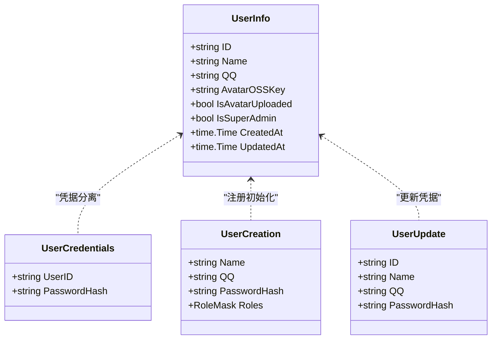

图表来源
- [backend/backend-v1/internal/domain/model/user.go:7-99](file://backend/backend-v1/internal/domain/model/user.go#L7-L99)

章节来源
- [backend/backend-v1/internal/domain/model/user.go:7-99](file://backend/backend-v1/internal/domain/model/user.go#L7-L99)

### 团队(TeamInfo)模型
- 数据结构
  - 基本字段：ID、名称、描述、头像OSS键、是否已上传头像
  - 时间戳：创建/更新时间
- 业务要点
  - 团队是工作集的容器，成员关系与权限边界以团队为单位
  - 头像OSS键用于统一资源管理
- 生命周期
  - 创建：NewTeamInfo/NewTeamCreation
  - 更新：NewTeamUpdate
  - 查询：通过OnLoadWorksetInfo/OnLoadMemberInfo联动

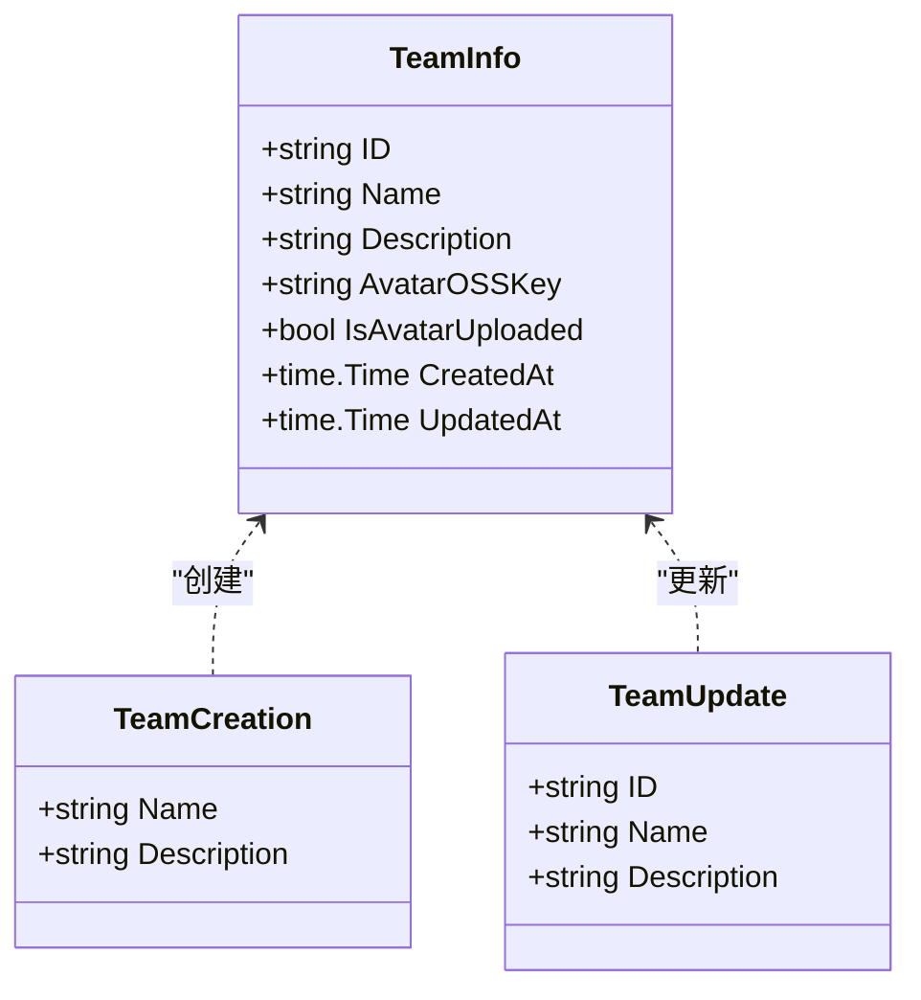

图表来源
- [backend/backend-v1/internal/domain/model/team.go:5-62](file://backend/backend-v1/internal/domain/model/team.go#L5-L62)

章节来源
- [backend/backend-v1/internal/domain/model/team.go:5-62](file://backend/backend-v1/internal/domain/model/team.go#L5-L62)

### 漫画(ComicInfo)模型
- 数据结构
  - 基本字段：ID、WorksetID、Index、Title、Author、Description、ChapterCount、CreatorID、LastActiveAt
  - 时间戳：Created/Updated
- 约束与索引
  - 唯一索引：(WorksetID, Index)
  - 索引：WorksetID+CreatedAt降序、CreatorID、WorksetID+LastActiveAt降序
- 业务要点
  - 漫画属于工作集；统计章节数量；LastActiveAt用于排序与活跃度追踪
- 生命周期
  - 创建：NewComicInfo/NewComicCreation
  - 更新：NewComicUpdate
  - 查询：支持包含Workset/User信息

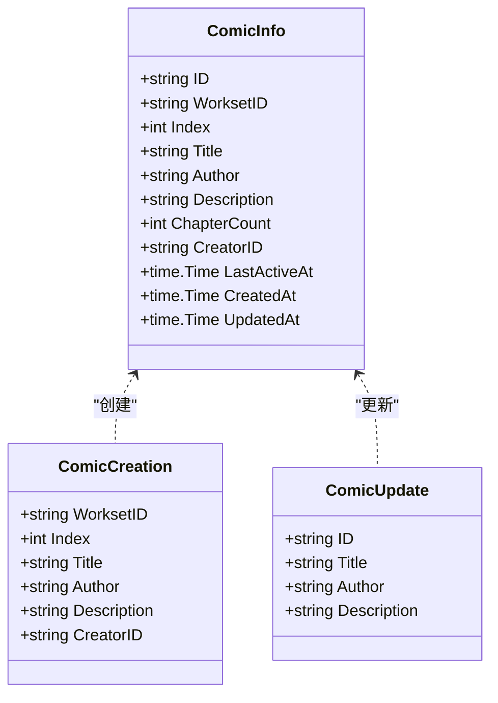

图表来源
- [backend/backend-v1/internal/domain/model/comic.go:5-106](file://backend/backend-v1/internal/domain/model/comic.go#L5-L106)
- [backend/backend-v1/migrations/20260306101212_comic-table.up.sql:1-37](file://backend/backend-v1/migrations/20260306101212_comic-table.up.sql#L1-L37)

章节来源
- [backend/backend-v1/internal/domain/model/comic.go:5-106](file://backend/backend-v1/internal/domain/model/comic.go#L5-L106)
- [backend/backend-v1/migrations/20260306101212_comic-table.up.sql:1-37](file://backend/backend-v1/migrations/20260306101212_comic-table.up.sql#L1-L37)

### 成员(MemberInfo)与角色(Role)模型
- 数据结构
  - 基本字段：ID、UserID、TeamID、各角色分配时间戳
  - 时间戳：Created/Updated
- 角色掩码
  - RoleFlag枚举与RoleMask位运算；支持HasAnyRole/Roles查询
- 业务要点
  - 成员角色以“分配时间戳非空”表示生效；支持批量角色掩码计算
  - MemberCreation支持从RoleFlag切片构造目标角色
- 生命周期
  - 创建：NewMemberInfo/NewMemberCreation
  - 更新：NewMemberUpdate（保留已有角色时间戳）

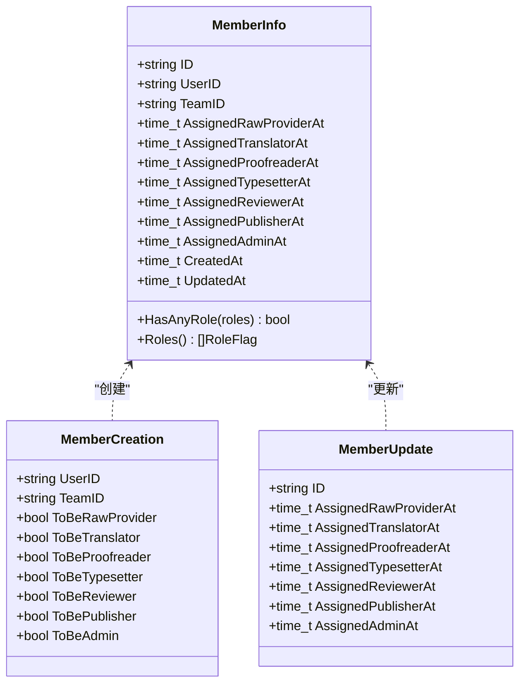

图表来源
- [backend/backend-v1/internal/domain/model/member.go:48-204](file://backend/backend-v1/internal/domain/model/member.go#L48-L204)
- [backend/backend-v1/internal/domain/model/role.go:9-55](file://backend/backend-v1/internal/domain/model/role.go#L9-L55)

章节来源
- [backend/backend-v1/internal/domain/model/member.go:48-204](file://backend/backend-v1/internal/domain/model/member.go#L48-L204)
- [backend/backend-v1/internal/domain/model/role.go:9-55](file://backend/backend-v1/internal/domain/model/role.go#L9-L55)

### 工作集(WorksetInfo)模型
- 数据结构
  - 基本字段：ID、TeamID、Index、Name、Description、ComicCount
  - 时间戳：Created/Updated
- 业务要点
  - 作为漫画的分组容器；ComicCount用于统计
- 生命周期
  - 创建：NewWorksetInfo/NewWorksetCreation
  - 更新：NewWorksetUpdate

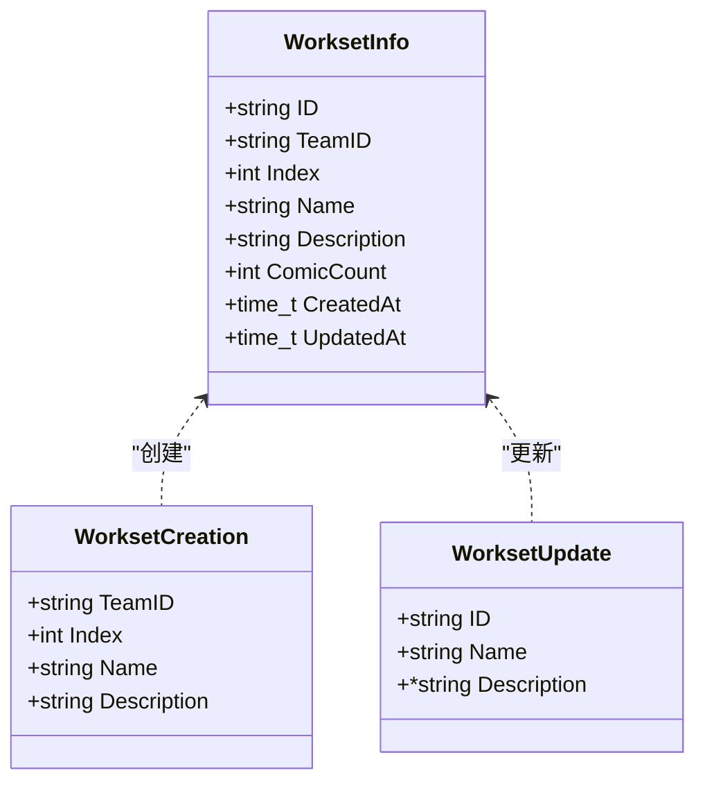

图表来源
- [backend/backend-v1/internal/domain/model/workset.go:5-81](file://backend/backend-v1/internal/domain/model/workset.go#L5-L81)

章节来源
- [backend/backend-v1/internal/domain/model/workset.go:5-81](file://backend/backend-v1/internal/domain/model/workset.go#L5-L81)

### 章节(ChapterInfo)与页面(PageInfo)模型
- 章节
  - 字段：ComicID、Index、Subtitle、PageCount、单元统计、多阶段时间戳、CreatorID
  - 约束：ComicID+Index唯一；各阶段时间戳支持工作流推进
- 页面
  - 字段：ChapterID、Index、OSSKey、是否已上传、统计信息、CreatorID
  - 约束：ChapterID+Index唯一；OSSKey指向图片资源
- 生命周期
  - 章节：NewChapterDetail/NewChapterCreation/NewChapterUpdate
  - 页面：NewPageInfo/NewPageCreation/NewPageUpdate

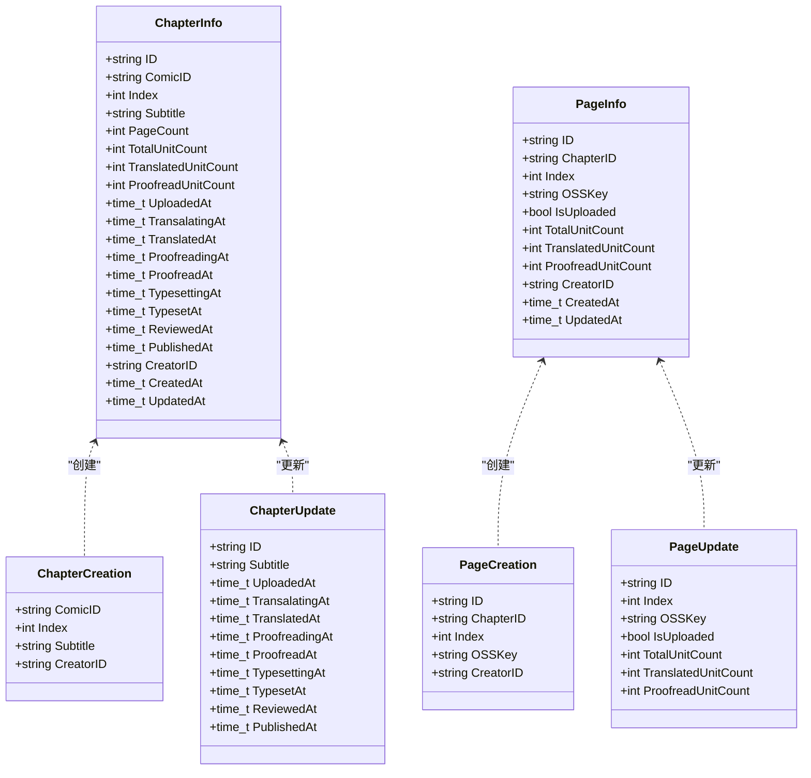

图表来源
- [backend/backend-v1/internal/domain/model/chapter.go:5-259](file://backend/backend-v1/internal/domain/model/chapter.go#L5-L259)
- [backend/backend-v1/internal/domain/model/page.go:5-133](file://backend/backend-v1/internal/domain/model/page.go#L5-L133)

章节来源
- [backend/backend-v1/internal/domain/model/chapter.go:5-259](file://backend/backend-v1/internal/domain/model/chapter.go#L5-L259)
- [backend/backend-v1/internal/domain/model/page.go:5-133](file://backend/backend-v1/internal/domain/model/page.go#L5-L133)

### 分配(AssignmentInfo)模型
- 数据结构
  - 字段：ID、ChapterID、UserID、各角色分配时间戳
  - 约束：Unique(ChapterID, UserID)
- 业务要点
  - 决定用户在章节上的操作权限；HasAnyRole/RoleMask用于权限判断
- 生命周期
  - 创建：NewAssignmentInfo/NewAssignmentCreation
  - 更新：NewAssignmentUpdate（保留已有角色时间戳）

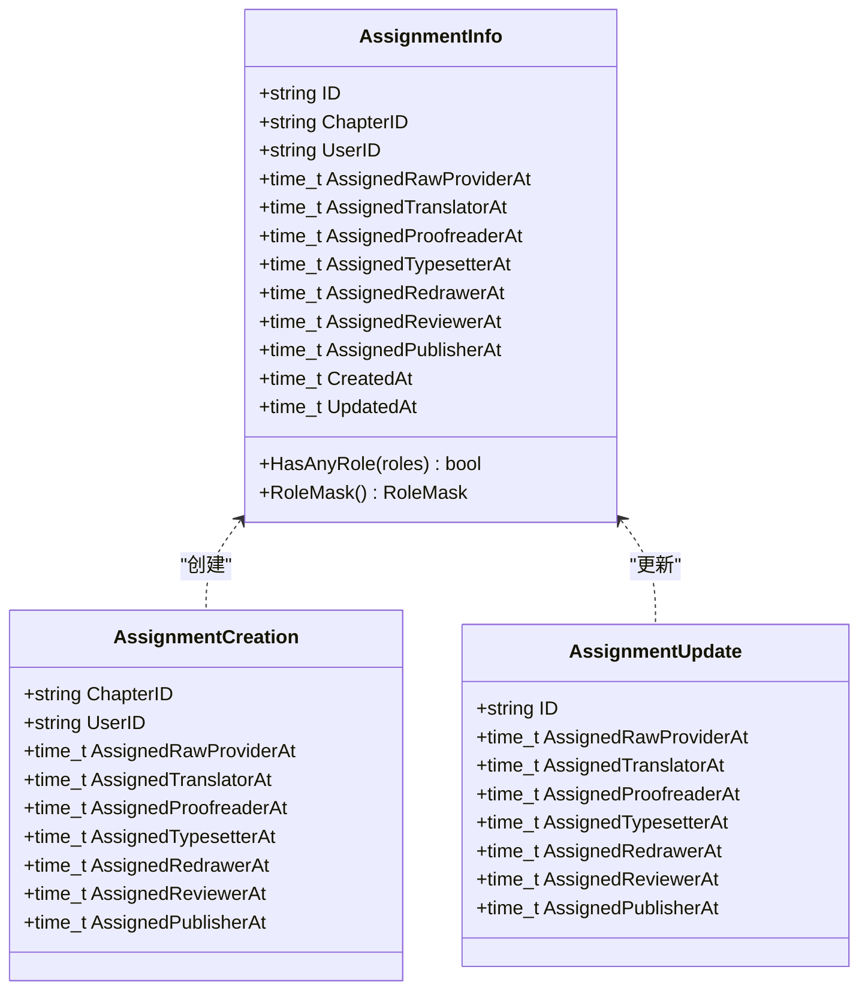

图表来源
- [backend/backend-v1/internal/domain/model/assignment.go:5-189](file://backend/backend-v1/internal/domain/model/assignment.go#L5-L189)

章节来源
- [backend/backend-v1/internal/domain/model/assignment.go:5-189](file://backend/backend-v1/internal/domain/model/assignment.go#L5-L189)

### 权限(Permission)与工作流(Workflow)模型
- 权限
  - 设计：以“权限对象”封装Check方法，结合加载器函数OnLoadXxx进行上下文数据加载
  - 超级管理员：IsSuperAdmin豁免所有权限检查
  - 团队管理员：基于成员信息HasAnyRole(RoleAdmin)判定
  - 资源权限：邀请、用户、团队、成员、漫画、章节、分配、页面、单元等均有对应权限对象
- 工作流
  - 阶段：上传、翻译、二校、排版、审阅、发布
  - 状态：待处理、进行中、已完成、未设置
  - 校验：IsValidWorkflowCombination确保状态与阶段匹配

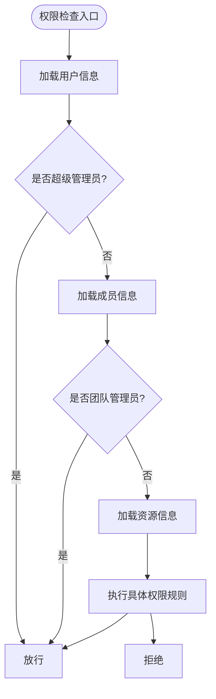

图表来源
- [backend/backend-v1/internal/domain/model/permission.go:15-80](file://backend/backend-v1/internal/domain/model/permission.go#L15-L80)
- [backend/backend-v1/internal/domain/model/permission.go:212-246](file://backend/backend-v1/internal/domain/model/permission.go#L212-L246)
- [backend/backend-v1/internal/domain/model/permission.go:424-446](file://backend/backend-v1/internal/domain/model/permission.go#L424-L446)

章节来源
- [backend/backend-v1/internal/domain/model/permission.go:15-80](file://backend/backend-v1/internal/domain/model/permission.go#L15-L80)
- [backend/backend-v1/internal/domain/model/permission.go:212-246](file://backend/backend-v1/internal/domain/model/permission.go#L212-L246)
- [backend/backend-v1/internal/domain/model/permission.go:424-446](file://backend/backend-v1/internal/domain/model/permission.go#L424-L446)
- [backend/backend-v1/internal/domain/model/workflow.go:24-35](file://backend/backend-v1/internal/domain/model/workflow.go#L24-L35)

## 依赖分析
- 实体间依赖
  - 用户(User)与成员(Member)：一对多；成员记录用户在团队内的角色
  - 团队(Team)与工作集(Workset)：一对多；工作集归属团队
  - 工作集(Workset)与漫画(Comic)：一对多；漫画归属工作集
  - 漫画(Comic)与章节(Chapter)：一对多；章节归属漫画
  - 章节(Chapter)与页面(Page)：一对多；页面归属章节
  - 用户(User)与分配(Assignment)：一对多；用户在章节上被分配角色
  - 章节(Chapter)与分配(Assignment)：一对多；章节上有多人分配
- 权限依赖
  - 权限检查依赖加载器函数OnLoadXxx；超级管理员豁免；团队管理员基于成员信息
- 索引与约束
  - 唯一索引保证(WorksetID, Index)、(ComicID, Index)、(ChapterID, Index)
  - 外键约束保证引用完整性；软删除字段deleted_at配合WHERE过滤

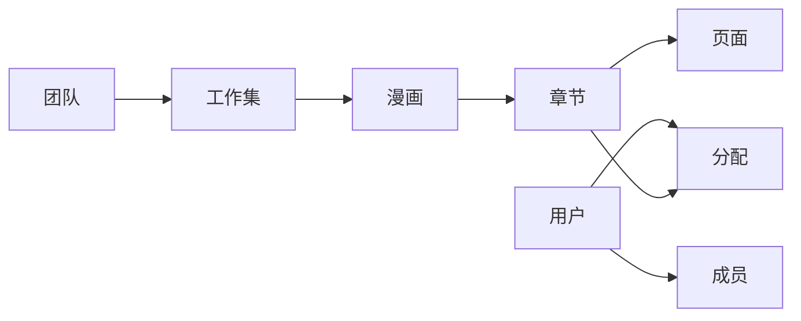

图表来源
- [backend/backend-v1/migrations/20260306101212_comic-table.up.sql:1-37](file://backend/backend-v1/migrations/20260306101212_comic-table.up.sql#L1-L37)
- [backend/backend-v1/migrations/20260306101213_chapter-table.up.sql:1-38](file://backend/backend-v1/migrations/20260306101213_chapter-table.up.sql#L1-L38)
- [backend/backend-v1/migrations/20260306101214_page-table.up.sql:1-25](file://backend/backend-v1/migrations/20260306101214_page-table.up.sql#L1-L25)
- [backend/backend-v1/migrations/20260306101215_assignment-table.up.sql:1-26](file://backend/backend-v1/migrations/20260306101215_assignment-table.up.sql#L1-L26)

章节来源
- [backend/backend-v1/migrations/20260306101212_comic-table.up.sql:1-37](file://backend/backend-v1/migrations/20260306101212_comic-table.up.sql#L1-L37)
- [backend/backend-v1/migrations/20260306101213_chapter-table.up.sql:1-38](file://backend/backend-v1/migrations/20260306101213_chapter-table.up.sql#L1-L38)
- [backend/backend-v1/migrations/20260306101214_page-table.up.sql:1-25](file://backend/backend-v1/migrations/20260306101214_page-table.up.sql#L1-L25)
- [backend/backend-v1/migrations/20260306101215_assignment-table.up.sql:1-26](file://backend/backend-v1/migrations/20260306101215_assignment-table.up.sql#L1-L26)

## 性能考虑
- 索引策略
  - 漫画：按(WorksetID, Index)唯一索引；(WorksetID, CreatedAt DESC)、(CreatorID)、(WorksetID, LastActiveAt DESC)辅助查询与排序
  - 章节：按(ComicID, Index DESC)唯一索引；(ComicID)索引加速章节列表
  - 页面：按(ChapterID, Index)唯一索引；(ChapterID)索引加速页面列表
  - 分配：按(ChapterID, User_ID)唯一索引；分别对(ChapterID)、(User_ID)建立索引
- 软删除
  - 表均含deleted_at字段，查询时使用WHERE deleted_at IS NULL过滤，避免全表扫描
- 工作流状态更新
  - 章节状态更新采用条件赋值，仅在必要时写入时间戳，减少冗余写入

## 故障排查指南
- 权限检查失败
  - 确认用户是否为超级管理员；检查团队成员关系与角色分配
  - 使用日志输出的错误上下文定位加载器函数失败原因
- 唯一索引冲突
  - 漫画/章节/页面的唯一索引冲突通常源于重复Index或重复(WorksetID, Index)/(ComicID, Index)/(ChapterID, Index)
- 外键约束失败
  - 删除/更新上游实体时需遵循ON DELETE策略；注意软删除场景下的过滤条件
- 工作流状态异常
  - 校验状态与阶段组合是否符合IsValidWorkflowCombination；避免非法状态推进

章节来源
- [backend/backend-v1/internal/domain/model/permission.go:33-44](file://backend/backend-v1/internal/domain/model/permission.go#L33-L44)
- [backend/backend-v1/internal/domain/model/permission.go:86-98](file://backend/backend-v1/internal/domain/model/permission.go#L86-L98)
- [backend/backend-v1/internal/domain/model/workflow.go:24-35](file://backend/backend-v1/internal/domain/model/workflow.go#L24-L35)

## 结论
Poprako 的核心实体模型以清晰的领域边界与严格的主外键约束为基础，结合角色掩码与权限对象实现了细粒度的权限控制。通过工作流状态机与统计字段，系统在保证数据一致性的同时，提供了高效的查询与更新能力。建议在后续演进中持续完善索引覆盖与缓存策略，以进一步提升高并发场景下的响应性能。

## 附录
- 索引与约束清单
  - 漫画：唯一索引(WorksetID, Index)、索引(WorksetID, CreatedAt DESC)、(CreatorID)、(WorksetID, LastActiveAt DESC)
  - 章节：唯一索引(ComicID, Index DESC)、索引(ComicID)
  - 页面：唯一索引(ChapterID, Index)、索引(ChapterID)
  - 分配：唯一索引(ChapterID, User_ID)、索引(ChapterID)、(User_ID)
- 业务规则摘要
  - 超级管理员拥有全局豁免权限
  - 团队管理员仅在所属团队内拥有相应权限
  - 页面与单元操作权限基于章节分配的角色决定
  - 工作流状态推进遵循阶段与状态组合规则