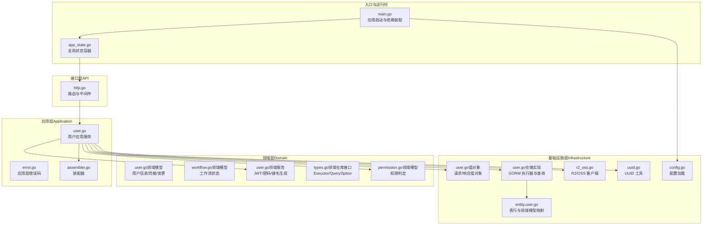
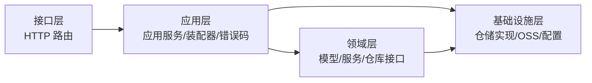
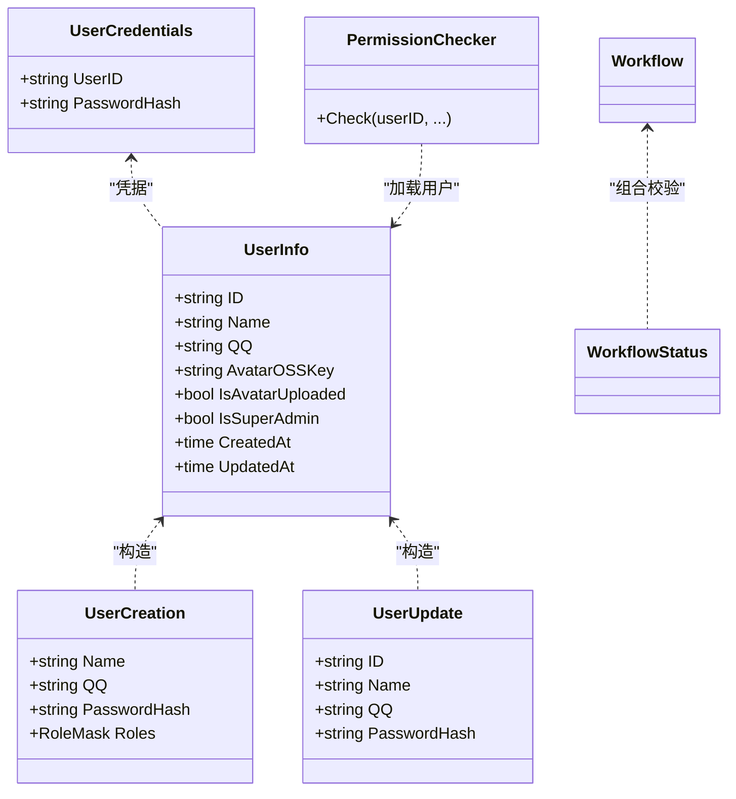
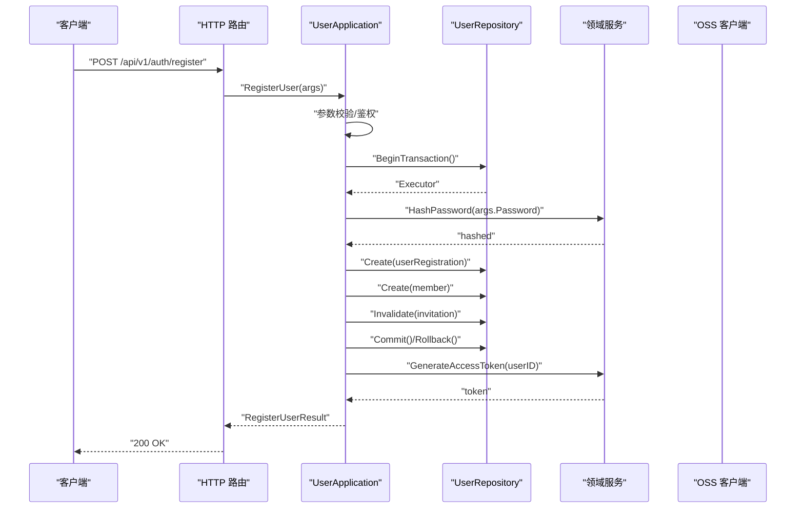
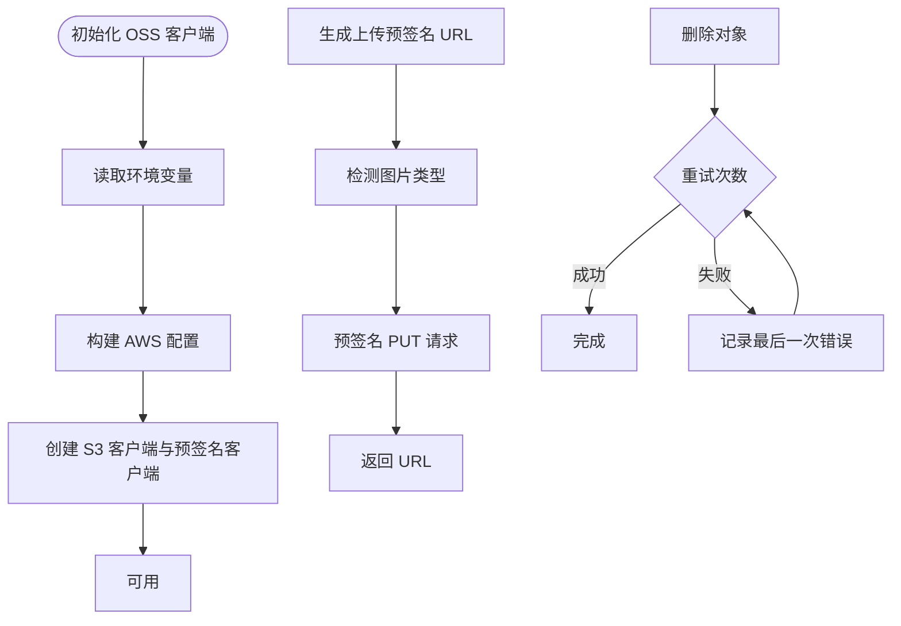
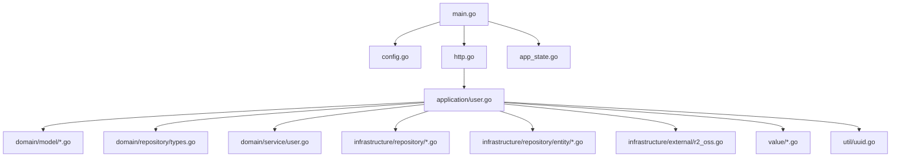

# DDD 分层架构

<cite>
**本文引用的文件**
- [main.go](file://backend/backend-v1/main.go)
- [app_state.go](file://backend/backend-v1/internal/state/app_state.go)
- [http.go](file://backend/backend-v1/internal/api/http/http.go)
- [config.go](file://backend/backend-v1/internal/config/config.go)
- [user.go（领域模型）](file://backend/backend-v1/internal/domain/model/user.go)
- [workflow.go（领域模型）](file://backend/backend-v1/internal/domain/model/workflow.go)
- [permission.go（领域模型）](file://backend/backend-v1/internal/domain/model/permission.go)
- [types.go（领域仓库接口）](file://backend/backend-v1/internal/domain/repository/types.go)
- [user.go（应用服务）](file://backend/backend-v1/internal/application/user.go)
- [error.go（应用层错误码）](file://backend/backend-v1/internal/application/error.go)
- [assembler.go（应用装配器）](file://backend/backend-v1/internal/application/assembler/user.go)
- [user.go（基础设施仓储）](file://backend/backend-v1/internal/infrastructure/repository/user.go)
- [entity.user.go（实体映射）](file://backend/backend-v1/internal/infrastructure/repository/entity/user.go)
- [r2_oss.go（基础设施外部服务）](file://backend/backend-v1/internal/infrastructure/external/r2_oss.go)
- [user.go（值对象）](file://backend/backend-v1/internal/value/user.go)
- [user.go（领域服务）](file://backend/backend-v1/internal/domain/service/user.go)
- [uuid.go（工具）](file://backend/backend-v1/internal/util/uuid.go)
</cite>

## 目录
1. [引言](#引言)
2. [项目结构](#项目结构)
3. [核心组件](#核心组件)
4. [架构总览](#架构总览)
5. [详细组件分析](#详细组件分析)
6. [依赖关系分析](#依赖关系分析)
7. [性能考量](#性能考量)
8. [故障排查指南](#故障排查指南)
9. [结论](#结论)
10. [附录](#附录)

## 引言
本文件面向 Poprako 项目的 DDD 分层架构文档，系统性阐述领域驱动设计三层架构的实现：领域层（Domain）、应用层（Application）、基础设施层（Infrastructure）。重点说明：
- 每层职责边界与设计原则
- 领域模型层的充血模型策略与权限模型
- 应用服务层如何协调领域逻辑与基础设施操作
- 基础设施层如何抽象数据库、外部服务等技术细节
- 层间依赖关系与数据流向
- 结合具体文件路径给出实现模式与最佳实践

## 项目结构
后端采用 Go 模块化分层组织，入口位于 main.go，通过状态对象集中注入各应用服务；HTTP 路由在 API 层注册；应用层协调领域与基础设施；基础设施层封装数据库与外部存储。

图表来源
- [main.go:25-145](file://backend/backend-v1/main.go#L25-L145)
- [app_state.go:23-49](file://backend/backend-v1/internal/state/app_state.go#L23-L49)
- [http.go:16-151](file://backend/backend-v1/internal/api/http/http.go#L16-L151)
- [user.go（应用服务）:75-104](file://backend/backend-v1/internal/application/user.go#L75-L104)
- [user.go（领域模型）:21-100](file://backend/backend-v1/internal/domain/model/user.go#L21-L100)
- [workflow.go（领域模型）:24-35](file://backend/backend-v1/internal/domain/model/workflow.go#L24-L35)
- [permission.go（领域模型）:260-300](file://backend/backend-v1/internal/domain/model/permission.go#L260-L300)
- [types.go（领域仓库接口）:5-12](file://backend/backend-v1/internal/domain/repository/types.go#L5-L12)
- [user.go（基础设施仓储）:16-30](file://backend/backend-v1/internal/infrastructure/repository/user.go#L16-L30)
- [entity.user.go:25-36](file://backend/backend-v1/internal/infrastructure/repository/entity/user.go#L25-L36)
- [r2_oss.go:29-79](file://backend/backend-v1/internal/infrastructure/external/r2_oss.go#L29-L79)
- [config.go:11-59](file://backend/backend-v1/internal/config/config.go#L11-L59)
- [user.go（值对象）:8-27](file://backend/backend-v1/internal/value/user.go#L8-L27)
- [user.go（领域服务）:15-41](file://backend/backend-v1/internal/domain/service/user.go#L15-L41)
- [uuid.go:5-12](file://backend/backend-v1/internal/util/uuid.go#L5-L12)

章节来源
- [main.go:25-145](file://backend/backend-v1/main.go#L25-L145)
- [http.go:16-151](file://backend/backend-v1/internal/api/http/http.go#L16-L151)

## 核心组件
- 入口与状态
  - main.go：加载环境与配置，构建数据库执行器与 OSS 客户端，实例化各应用服务，并注入到 AppState，随后启动 HTTP 服务器。
  - app_state.go：集中持有应用层服务与配置，作为全局依赖容器。
- 接口层（API）
  - http.go：注册认证、用户、团队、成员、邀请、漫画、工作集、章节、页面、分配、单元等路由，统一中间件与 Swagger。
- 应用层（Application）
  - user.go：实现用户登录、注册、查询、头像预留/确认、更新、删除等业务流程，协调仓库、领域服务与 OSS。
  - assembler/user.go：将领域模型转换为应用层值对象，按需加载预签名 URL。
  - error.go：统一应用层错误码常量。
- 领域层（Domain）
  - model/user.go：用户信息、凭据、创建/更新值对象，构造函数封装不变量。
  - model/workflow.go：工作流类型与状态组合有效性校验。
  - model/permission.go：权限判定接口与各类权限规则，支持超级管理员、汉化组管理员、成员角色等。
  - domain/repository/types.go：Executor、QueryOption、Transactor 抽象，屏蔽底层 ORM 细节。
  - domain/service/user.go：JWT 生成/解析、密码哈希/校验、头像键名生成等纯领域服务。
- 基础设施层（Infrastructure）
  - infrastructure/repository/user.go：基于 GORM 的仓储实现，封装 CRUD、事务、查询选项。
  - infrastructure/repository/entity/user.go：表行结构与领域模型映射。
  - infrastructure/external/r2_oss.go：R2/OSS 客户端，生成上传/下载预签名 URL，带重试与错误处理。
  - config/config.go：配置加载与环境判断。
  - value/user.go：请求/响应值对象，参数校验。
  - util/uuid.go：UUID 生成工具。

章节来源
- [main.go:25-145](file://backend/backend-v1/main.go#L25-L145)
- [app_state.go:8-21](file://backend/backend-v1/internal/state/app_state.go#L8-L21)
- [http.go:16-151](file://backend/backend-v1/internal/api/http/http.go#L16-L151)
- [user.go（应用服务）:21-64](file://backend/backend-v1/internal/application/user.go#L21-L64)
- [assembler.go:10-33](file://backend/backend-v1/internal/application/assembler/user.go#L10-L33)
- [error.go:3-7](file://backend/backend-v1/internal/application/error.go#L3-L7)
- [user.go（领域模型）:21-100](file://backend/backend-v1/internal/domain/model/user.go#L21-L100)
- [workflow.go（领域模型）:24-35](file://backend/backend-v1/internal/domain/model/workflow.go#L24-L35)
- [permission.go（领域模型）:260-300](file://backend/backend-v1/internal/domain/model/permission.go#L260-L300)
- [types.go（领域仓库接口）:5-12](file://backend/backend-v1/internal/domain/repository/types.go#L5-L12)
- [user.go（基础设施仓储）:16-30](file://backend/backend-v1/internal/infrastructure/repository/user.go#L16-L30)
- [entity.user.go:25-36](file://backend/backend-v1/internal/infrastructure/repository/entity/user.go#L25-L36)
- [r2_oss.go:29-79](file://backend/backend-v1/internal/infrastructure/external/r2_oss.go#L29-L79)
- [config.go:11-59](file://backend/backend-v1/internal/config/config.go#L11-L59)
- [user.go（值对象）:8-27](file://backend/backend-v1/internal/value/user.go#L8-L27)
- [user.go（领域服务）:15-41](file://backend/backend-v1/internal/domain/service/user.go#L15-L41)
- [uuid.go:5-12](file://backend/backend-v1/internal/util/uuid.go#L5-L12)

## 架构总览
三层架构遵循“依赖倒置”与“关注点分离”：
- 领域层：承载核心业务规则与不变量，不依赖外部框架。
- 应用层：编排业务用例，协调领域与基础设施，保持业务无侵入。
- 基础设施层：抽象数据库、外部服务等技术细节，向上提供稳定接口。

图表来源
- [http.go:16-151](file://backend/backend-v1/internal/api/http/http.go#L16-L151)
- [user.go（应用服务）:75-104](file://backend/backend-v1/internal/application/user.go#L75-L104)
- [user.go（领域模型）:21-100](file://backend/backend-v1/internal/domain/model/user.go#L21-L100)
- [user.go（基础设施仓储）:16-30](file://backend/backend-v1/internal/infrastructure/repository/user.go#L16-L30)
- [r2_oss.go:29-79](file://backend/backend-v1/internal/infrastructure/external/r2_oss.go#L29-L79)

## 详细组件分析

### 领域层（Domain）
- 充血模型策略
  - 领域模型以值对象与构造函数承载不变量，如用户信息、凭据、创建/更新参数均通过工厂方法构造，避免无效状态进入系统。
  - 权限判定以“权限对象 + 加载器回调”的方式实现，既保证权限规则集中在领域层，又允许应用层按需注入上下文。
  - 工作流状态校验函数集中于领域层，确保业务约束在上游被拦截。
- 关键文件
  - [user.go（领域模型）:21-100](file://backend/backend-v1/internal/domain/model/user.go#L21-L100)
  - [workflow.go（领域模型）:24-35](file://backend/backend-v1/internal/domain/model/workflow.go#L24-L35)
  - [permission.go（领域模型）:260-300](file://backend/backend-v1/internal/domain/model/permission.go#L260-L300)
  - [types.go（领域仓库接口）:5-12](file://backend/backend-v1/internal/domain/repository/types.go#L5-L12)
  - [user.go（领域服务）:15-41](file://backend/backend-v1/internal/domain/service/user.go#L15-L41)

图表来源
- [user.go（领域模型）:21-100](file://backend/backend-v1/internal/domain/model/user.go#L21-L100)
- [workflow.go（领域模型）:24-35](file://backend/backend-v1/internal/domain/model/workflow.go#L24-L35)
- [permission.go（领域模型）:260-300](file://backend/backend-v1/internal/domain/model/permission.go#L260-L300)

章节来源
- [user.go（领域模型）:21-100](file://backend/backend-v1/internal/domain/model/user.go#L21-L100)
- [workflow.go（领域模型）:24-35](file://backend/backend-v1/internal/domain/model/workflow.go#L24-L35)
- [permission.go（领域模型）:260-300](file://backend/backend-v1/internal/domain/model/permission.go#L260-L300)
- [types.go（领域仓库接口）:5-12](file://backend/backend-v1/internal/domain/repository/types.go#L5-L12)
- [user.go（领域服务）:15-41](file://backend/backend-v1/internal/domain/service/user.go#L15-L41)

### 应用层（Application）
- 协调职责
  - 应用服务负责用例编排：参数校验、鉴权、事务控制、跨仓库协作、与外部服务交互。
  - 使用装配器将领域模型转换为对外值对象，必要时加载预签名 URL。
  - 错误码统一管理，便于接口层标准化响应。
- 关键文件
  - [user.go（应用服务）:21-64](file://backend/backend-v1/internal/application/user.go#L21-L64)
  - [user.go（应用服务）:106-278](file://backend/backend-v1/internal/application/user.go#L106-L278)
  - [assembler.go:10-33](file://backend/backend-v1/internal/application/assembler/user.go#L10-L33)
  - [error.go:3-7](file://backend/backend-v1/internal/application/error.go#L3-L7)

图表来源
- [http.go:42-45](file://backend/backend-v1/internal/api/http/http.go#L42-L45)
- [user.go（应用服务）:156-278](file://backend/backend-v1/internal/application/user.go#L156-L278)
- [user.go（基础设施仓储）:28-30](file://backend/backend-v1/internal/infrastructure/repository/user.go#L28-L30)
- [user.go（领域服务）:76-84](file://backend/backend-v1/internal/domain/service/user.go#L76-L84)

章节来源
- [user.go（应用服务）:21-64](file://backend/backend-v1/internal/application/user.go#L21-L64)
- [user.go（应用服务）:106-278](file://backend/backend-v1/internal/application/user.go#L106-L278)
- [assembler.go:10-33](file://backend/backend-v1/internal/application/assembler/user.go#L10-L33)
- [error.go:3-7](file://backend/backend-v1/internal/application/error.go#L3-L7)

### 基础设施层（Infrastructure）
- 数据库抽象
  - 仓储实现通过 Executor 接口屏蔽 GORM 细节，支持查询选项链式组合与事务封装。
  - 实体映射文件将表行结构与领域模型互转，避免 ORM 对领域模型的污染。
- 外部服务抽象
  - R2/OSS 客户端封装预签名 URL 生成、删除与批量删除，内置重试与错误分类处理。
- 配置与工具
  - 配置加载统一从环境变量与 JSON 文件读取，支持开发/生产环境切换。
  - UUID 工具提供稳定 ID 生成。

图表来源
- [r2_oss.go:29-79](file://backend/backend-v1/internal/infrastructure/external/r2_oss.go#L29-L79)
- [r2_oss.go:81-99](file://backend/backend-v1/internal/infrastructure/external/r2_oss.go#L81-L99)
- [r2_oss.go:109-140](file://backend/backend-v1/internal/infrastructure/external/r2_oss.go#L109-L140)
- [r2_oss.go:142-198](file://backend/backend-v1/internal/infrastructure/external/r2_oss.go#L142-L198)

章节来源
- [user.go（基础设施仓储）:16-30](file://backend/backend-v1/internal/infrastructure/repository/user.go#L16-L30)
- [entity.user.go:25-36](file://backend/backend-v1/internal/infrastructure/repository/entity/user.go#L25-L36)
- [r2_oss.go:29-79](file://backend/backend-v1/internal/infrastructure/external/r2_oss.go#L29-L79)
- [config.go:11-59](file://backend/backend-v1/internal/config/config.go#L11-L59)
- [uuid.go:5-12](file://backend/backend-v1/internal/util/uuid.go#L5-L12)

## 依赖关系分析
- 入口依赖
  - main.go 依赖配置、日志、HTTP、应用层与基础设施模块，完成依赖注入与服务启动。
- 应用层依赖
  - 应用服务依赖领域模型、领域服务、装配器、值对象、仓库接口与外部 OSS 客户端。
- 领域层依赖
  - 领域模型与服务不依赖应用/基础设施层，保持纯净。
- 基础设施层依赖
  - 仓储实现依赖实体映射与领域仓库接口；OSS 客户端依赖 AWS SDK。

图表来源
- [main.go:30-145](file://backend/backend-v1/main.go#L30-L145)
- [http.go:16-151](file://backend/backend-v1/internal/api/http/http.go#L16-L151)
- [app_state.go:23-49](file://backend/backend-v1/internal/state/app_state.go#L23-L49)
- [user.go（应用服务）:75-104](file://backend/backend-v1/internal/application/user.go#L75-L104)

章节来源
- [main.go:30-145](file://backend/backend-v1/main.go#L30-L145)
- [http.go:16-151](file://backend/backend-v1/internal/api/http/http.go#L16-L151)
- [app_state.go:23-49](file://backend/backend-v1/internal/state/app_state.go#L23-L49)
- [user.go（应用服务）:75-104](file://backend/backend-v1/internal/application/user.go#L75-L104)

## 性能考量
- 事务与批量操作
  - 注册流程在单事务内完成用户、成员、邀请状态变更，减少一致性风险与往返开销。
- 预签名 URL
  - 头像上传采用预签名 URL，降低服务端中转压力，提升上传吞吐。
- 查询优化
  - 仓储通过 QueryOption 组合过滤条件，避免一次性加载全量数据；软删除字段统一过滤。
- 外部服务重试
  - OSS 删除操作具备指数退避与最大重试次数，提高可靠性与稳定性。

章节来源
- [user.go（应用服务）:199-261](file://backend/backend-v1/internal/application/user.go#L199-L261)
- [r2_oss.go:109-140](file://backend/backend-v1/internal/infrastructure/external/r2_oss.go#L109-L140)
- [r2_oss.go:142-198](file://backend/backend-v1/internal/infrastructure/external/r2_oss.go#L142-L198)
- [user.go（基础设施仓储）:32-71](file://backend/backend-v1/internal/infrastructure/repository/user.go#L32-L71)

## 故障排查指南
- 登录/注册失败
  - 检查 JWT 秘钥与数据库连接是否正确加载。
  - 关注应用层日志与错误码，确认参数校验与权限检查是否通过。
- 头像上传异常
  - 确认 OSS 预签名 URL 生成与上传请求头 Content-Type 是否匹配。
  - 观察删除/批量删除重试日志，定位 NoSuchKey 与网络错误。
- 数据库事务回滚
  - 查看应用层事务回滚日志，确认任一步骤失败后的回滚是否成功。

章节来源
- [config.go:11-59](file://backend/backend-v1/internal/config/config.go#L11-L59)
- [user.go（应用服务）:124-154](file://backend/backend-v1/internal/application/user.go#L124-L154)
- [r2_oss.go:81-99](file://backend/backend-v1/internal/infrastructure/external/r2_oss.go#L81-L99)
- [r2_oss.go:109-140](file://backend/backend-v1/internal/infrastructure/external/r2_oss.go#L109-L140)

## 结论
Poprako 的 DDD 分层架构清晰地划分了职责边界：领域层专注业务不变量与规则，应用层编排业务用例并协调外部资源，基础设施层抽象技术细节。通过充血模型、权限判定、事务与预签名 URL 等实践，系统在可维护性、扩展性与性能方面取得平衡。建议持续完善权限细化与错误码标准化，逐步开放更多列表/分页接口。

## 附录
- 最佳实践清单
  - 领域层：以构造函数与工厂方法约束状态，权限规则集中于领域层。
  - 应用层：用例内统一参数校验、鉴权与事务，装配器负责值对象转换。
  - 基础设施层：抽象外部服务与数据库，提供稳定接口与可观测性。
  - 日志与错误：统一错误码与日志字段，便于问题定位与监控告警。