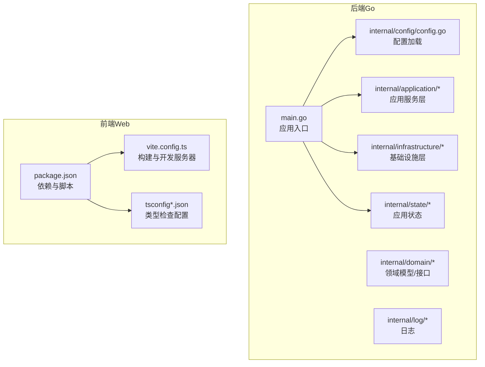
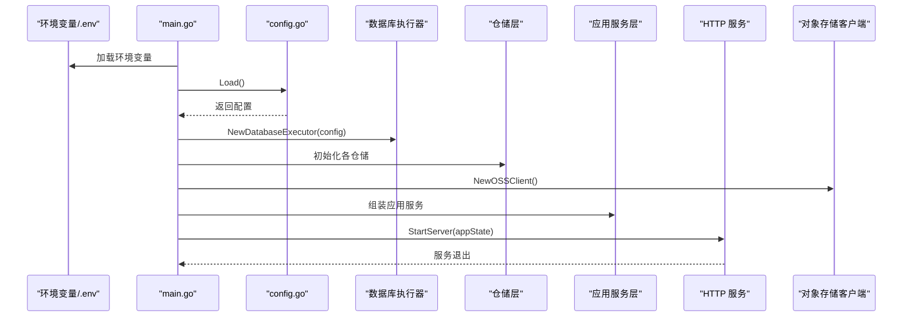
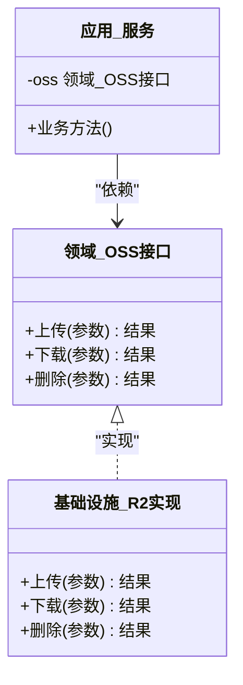
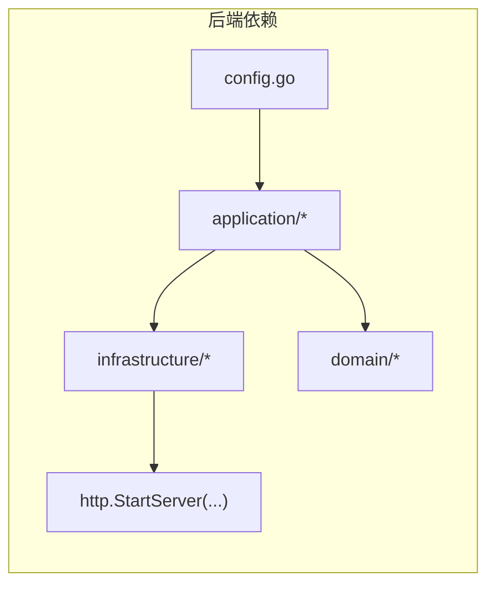

# 技术选型

<cite>
**本文引用的文件**
- [go.mod](file://backend/go.mod)
- [main.go](file://backend/main.go)
- [config.go](file://backend/internal/config/config.go)
- [r2_oss.go](file://backend/internal/infrastructure/external/r2_oss.go)
- [oss.go（领域外部接口）](file://backend/internal/domain/external/oss.go)
- [oss.go（应用服务）](file://backend/internal/domain/service/oss.go)
- [package.json](file://web/package.json)
- [vite.config.ts](file://web/vite.config.ts)
- [tsconfig.json](file://web/tsconfig.json)
- [tsconfig.app.json](file://web/tsconfig.app.json)
- [README.md（后端）](file://backend/README.md)
- [README.md（项目总览）](file://README.md)
</cite>

## 目录
1. [引言](#引言)
2. [项目结构](#项目结构)
3. [核心组件](#核心组件)
4. [架构总览](#架构总览)
5. [详细组件分析](#详细组件分析)
6. [依赖分析](#依赖分析)
7. [性能考量](#性能考量)
8. [故障排查指南](#故障排查指南)
9. [结论](#结论)
10. [附录](#附录)

## 引言
本技术选型文档面向 Poprako 项目的后端与前端技术栈，系统阐述各技术组件的选择理由、替代方案对比、性能与扩展性影响，并给出版本兼容性与升级路径建议。重点覆盖以下方面：
- 后端：Go 语言、Iris 框架、GORM ORM、PostgreSQL 数据库、Cloudflare R2 对象存储
- 前端：Vue 3、TypeScript、Vite、Pinia、Vue Router、Ant Design Vue
- 整体：技术组合的性能影响与扩展性评估

## 项目结构
Poprako 采用前后端分离架构：
- 后端位于 backend 目录，使用 Go 语言实现，模块化组织为 config、domain、application、infrastructure、log、state、util、value 等层次
- 前端位于 web 目录，基于 Vue 3、TypeScript、Vite 构建，使用 Pinia 状态管理与 Vue Router 路由

图示来源
- [main.go:1-170](file://backend/main.go#L1-L170)
- [config.go](file://backend/internal/config/config.go)
- [package.json:1-36](file://web/package.json#L1-L36)
- [vite.config.ts:1-44](file://web/vite.config.ts#L1-L44)

章节来源
- [main.go:1-170](file://backend/main.go#L1-L170)
- [README.md（后端）](file://backend/README.md)
- [README.md（项目总览）](file://README.md)

## 核心组件
- 后端运行时与框架
  - Go 1.25.0：稳定 LTS 版本，具备优秀的并发模型与生态
  - Iris v12：高性能 Web 框架，内置 Swagger 支持，适合快速构建 REST API
- ORM 与数据库
  - GORM v1.x + Postgres 驱动：成熟 ORM，支持复杂查询与事务，适配 PostgreSQL
- 对象存储
  - Cloudflare R2：边缘存储，低延迟、高可用、成本低，适配多云与边缘分发
- 前端技术栈
  - Vue 3 + TypeScript：类型安全与现代语法，提升开发效率与可维护性
  - Vite：极速开发体验与构建工具
  - Pinia：轻量状态管理
  - Vue Router：单页路由
  - Ant Design Vue：企业级 UI 组件库

章节来源
- [go.mod:1-114](file://backend/go.mod#L1-L114)
- [main.go:1-170](file://backend/main.go#L1-L170)
- [package.json:1-36](file://web/package.json#L1-L36)

## 架构总览
后端采用“配置 → 应用状态 → HTTP 服务”的启动流程；对象存储通过抽象接口注入到应用服务中，便于替换与测试。

图示来源
- [main.go:28-156](file://backend/main.go#L28-L156)
- [config.go](file://backend/internal/config/config.go)
- [r2_oss.go](file://backend/internal/infrastructure/external/r2_oss.go)

## 详细组件分析

### 后端：Go 语言
- 优势
  - 并发模型优秀，协程调度高效，适合高并发 API 场景
  - 编译型语言，运行时性能稳定，内存占用可控
  - 生态完善，ORM、Web、日志、监控等库丰富
- 适用场景
  - 中大型 Web API、微服务、边缘计算、对象存储网关
- 替代方案对比
  - Rust：内存安全与极致性能，学习曲线陡峭，生态不如 Go 成熟
  - Java：生态成熟，但 JVM 启动与内存开销较大
  - Node.js：开发效率高，但高并发下 GC 压力大
- 选型理由
  - 与 Iris + GORM 组合成熟，社区支持好，部署简单

章节来源
- [go.mod:3-18](file://backend/go.mod#L3-L18)
- [main.go:12-26](file://backend/main.go#L12-L26)

### 后端：Iris 框架（v12）
- 特点
  - 路由清晰、中间件体系完善、内置 Swagger 文档生成
  - 性能优异，适合高并发请求处理
- 与替代方案对比
  - Gin：更轻量，但文档与中间件生态不及 Iris
  - Fiber：更快，但生态与文档成熟度不及 Iris
- 选型理由
  - 与 Swagger 集成良好，便于 API 文档维护与联调

章节来源
- [go.mod:11-13](file://backend/go.mod#L11-L13)
- [main.go:16-22](file://backend/main.go#L16-L22)

### 后端：GORM ORM（v1.x + Postgres 驱动）
- 特点
  - 语法简洁、生态丰富、支持复杂查询与事务
  - 与 PostgreSQL 驱动配合良好，支持连接池与并发
- 与替代方案对比
  - SQLx：原生 SQL 更可控，但样板代码较多
  - Ent：声明式模式，适合复杂实体关系，学习成本较高
- 选型理由
  - 快速迭代期友好，上手快、维护成本低

章节来源
- [go.mod:16-17](file://backend/go.mod#L16-L17)
- [main.go:40-65](file://backend/main.go#L40-L65)

### 后端：PostgreSQL
- 技术考量
  - ACID 事务、强一致性、标准 SQL 与 JSON 支持
  - 与 GORM 兼容性好，生态成熟
- 替代方案对比
  - MySQL：易用性高，但在复杂查询与 JSON 上不及 PostgreSQL
  - CockroachDB：分布式强一致，但生态与工具链尚不成熟
- 选型理由
  - 业务数据一致性要求高，PostgreSQL 更契合

章节来源
- [go.mod:16-17](file://backend/go.mod#L16-L17)
- [main.go:40-45](file://backend/main.go#L40-L45)

### 后端：Cloudflare R2 对象存储
- 选择原因
  - 边缘网络覆盖广，低延迟访问
  - 与 S3 兼容 API，迁移成本低
  - 成本低、高可用、易于与 Workers/边缘网关集成
- 抽象与实现
  - 领域层定义对象存储接口，应用服务通过接口调用
  - 基础设施层提供 R2 客户端实现，便于替换为其他对象存储

图示来源
- [oss.go（领域外部接口）](file://backend/internal/domain/external/oss.go)
- [oss.go（应用服务）](file://backend/internal/domain/service/oss.go)
- [r2_oss.go](file://backend/internal/infrastructure/external/r2_oss.go)

章节来源
- [r2_oss.go](file://backend/internal/infrastructure/external/r2_oss.go)
- [oss.go（领域外部接口）](file://backend/internal/domain/external/oss.go)
- [oss.go（应用服务）](file://backend/internal/domain/service/oss.go)

### 前端：Vue 3 + TypeScript
- 价值
  - 类型安全减少运行时错误，提升团队协作效率
  - Composition API 提升逻辑复用与可维护性
- 与替代方案对比
  - React + TS：生态成熟，但模板与状态管理复杂度更高
  - Svelte：编译期优化，但生态与工具链不及 Vue/React
- 选型理由
  - 团队熟悉度与生态匹配度高，开发效率与质量兼顾

章节来源
- [package.json:13-34](file://web/package.json#L13-L34)
- [tsconfig.json:1-12](file://web/tsconfig.json#L1-L12)
- [tsconfig.app.json:1-9](file://web/tsconfig.app.json#L1-L9)

### 前端：Vite
- 价值
  - 极速冷启动与热更新，开发体验佳
  - 插件生态完善，按需构建与预设优化
- 与替代方案对比
  - Webpack：功能强大但配置复杂，启动较慢
  - esbuild 工具链：更快但生态偏小
- 选型理由
  - 与 Vue 3 生态契合，满足开发与生产需求

章节来源
- [package.json:6-12](file://web/package.json#L6-L12)
- [vite.config.ts:1-44](file://web/vite.config.ts#L1-L44)

### 前端：Pinia、Vue Router、Ant Design Vue
- 价值
  - Pinia 轻量且与 Vue 3 协同好，适合中小型状态管理
  - Vue Router 与单页应用契合度高
  - Ant Design Vue 提供企业级 UI 组件，设计规范统一
- 选型理由
  - 与 Vue 3 生态无缝衔接，降低学习与迁移成本

章节来源
- [package.json:13-20](file://web/package.json#L13-L20)

## 依赖分析
后端依赖关系围绕“配置 → 应用状态 → HTTP 服务”展开，对象存储通过接口注入，便于替换与测试。

图示来源
- [main.go:33-151](file://backend/main.go#L33-L151)
- [config.go](file://backend/internal/config/config.go)
- [r2_oss.go](file://backend/internal/infrastructure/external/r2_oss.go)

章节来源
- [go.mod:1-114](file://backend/go.mod#L1-L114)
- [main.go:12-26](file://backend/main.go#L12-L26)

## 性能考量
- 后端
  - Go 的并发模型与 Iris 的高性能路由，适合高并发 API
  - GORM + PostgreSQL 在中高并发下表现稳定，建议结合连接池与索引优化
  - 对象存储采用 R2，边缘就近访问，降低跨区域延迟
- 前端
  - Vite 的按需打包与 Tree-shaking，构建体积与首屏加载时间可控
  - TypeScript 类型检查在构建阶段发现潜在问题，减少运行时错误
- 整体
  - 前后端分离架构利于缓存与 CDN 分发，整体响应时间可进一步优化

## 故障排查指南
- 后端
  - 环境变量加载失败：检查 .env 是否存在且字段完整
  - 数据库连接失败：核对连接串、网络连通性与迁移开关
  - 自动迁移未执行：检查 AUTO_RUN_MIGRATIONS 环境变量值
- 前端
  - 开发服务器端口冲突：通过 FRONTEND_PORT/FRONTEND_PREVIEW_PORT 调整
  - 类型检查失败：根据 vue-tsc 输出修复类型错误
  - 构建报错：检查 ESLint 规则与依赖版本

章节来源
- [main.go:29-31](file://backend/main.go#L29-L31)
- [main.go:47-53](file://backend/main.go#L47-L53)
- [vite.config.ts:8-25](file://web/vite.config.ts#L8-L25)
- [package.json:8-12](file://web/package.json#L8-L12)

## 结论
Poprako 的技术栈组合在性能、可维护性与扩展性之间取得平衡：
- 后端以 Go + Iris + GORM + PostgreSQL + R2 为核心，适合中大型 Web API 与对象存储场景
- 前端以 Vue 3 + TypeScript + Vite 为基础，兼顾开发效率与质量
- 建议持续关注依赖版本演进，按需引入中间件与可观测性组件，逐步完善测试与 CI/CD 流程

## 附录

### 版本兼容性矩阵与升级路径
- Go 1.25.0
  - 升级路径：遵循语义化版本，优先升级小版本；重大版本升级需回归测试
- Iris v12
  - 升级路径：保持主版本内升级；注意中间件与 Swagger 集成变更
- GORM v1.x + Postgres 驱动
  - 升级路径：ORM 主版本升级需严格回归；建议先在测试环境验证
- Cloudflare R2
  - 升级路径：遵循 S3 兼容 API 变更；关注边缘节点稳定性
- 前端
  - Vue 3 → 保持主版本内升级；TypeScript 与 Vite 按需升级
  - Pinia、Vue Router、Ant Design Vue：遵循官方迁移指南

章节来源
- [go.mod:3-18](file://backend/go.mod#L3-L18)
- [package.json:1-36](file://web/package.json#L1-L36)