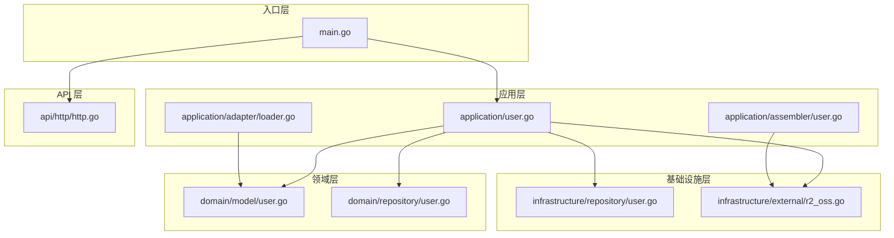
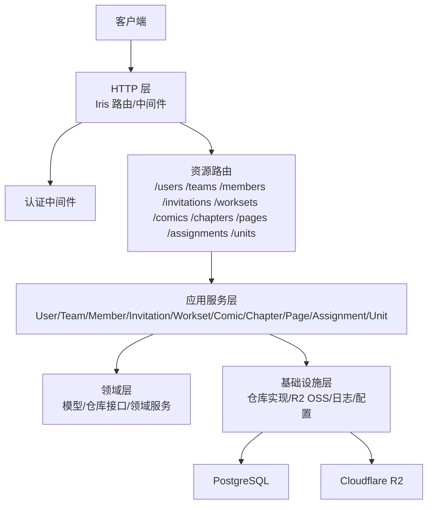
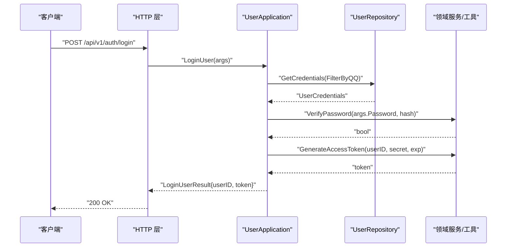
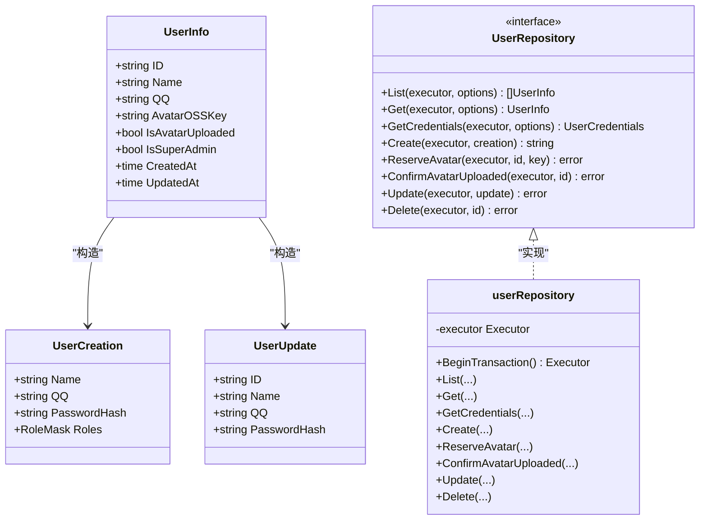
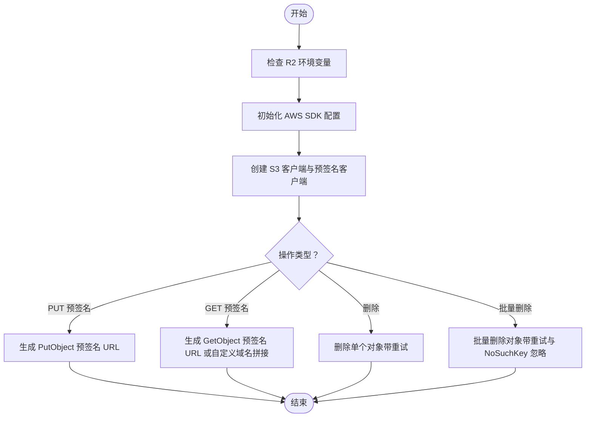
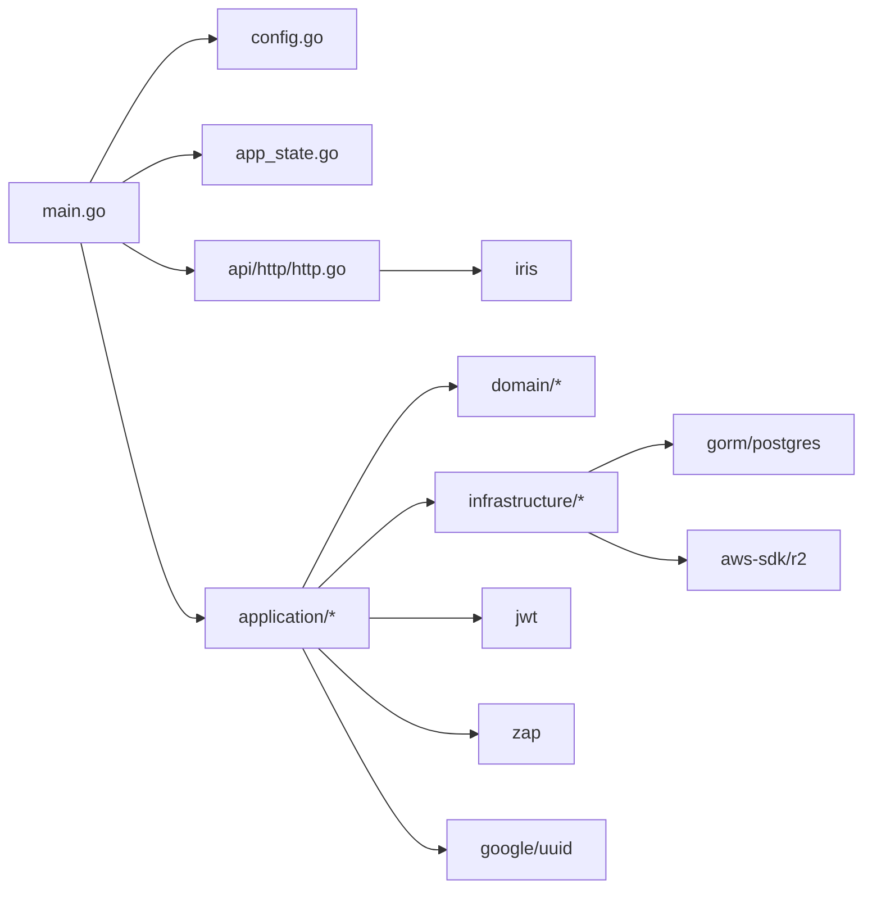

# 架构设计

<cite>
**本文引用的文件**
- [main.go](file://backend/backend-v1/main.go)
- [http.go](file://backend/backend-v1/internal/api/http/http.go)
- [app_state.go](file://backend/backend-v1/internal/state/app_state.go)
- [config.go](file://backend/backend-v1/internal/config/config.go)
- [user.go](file://backend/backend-v1/internal/application/user.go)
- [user.go](file://backend/backend-v1/internal/domain/model/user.go)
- [user.go](file://backend/backend-v1/internal/domain/repository/user.go)
- [user.go](file://backend/backend-v1/internal/infrastructure/repository/user.go)
- [r2_oss.go](file://backend/backend-v1/internal/infrastructure/external/r2_oss.go)
- [user.go](file://backend/backend-v1/internal/application/assembler/user.go)
- [loader.go](file://backend/backend-v1/internal/application/adapter/loader.go)
- [go.mod](file://backend/backend-v1/go.mod)
</cite>

## 目录
1. [引言](#引言)
2. [项目结构](#项目结构)
3. [核心组件](#核心组件)
4. [架构总览](#架构总览)
5. [详细组件分析](#详细组件分析)
6. [依赖分析](#依赖分析)
7. [性能考虑](#性能考虑)
8. [故障排查指南](#故障排查指南)
9. [结论](#结论)
10. [附录](#附录)

## 引言
本文件为 Poprako 项目的架构设计文档，聚焦于基于领域驱动设计（DDD）的三层架构：领域层（Domain）、应用层（Application）、基础设施层（Infrastructure），并结合 CQRS（命令与查询职责分离）模式进行说明。文档阐述了依赖注入与依赖倒置原则的实现方式，系统边界与集成模式，以及跨领域关注点（安全、监控、灾难恢复）的落地策略，并给出技术栈选择理由与第三方依赖的集成方案。

## 项目结构
后端采用 Go 语言与 Iris Web 框架，按 DDD 分层组织代码：
- 入口层：main.go 负责环境变量加载、配置初始化、依赖装配与 HTTP 服务器启动
- 应用层：application 包含各聚合域的应用服务（如用户、团队、成员、邀请、工作集、漫画、章节、页面、分配、单元等）
- 领域层：domain 定义模型、仓库接口与领域服务
- 基础设施层：infrastructure 实现仓库与外部服务（如 R2 对象存储）
- API 层：internal/api/http 提供 HTTP 路由与中间件
- 状态与配置：internal/state 与 internal/config 统一承载应用状态与配置

图表来源
- [main.go:25-145](file://backend/backend-v1/main.go#L25-L145)
- [http.go:16-151](file://backend/backend-v1/internal/api/http/http.go#L16-L151)
- [user.go:106-278](file://backend/backend-v1/internal/application/user.go#L106-L278)
- [user.go:21-41](file://backend/backend-v1/internal/domain/model/user.go#L21-L41)
- [user.go:5-15](file://backend/backend-v1/internal/domain/repository/user.go#L5-L15)
- [user.go:89-106](file://backend/backend-v1/internal/infrastructure/repository/user.go#L89-L106)
- [r2_oss.go:29-79](file://backend/backend-v1/internal/infrastructure/external/r2_oss.go#L29-L79)

章节来源
- [main.go:25-145](file://backend/backend-v1/main.go#L25-L145)
- [http.go:16-151](file://backend/backend-v1/internal/api/http/http.go#L16-L151)

## 核心组件
- 应用状态 AppState：集中持有所有应用服务实例，作为依赖注入容器的简化实现，贯穿请求生命周期
- 配置管理 AppConfig：通过 Viper 从 JSON 文件与环境变量加载配置，支持开发/生产环境切换
- HTTP 层：Iris 路由与中间件（请求 ID、日志、panic 恢复、Swagger UI），按资源划分受保护路由
- 应用服务 UserApplication：封装用户登录、注册、头像预留/确认、更新、删除等业务流程，协调仓库与外部服务
- 领域模型与仓库接口：UserInfo/UserCreation/UserUpdate 等模型与 UserRepository 接口定义
- 基础设施实现：PostgreSQL 仓库实现与 R2 对象存储客户端，提供预签名 URL 与批量删除能力
- 组装器与适配器：AssembleUserInfo 将领域模型转换为应用层值对象；适配器函数提供权限检查所需的加载回调

章节来源
- [app_state.go:8-50](file://backend/backend-v1/internal/state/app_state.go#L8-L50)
- [config.go:11-59](file://backend/backend-v1/internal/config/config.go#L11-L59)
- [http.go:16-151](file://backend/backend-v1/internal/api/http/http.go#L16-L151)
- [user.go:106-278](file://backend/backend-v1/internal/application/user.go#L106-L278)
- [user.go:21-41](file://backend/backend-v1/internal/domain/model/user.go#L21-L41)
- [user.go:5-15](file://backend/backend-v1/internal/domain/repository/user.go#L5-L15)
- [user.go:89-106](file://backend/backend-v1/internal/infrastructure/repository/user.go#L89-L106)
- [r2_oss.go:29-79](file://backend/backend-v1/internal/infrastructure/external/r2_oss.go#L29-L79)
- [user.go:10-33](file://backend/backend-v1/internal/application/assembler/user.go#L10-L33)
- [loader.go:10-70](file://backend/backend-v1/internal/application/adapter/loader.go#L10-L70)

## 架构总览
系统采用 DDD 三层架构与 CQRS 的职责分离：
- 领域层：纯业务模型与规则，不依赖外部框架
- 应用层：编排业务用例，协调仓库与外部服务，负责参数校验、鉴权与事务控制
- 基础设施层：数据持久化与外部集成（R2、PostgreSQL、Zap 日志、Viper 配置）

图表来源
- [http.go:16-151](file://backend/backend-v1/internal/api/http/http.go#L16-L151)
- [main.go:25-145](file://backend/backend-v1/main.go#L25-L145)
- [user.go:106-278](file://backend/backend-v1/internal/application/user.go#L106-L278)
- [r2_oss.go:29-79](file://backend/backend-v1/internal/infrastructure/external/r2_oss.go#L29-L79)

## 详细组件分析

### 应用服务：UserApplication（登录/注册/头像）
- 登录流程：校验参数 → 查询凭证 → 校验密码 → 生成 JWT
- 注册流程：校验参数 → 查询并校验邀请 → 密码哈希 → 事务内创建用户/成员并标记邀请失效 → 生成 JWT
- 头像流程：预留头像 OSS Key 并生成 PUT 预签名 URL；确认上传后更新状态
- 权限与审计：每个方法均记录 TraceScope 与关键字段日志，权限检查通过领域模型的权限对象完成

图表来源
- [http.go:42-45](file://backend/backend-v1/internal/api/http/http.go#L42-L45)
- [user.go:106-154](file://backend/backend-v1/internal/application/user.go#L106-L154)
- [user.go:125-137](file://backend/backend-v1/internal/application/user.go#L125-L137)

章节来源
- [user.go:106-278](file://backend/backend-v1/internal/application/user.go#L106-L278)

### 领域模型与仓库接口
- 领域模型：UserInfo、UserCredentials、UserCreation、UserUpdate 等，封装用户实体属性与构造
- 仓库接口：UserRepository 定义查询、创建、更新、删除、头像预留/确认等操作契约
- 基础设施实现：PostgreSQL 仓库实现，统一使用表名常量与实体映射，支持事务执行器

图表来源
- [user.go:21-41](file://backend/backend-v1/internal/domain/model/user.go#L21-L41)
- [user.go:5-15](file://backend/backend-v1/internal/domain/repository/user.go#L5-L15)
- [user.go:89-106](file://backend/backend-v1/internal/infrastructure/repository/user.go#L89-L106)

章节来源
- [user.go:21-41](file://backend/backend-v1/internal/domain/model/user.go#L21-L41)
- [user.go:5-15](file://backend/backend-v1/internal/domain/repository/user.go#L5-L15)
- [user.go:89-106](file://backend/backend-v1/internal/infrastructure/repository/user.go#L89-L106)

### 基础设施：R2 对象存储客户端
- 功能：生成上传/下载预签名 URL、删除单个/批量对象、内容类型检测
- 可靠性：带重试与错误分类（NoSuchKey 视为成功），支持自定义域名回源
- 集成：被应用服务用于头像上传流程

图表来源
- [r2_oss.go:29-79](file://backend/backend-v1/internal/infrastructure/external/r2_oss.go#L29-L79)
- [r2_oss.go:81-99](file://backend/backend-v1/internal/infrastructure/external/r2_oss.go#L81-L99)
- [r2_oss.go:109-140](file://backend/backend-v1/internal/infrastructure/external/r2_oss.go#L109-L140)
- [r2_oss.go:142-198](file://backend/backend-v1/internal/infrastructure/external/r2_oss.go#L142-L198)

章节来源
- [r2_oss.go:29-79](file://backend/backend-v1/internal/infrastructure/external/r2_oss.go#L29-L79)
- [r2_oss.go:81-99](file://backend/backend-v1/internal/infrastructure/external/r2_oss.go#L81-L99)
- [r2_oss.go:109-140](file://backend/backend-v1/internal/infrastructure/external/r2_oss.go#L109-L140)
- [r2_oss.go:142-198](file://backend/backend-v1/internal/infrastructure/external/r2_oss.go#L142-L198)

### 组装器与适配器
- 组装器 AssembleUserInfo：将 UserInfo 与 OSS 预签名 URL 组合为应用层值对象，异常时记录日志并降级
- 适配器 HandleLoadUserInfo 等：将仓库查询包装为权限检查回调，避免应用层直接依赖具体仓储实现

章节来源
- [user.go:10-33](file://backend/backend-v1/internal/application/assembler/user.go#L10-L33)
- [loader.go:10-70](file://backend/backend-v1/internal/application/adapter/loader.go#L10-L70)

## 依赖分析
- 依赖注入与依赖倒置
  - main.go 中通过构造函数注入配置、仓库与外部客户端到应用服务，体现依赖倒置：应用服务依赖抽象（接口），而非具体实现
  - AppState 作为轻量“容器”，集中持有应用服务实例，便于 HTTP 层与应用层解耦
- 外部依赖
  - Iris：Web 框架与 Swagger 集成
  - Viper：配置加载
  - Zap：日志
  - GORM + Postgres：ORM 与数据库
  - AWS SDK：R2 对象存储
  - JWT：令牌生成与校验

图表来源
- [main.go:25-145](file://backend/backend-v1/main.go#L25-L145)
- [go.mod:5-18](file://backend/backend-v1/go.mod#L5-L18)

章节来源
- [main.go:25-145](file://backend/backend-v1/main.go#L25-L145)
- [go.mod:5-18](file://backend/backend-v1/go.mod#L5-L18)

## 性能考虑
- 数据库连接池：通过配置最小空闲与最大连接数，结合 GORM 默认连接池策略，建议在高并发场景下评估连接上限与慢查询
- ORM 查询：尽量使用 QueryOption 构建过滤与分页，避免 N+1 查询；必要时引入预加载与批量操作
- 缓存：当前未见缓存层，可在热点查询（如用户信息）引入短期缓存降低数据库压力
- 对象存储：预签名 URL 降低服务端带宽压力；批量删除与重试策略提升可靠性
- 日志与追踪：TraceScope 与请求 ID 有助于定位性能瓶颈与异常路径

## 故障排查指南
- 配置加载失败：检查 app_config.json 与环境变量（APP_ENVIRONMENT、JWT_SECRET_KEY、DATABASE_URL、R2_*）
- 认证失败：确认 JWT 密钥一致、过期时间合理；登录时区分“用户不存在/密码错误”以避免枚举攻击
- 头像上传失败：检查 R2 自定义域名是否配置、预签名 URL 是否过期、对象 Key 是否正确
- 事务回滚：注册流程中的事务回滚需关注具体阶段错误并查看日志
- Swagger 不可用：确认非生产环境且 Swagger 资源路径正确

章节来源
- [config.go:29-59](file://backend/backend-v1/internal/config/config.go#L29-L59)
- [user.go:125-137](file://backend/backend-v1/internal/application/user.go#L125-L137)
- [r2_oss.go:81-99](file://backend/backend-v1/internal/infrastructure/external/r2_oss.go#L81-L99)
- [http.go:153-166](file://backend/backend-v1/internal/api/http/http.go#L153-L166)

## 结论
本项目以 DDD 为核心，清晰划分领域、应用与基础设施三层，配合 CQRS 的命令/查询职责分离，实现了高内聚、低耦合的服务编排。通过依赖注入与依赖倒置，应用层与基础设施解耦，便于测试与扩展。结合安全（JWT、权限检查）、监控（Zap、TraceScope、Swagger）与灾难恢复（R2 批量删除与重试），系统具备良好的工程化实践基础。后续可在缓存、异步任务与可观测性方面进一步完善。

## 附录
- 技术栈选择理由
  - Go：并发模型与生态适合高吞吐 API；模块化与构建简单
  - Iris：简洁易用的 Web 框架，内置 Swagger 集成
  - Viper：灵活的配置加载与环境变量绑定
  - GORM + Postgres：成熟 ORM 与 SQL 生态，便于快速迭代
  - AWS SDK：R2 作为对象存储，支持预签名与批量删除
- 第三方依赖集成方案
  - 配置：Viper 从 JSON 与环境变量加载，运行时校验必填项
  - 日志：Zap 初始化与结构化日志输出
  - 安全：JWT 生成与校验，权限检查通过领域模型的权限对象
  - 存储：R2 客户端封装预签名与删除逻辑，支持重试与错误分类