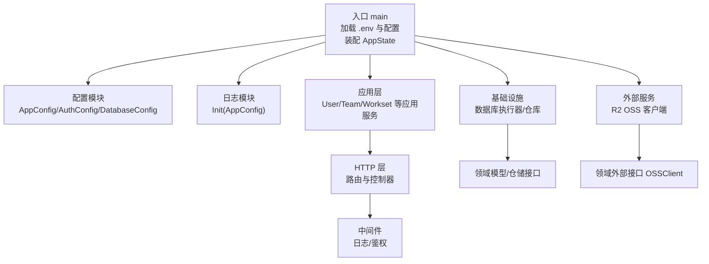
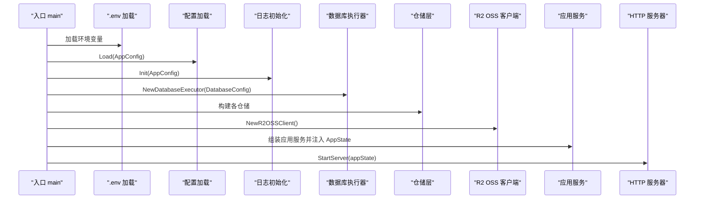
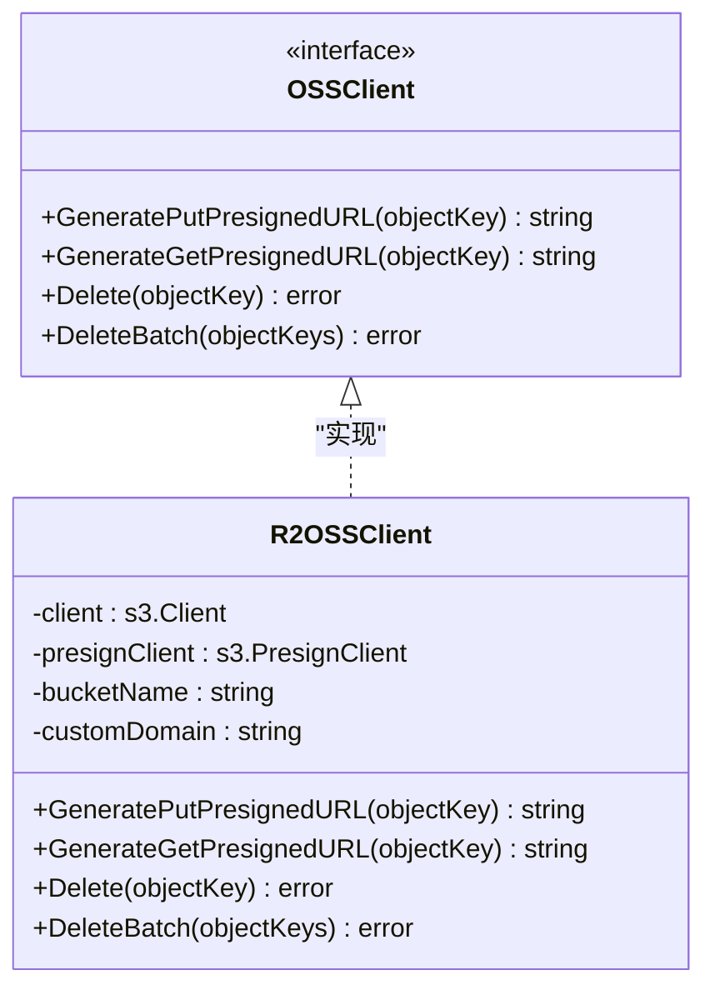
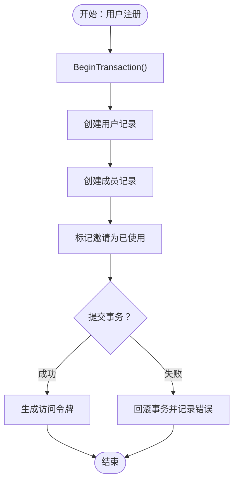
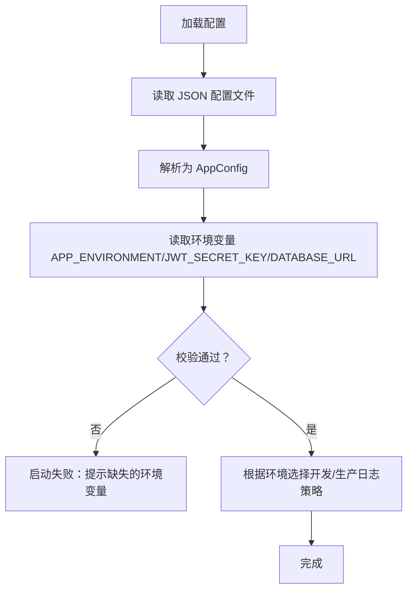
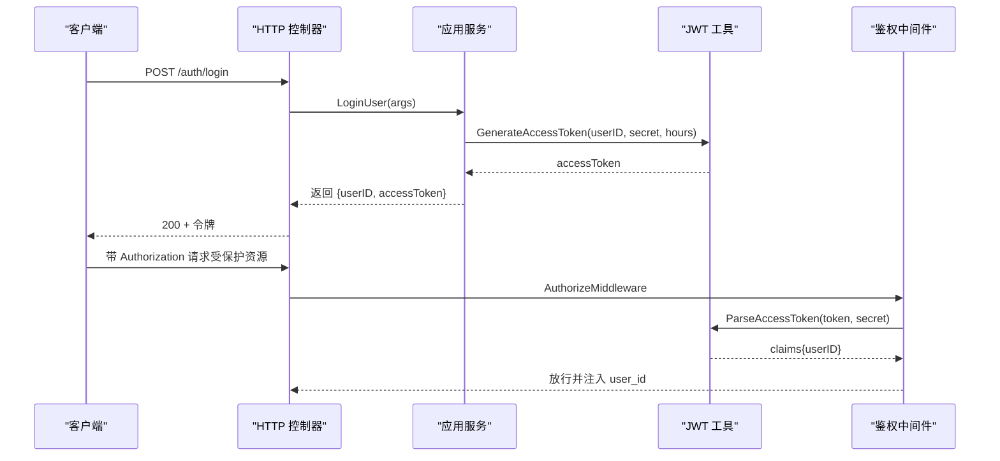
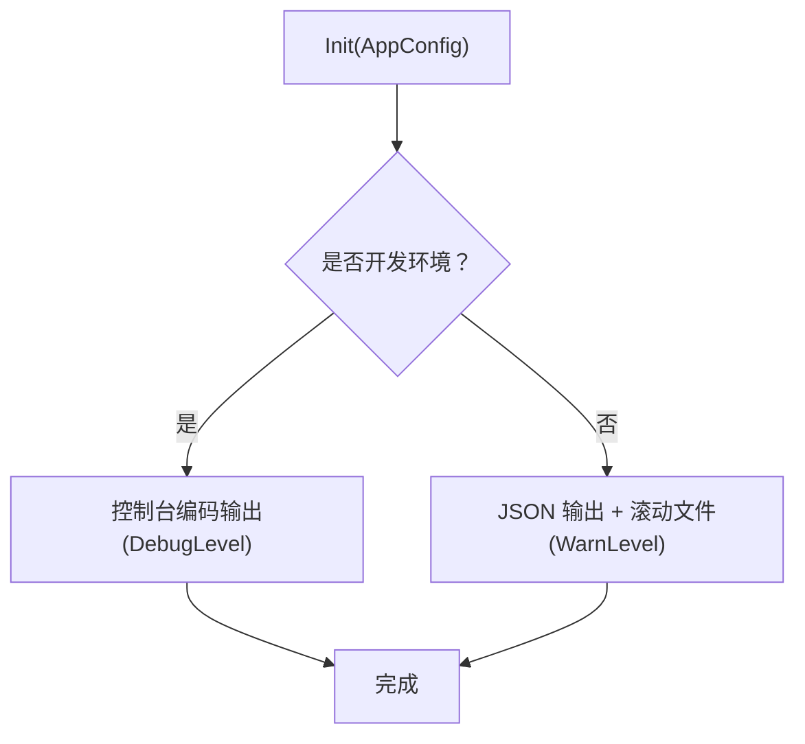
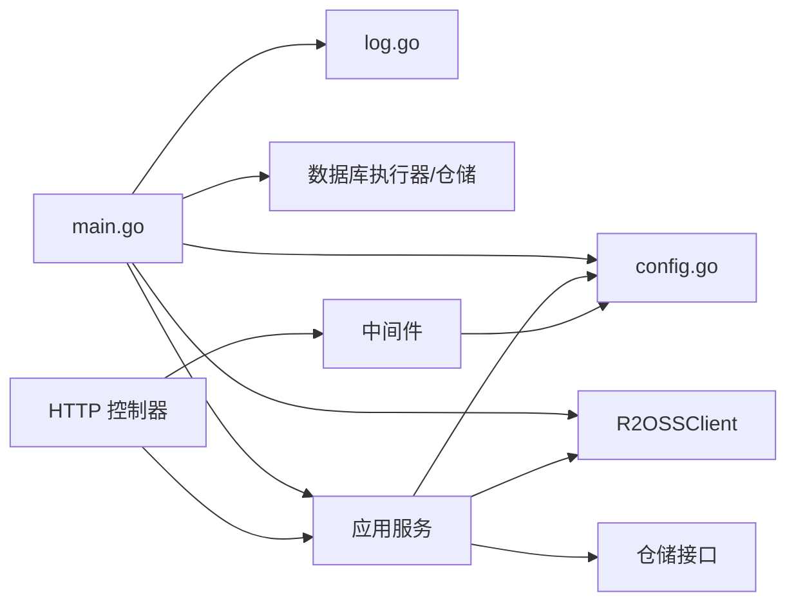

# 系统集成

<cite>
**本文引用的文件**
- [main.go](file://backend/backend-v1/main.go)
- [config.go](file://backend/backend-v1/internal/config/config.go)
- [app_state.go](file://backend/backend-v1/internal/state/app_state.go)
- [r2_oss.go](file://backend/backend-v1/internal/infrastructure/external/r2_oss.go)
- [oss.go](file://backend/backend-v1/internal/domain/external/oss.go)
- [auth.go](file://backend/backend-v1/internal/api/http/auth.go)
- [middleware.go](file://backend/backend-v1/internal/api/http/middleware.go)
- [log.go](file://backend/backend-v1/internal/log/log.go)
- [user.go](file://backend/backend-v1/internal/application/user.go)
- [token.go](file://backend/backend-v1/internal/domain/model/token.go)
</cite>

## 目录
1. [引言](#引言)
2. [项目结构](#项目结构)
3. [核心组件](#核心组件)
4. [架构总览](#架构总览)
5. [详细组件分析](#详细组件分析)
6. [依赖分析](#依赖分析)
7. [性能考量](#性能考量)
8. [故障排查指南](#故障排查指南)
9. [结论](#结论)
10. [附录](#附录)

## 引言
本文件面向 Poprako 的系统集成与第三方服务对接，重点覆盖以下方面：
- Cloudflare R2 对象存储的集成实现与配置
- 数据库连接管理与事务处理机制
- 配置管理策略与环境变量使用
- 认证服务集成与 JWT 令牌管理
- 日志系统与监控集成方案
- API 网关与负载均衡配置建议
- 系统边界与微服务架构考虑
- 集成测试策略与故障转移机制

## 项目结构
后端采用分层架构，核心分为：入口与状态装配、配置加载、基础设施（数据库与外部服务）、应用层、领域模型与仓储、HTTP 层与中间件、日志模块。

图表来源
- [main.go:25-145](file://backend/backend-v1/main.go#L25-L145)
- [config.go:11-101](file://backend/backend-v1/internal/config/config.go#L11-L101)
- [log.go:13-84](file://backend/backend-v1/internal/log/log.go#L13-L84)
- [r2_oss.go:29-79](file://backend/backend-v1/internal/infrastructure/external/r2_oss.go#L29-L79)
- [oss.go:3-8](file://backend/backend-v1/internal/domain/external/oss.go#L3-L8)

章节来源
- [main.go:25-145](file://backend/backend-v1/main.go#L25-L145)
- [config.go:11-101](file://backend/backend-v1/internal/config/config.go#L11-L101)

## 核心组件
- 配置管理：集中于 AppConfig，支持从 JSON 文件与环境变量加载；运行环境通过 APP_ENVIRONMENT 判断开发/生产；数据库与 JWT 秘钥分别由 DATABASE_URL 与 JWT_SECRET_KEY 提供。
- 外部服务：通过 OSSClient 接口抽象，R2OSSClient 作为 AWS SDK 的 S3 兼容客户端实现，支持预签名上传/下载与带重试的删除。
- 应用层：以应用服务为中心，封装业务流程；用户注册使用事务保证一致性。
- HTTP 层：提供登录/注册等接口，配合中间件实现统一日志与 JWT 鉴权。
- 日志：开发/生产差异化输出，生产环境启用 JSON 与滚动日志文件。

章节来源
- [config.go:21-101](file://backend/backend-v1/internal/config/config.go#L21-L101)
- [r2_oss.go:21-225](file://backend/backend-v1/internal/infrastructure/external/r2_oss.go#L21-L225)
- [user.go:66-104](file://backend/backend-v1/internal/application/user.go#L66-L104)
- [auth.go:22-72](file://backend/backend-v1/internal/api/http/auth.go#L22-L72)
- [middleware.go:15-80](file://backend/backend-v1/internal/api/http/middleware.go#L15-L80)
- [log.go:13-84](file://backend/backend-v1/internal/log/log.go#L13-L84)

## 架构总览
下图展示系统启动与关键交互：入口加载配置与环境变量，初始化日志，构建数据库执行器与仓库，实例化外部 OSS 客户端，组装应用服务并注入 AppState，随后启动 HTTP 服务器。

图表来源
- [main.go:25-145](file://backend/backend-v1/main.go#L25-L145)
- [config.go:11-59](file://backend/backend-v1/internal/config/config.go#L11-L59)
- [log.go:13-30](file://backend/backend-v1/internal/log/log.go#L13-L30)
- [r2_oss.go:29-79](file://backend/backend-v1/internal/infrastructure/external/r2_oss.go#L29-L79)

## 详细组件分析

### Cloudflare R2 对象存储集成
- 客户端初始化：从环境变量读取账户、密钥、区域、桶名与可选自定义域名；构造 S3 兼容客户端与预签名客户端。
- 预签名上传：生成带过期时间的 PUT URL，按扩展名自动设置内容类型。
- 预签名下载：若配置了自定义域名则返回该域名下的对象访问地址。
- 删除操作：单个与批量删除均内置重试与“键不存在”容错处理。

图表来源
- [oss.go:3-8](file://backend/backend-v1/internal/domain/external/oss.go#L3-L8)
- [r2_oss.go:21-79](file://backend/backend-v1/internal/infrastructure/external/r2_oss.go#L21-L79)

章节来源
- [r2_oss.go:29-198](file://backend/backend-v1/internal/infrastructure/external/r2_oss.go#L29-L198)
- [oss.go:3-8](file://backend/backend-v1/internal/domain/external/oss.go#L3-L8)

### 数据库连接管理与事务处理
- 连接管理：入口通过数据库配置创建数据库执行器，后续各仓储基于该执行器进行数据库操作。
- 事务处理：用户注册流程在一个事务中完成用户创建、成员创建与邀请失效标记，失败时回滚，成功时提交；异常路径记录错误并回滚。

图表来源
- [user.go:199-261](file://backend/backend-v1/internal/application/user.go#L199-L261)

章节来源
- [main.go:37-54](file://backend/backend-v1/main.go#L37-L54)
- [user.go:199-278](file://backend/backend-v1/internal/application/user.go#L199-L278)

### 配置管理策略与环境变量
- 配置来源：JSON 文件 app_config.json 与环境变量共同构成最终配置；运行环境通过 APP_ENVIRONMENT 判断开发/生产。
- 关键配置项：
  - 服务器地址 server_address
  - 认证 expiration_hours 与 JWT_SECRET_KEY
  - 数据库 min_idle_connections、max_open_connections 与 DATABASE_URL
- 环境变量校验：缺少任一关键变量会直接导致启动失败，确保部署一致性。

图表来源
- [config.go:11-59](file://backend/backend-v1/internal/config/config.go#L11-L59)
- [log.go:13-30](file://backend/backend-v1/internal/log/log.go#L13-L30)

章节来源
- [config.go:11-101](file://backend/backend-v1/internal/config/config.go#L11-L101)
- [log.go:13-84](file://backend/backend-v1/internal/log/log.go#L13-L84)

### 认证服务集成与 JWT 令牌管理
- 登录/注册：应用层生成访问令牌，包含用户标识与过期时间；前端通过 Authorization: Bearer <token> 携带令牌。
- 鉴权中间件：从请求头提取 Bearer 令牌，使用配置中的 JWT 秘钥解析并校验；将用户 ID 注入上下文以便后续授权检查。
- 令牌模型：声明包含标准字段与自定义用户 ID 字段。

图表来源
- [auth.go:22-40](file://backend/backend-v1/internal/api/http/auth.go#L22-L40)
- [user.go:139-154](file://backend/backend-v1/internal/application/user.go#L139-L154)
- [middleware.go:47-79](file://backend/backend-v1/internal/api/http/middleware.go#L47-L79)
- [token.go:5-8](file://backend/backend-v1/internal/domain/model/token.go#L5-L8)

章节来源
- [auth.go:22-72](file://backend/backend-v1/internal/api/http/auth.go#L22-L72)
- [middleware.go:47-79](file://backend/backend-v1/internal/api/http/middleware.go#L47-L79)
- [user.go:139-154](file://backend/backend-v1/internal/application/user.go#L139-L154)
- [token.go:5-8](file://backend/backend-v1/internal/domain/model/token.go#L5-L8)

### 日志系统与监控集成
- 开发环境：控制台彩色编码、ISO 时间格式、调试级别输出。
- 生产环境：JSON 编码、控制台与滚动文件同步输出、告警级别以上输出、文件轮转策略。
- 监控建议：结合生产日志与请求链路 ID，接入统一日志平台与指标采集；对鉴权失败、事务回滚、R2 删除重试等关键事件增加告警。

图表来源
- [log.go:13-84](file://backend/backend-v1/internal/log/log.go#L13-L84)

章节来源
- [log.go:13-84](file://backend/backend-v1/internal/log/log.go#L13-L84)

### API 网关与负载均衡配置
- API 网关：建议在网关层统一接入 HTTPS、TLS 终止、CORS、速率限制与 WAF；将请求转发至后端服务集群。
- 负载均衡：后端服务多副本部署，健康检查基于 HTTP 端点；R2 作为对象存储无需 LB，但需确保网络可达与 DNS 解析稳定。
- 证书与域名：HTTPS 证书由网关统一管理；R2 自定义域名需在 Cloudflare 控制台配置 CNAME 与 SSL/TLS 设置。

（本节为概念性说明，不直接对应具体源码）

### 系统边界与微服务架构考虑
- 边界划分：按业务域拆分应用服务（用户、团队、作品、章节、页面、作业等），仓储与领域模型清晰分离。
- 外部依赖：R2 作为单一对象存储依赖，通过接口抽象隔离；数据库作为核心持久化，事务在应用层编排。
- 可观测性：统一日志、请求链路 ID、错误计数与延迟分布，便于定位问题与容量规划。

（本节为概念性说明，不直接对应具体源码）

### 集成测试策略与故障转移机制
- 集成测试：针对登录/注册、头像上传预留与确认、事务提交/回滚、R2 删除重试等关键路径编写端到端测试；模拟鉴权中间件与外部 OSS 行为。
- 故障转移：R2 删除失败时的重试与“键不存在”容错；数据库事务失败时回滚并记录错误；日志统一输出便于快速定位。

章节来源
- [r2_oss.go:109-198](file://backend/backend-v1/internal/infrastructure/external/r2_oss.go#L109-L198)
- [user.go:204-261](file://backend/backend-v1/internal/application/user.go#L204-L261)

## 依赖分析
- 入口依赖：godotenv、配置、日志、数据库执行器、外部 OSS 客户端、应用服务与 HTTP 服务器。
- 应用层依赖：配置、外部 OSS 客户端、仓储接口。
- HTTP 层依赖：应用服务、中间件、状态对象。
- 日志模块依赖：配置与 Zap。

图表来源
- [main.go:12-23](file://backend/backend-v1/main.go#L12-L23)
- [config.go:3-9](file://backend/backend-v1/internal/config/config.go#L3-L9)
- [log.go:3-11](file://backend/backend-v1/internal/log/log.go#L3-L11)
- [r2_oss.go:3-19](file://backend/backend-v1/internal/infrastructure/external/r2_oss.go#L3-L19)

章节来源
- [main.go:12-23](file://backend/backend-v1/main.go#L12-L23)
- [app_state.go:8-21](file://backend/backend-v1/internal/state/app_state.go#L8-L21)

## 性能考量
- R2 预签名上传：合理设置过期时间，避免长时间暴露的 URL；按扩展名自动设置 Content-Type，减少客户端额外请求。
- 事务批处理：注册流程一次性提交，降低锁竞争与往返开销。
- 日志级别：生产环境使用 JSON 与文件轮转，避免高频写盘影响；必要时引入异步日志或缓冲队列。
- 并发与连接池：数据库连接池参数由配置决定，应结合实际 QPS 调优最小空闲与最大打开连接数。

（本节提供通用指导，不直接对应具体源码）

## 故障排查指南
- 启动失败：检查 .env 与 app_config.json 是否存在且包含必需环境变量；确认 APP_ENVIRONMENT、JWT_SECRET_KEY、DATABASE_URL 是否正确。
- 登录/鉴权失败：确认 Authorization 头格式为 Bearer <token>；核对 JWT 秘钥与过期时间配置；查看中间件日志。
- R2 删除失败：关注重试次数与错误类型；若出现“键不存在”，属于预期容错；否则检查桶名与凭证。
- 事务回滚：查看应用层回滚日志与错误消息，确认数据库连接与事务边界。

章节来源
- [config.go:44-56](file://backend/backend-v1/internal/config/config.go#L44-L56)
- [middleware.go:50-78](file://backend/backend-v1/internal/api/http/middleware.go#L50-L78)
- [r2_oss.go:109-198](file://backend/backend-v1/internal/infrastructure/external/r2_oss.go#L109-L198)
- [user.go:204-261](file://backend/backend-v1/internal/application/user.go#L204-L261)

## 结论
本系统通过清晰的分层与接口抽象，实现了与 Cloudflare R2 的可靠集成、严格的配置与环境变量管理、完善的 JWT 鉴权与日志体系，并在关键业务流程中采用事务保障数据一致性。建议在生产环境中完善 API 网关与负载均衡策略，强化监控与告警，持续优化数据库连接池与日志性能。

## 附录
- 环境变量清单
  - APP_ENVIRONMENT：运行环境（development/production）
  - JWT_SECRET_KEY：JWT 秘钥
  - DATABASE_URL：数据库连接字符串
  - R2_ACCOUNT_ID：Cloudflare R2 账户 ID
  - R2_ACCESS_KEY_ID：访问密钥 ID
  - R2_SECRET_ACCESS_KEY：访问密钥
  - R2_REGION：区域（默认 auto）
  - R2_BUCKET_NAME：存储桶名称
  - R2_CUSTOM_DOMAIN：自定义域名（用于生成对象访问 URL）

章节来源
- [config.go:44-97](file://backend/backend-v1/internal/config/config.go#L44-L97)
- [r2_oss.go:30-56](file://backend/backend-v1/internal/infrastructure/external/r2_oss.go#L30-L56)