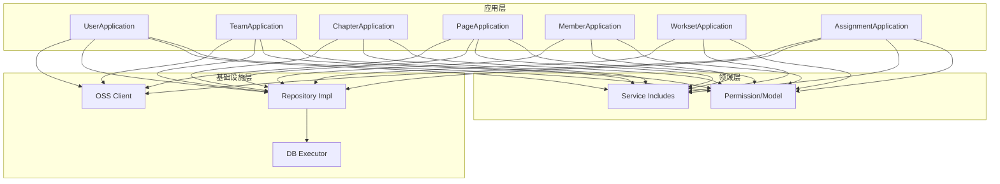
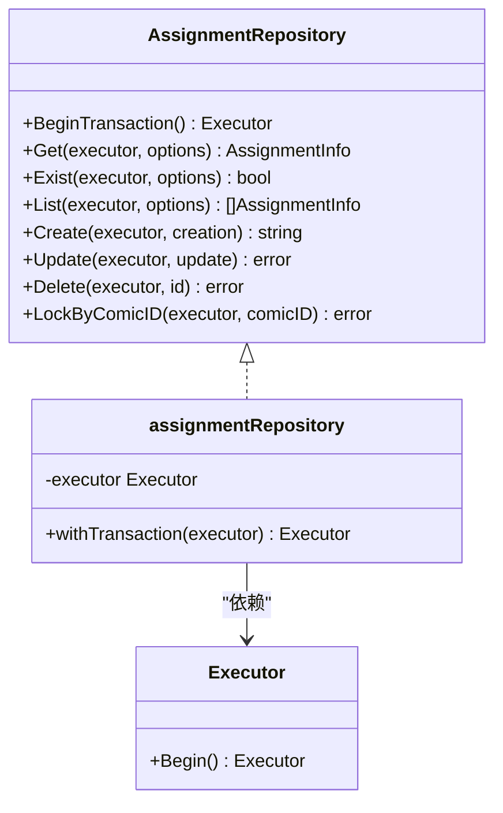
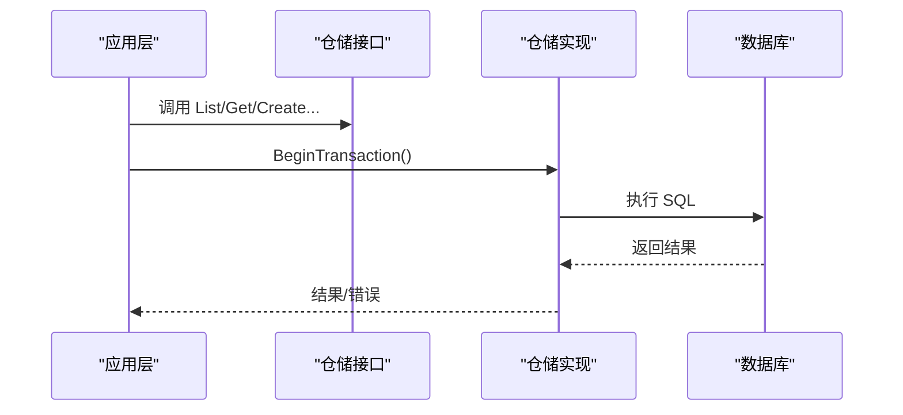
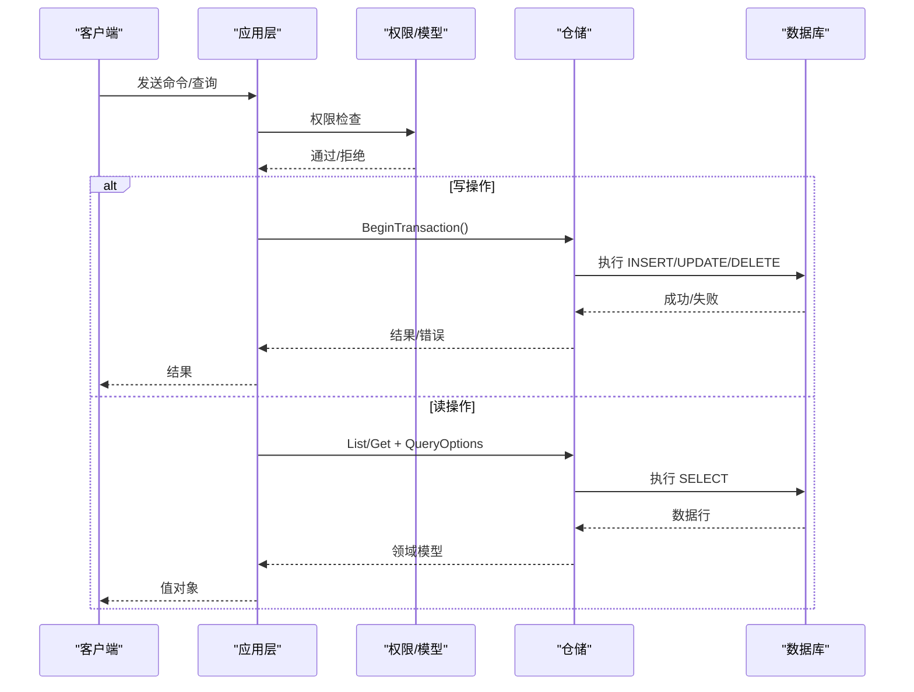
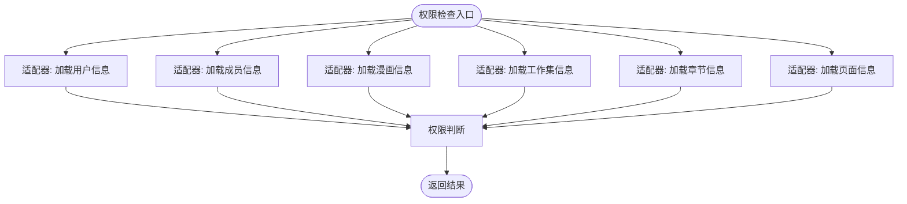
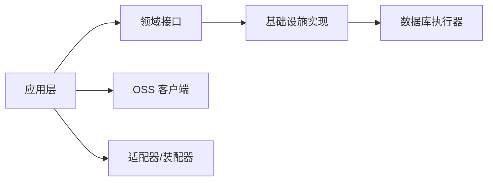

# 设计模式应用

<cite>
**本文引用的文件**
- [backend/backend-v1/internal/application/assignment.go](file://backend/backend-v1/internal/application/assignment.go)
- [backend/backend-v1/internal/application/chapter.go](file://backend/backend-v1/internal/application/chapter.go)
- [backend/backend-v1/internal/application/comic.go](file://backend/backend-v1/internal/application/comic.go)
- [backend/backend-v1/internal/application/team.go](file://backend/backend-v1/internal/application/team.go)
- [backend/backend-v1/internal/application/user.go](file://backend/backend-v1/internal/application/user.go)
- [backend/backend-v1/internal/application/workset.go](file://backend/backend-v1/internal/application/workset.go)
- [backend/backend-v1/internal/application/member.go](file://backend/backend-v1/internal/application/member.go)
- [backend/backend-v1/internal/application/page.go](file://backend/backend-v1/internal/application/page.go)
- [backend/backend-v1/internal/application/adapter/loader.go](file://backend/backend-v1/internal/application/adapter/loader.go)
- [backend/backend-v1/internal/application/assembler/assignment.go](file://backend/backend-v1/internal/application/assembler/assignment.go)
- [backend/backend-v1/internal/domain/service/assignment_include.go](file://backend/backend-v1/internal/domain/service/assignment_include.go)
- [backend/backend-v1/internal/domain/repository/types.go](file://backend/backend-v1/internal/domain/repository/types.go)
- [backend/backend-v1/internal/infrastructure/repository/repository.go](file://backend/backend-v1/internal/infrastructure/repository/repository.go)
- [backend/backend-v1/internal/infrastructure/repository/assignment.go](file://backend/backend-v1/internal/infrastructure/repository/assignment.go)
- [backend/backend-v1/internal/domain/model/assignment.go](file://backend/backend-v1/internal/domain/model/assignment.go)
</cite>

## 目录
1. [引言](#引言)
2. [项目结构](#项目结构)
3. [核心组件](#核心组件)
4. [架构总览](#架构总览)
5. [详细组件分析](#详细组件分析)
6. [依赖分析](#依赖分析)
7. [性能考虑](#性能考虑)
8. [故障排查指南](#故障排查指南)
9. [结论](#结论)
10. [附录](#附录)

## 引言
本文件面向 Poprako 项目的后端模块，系统性梳理并解析其中应用的设计模式与实现细节，重点包括：
- 仓储模式（Repository Pattern）的实现与优势
- 依赖注入与依赖倒置原则（DIP）的具体落地
- 工厂模式、策略模式的应用场景
- CQRS 命令查询职责分离模式的实践
- 适配器模式、装饰器模式在系统集成中的使用
- 每个模式的选择依据、技术权衡与最佳实践

## 项目结构
后端采用分层清晰的 Go 应用结构，围绕“应用层-领域层-基础设施层”组织代码，辅以装配器（Assembler）、适配器（Adapter）与服务工具（Service）等横切关注点，形成高内聚、低耦合的模块化体系。

```mermaid
graph TB
subgraph "应用层 Application"
A1["assignment.go"]
A2["chapter.go"]
A3["comic.go"]
A4["team.go"]
A5["user.go"]
A6["workset.go"]
A7["member.go"]
A8["page.go"]
AA["adapter/loader.go"]
AS["assembler/assignment.go"]
SV["domain/service/assignment_include.go"]
end
subgraph "领域层 Domain"
DM["domain/model/assignment.go"]
DT["domain/repository/types.go"]
end
subgraph "基础设施层 Infrastructure"
IR["infrastructure/repository/repository.go"]
IA["infrastructure/repository/assignment.go"]
end
A1 --> AA
A2 --> AA
A3 --> AA
A4 --> AA
A5 --> AA
A6 --> AA
A7 --> AA
A8 --> AA
A1 --> AS
A2 --> AS
A3 --> AS
A4 --> AS
A5 --> AS
A6 --> AS
A7 --> AS
A8 --> AS
A1 --> SV
A2 --> SV
A3 --> SV
A4 --> SV
A5 --> SV
A6 --> SV
A7 --> SV
A8 --> SV
A1 --> DM
A2 --> DM
A3 --> DM
A4 --> DM
A5 --> DM
A6 --> DM
A7 --> DM
A8 --> DM
A1 --> DT
A2 --> DT
A3 --> DT
A4 --> DT
A5 --> DT
A6 --> DT
A7 --> DT
A8 --> DT
IA --> IR
```

图表来源
- [backend/backend-v1/internal/application/assignment.go:1-358](file://backend/backend-v1/internal/application/assignment.go#L1-L358)
- [backend/backend-v1/internal/application/chapter.go:1-330](file://backend/backend-v1/internal/application/chapter.go#L1-L330)
- [backend/backend-v1/internal/application/comic.go:1-354](file://backend/backend-v1/internal/application/comic.go#L1-L354)
- [backend/backend-v1/internal/application/team.go:1-415](file://backend/backend-v1/internal/application/team.go#L1-L415)
- [backend/backend-v1/internal/application/user.go:1-594](file://backend/backend-v1/internal/application/user.go#L1-L594)
- [backend/backend-v1/internal/application/workset.go:1-310](file://backend/backend-v1/internal/application/workset.go#L1-L310)
- [backend/backend-v1/internal/application/member.go:1-448](file://backend/backend-v1/internal/application/member.go#L1-L448)
- [backend/backend-v1/internal/application/page.go:1-402](file://backend/backend-v1/internal/application/page.go#L1-L402)
- [backend/backend-v1/internal/application/adapter/loader.go:1-71](file://backend/backend-v1/internal/application/adapter/loader.go#L1-L71)
- [backend/backend-v1/internal/application/assembler/assignment.go:1-39](file://backend/backend-v1/internal/application/assembler/assignment.go#L1-L39)
- [backend/backend-v1/internal/domain/service/assignment_include.go:1-67](file://backend/backend-v1/internal/domain/service/assignment_include.go#L1-L67)
- [backend/backend-v1/internal/domain/repository/types.go:1-12](file://backend/backend-v1/internal/domain/repository/types.go#L1-L12)
- [backend/backend-v1/internal/infrastructure/repository/repository.go:1-30](file://backend/backend-v1/internal/infrastructure/repository/repository.go#L1-L30)
- [backend/backend-v1/internal/infrastructure/repository/assignment.go:1-143](file://backend/backend-v1/internal/infrastructure/repository/assignment.go#L1-L143)
- [backend/backend-v1/internal/domain/model/assignment.go:1-190](file://backend/backend-v1/internal/domain/model/assignment.go#L1-L190)

章节来源
- [backend/backend-v1/internal/application/assignment.go:1-358](file://backend/backend-v1/internal/application/assignment.go#L1-L358)
- [backend/backend-v1/internal/application/chapter.go:1-330](file://backend/backend-v1/internal/application/chapter.go#L1-L330)
- [backend/backend-v1/internal/application/comic.go:1-354](file://backend/backend-v1/internal/application/comic.go#L1-L354)
- [backend/backend-v1/internal/application/team.go:1-415](file://backend/backend-v1/internal/application/team.go#L1-L415)
- [backend/backend-v1/internal/application/user.go:1-594](file://backend/backend-v1/internal/application/user.go#L1-L594)
- [backend/backend-v1/internal/application/workset.go:1-310](file://backend/backend-v1/internal/application/workset.go#L1-L310)
- [backend/backend-v1/internal/application/member.go:1-448](file://backend/backend-v1/internal/application/member.go#L1-L448)
- [backend/backend-v1/internal/application/page.go:1-402](file://backend/backend-v1/internal/application/page.go#L1-L402)
- [backend/backend-v1/internal/application/adapter/loader.go:1-71](file://backend/backend-v1/internal/application/adapter/loader.go#L1-L71)
- [backend/backend-v1/internal/application/assembler/assignment.go:1-39](file://backend/backend-v1/internal/application/assembler/assignment.go#L1-L39)
- [backend/backend-v1/internal/domain/service/assignment_include.go:1-67](file://backend/backend-v1/internal/domain/service/assignment_include.go#L1-L67)
- [backend/backend-v1/internal/domain/repository/types.go:1-12](file://backend/backend-v1/internal/domain/repository/types.go#L1-L12)
- [backend/backend-v1/internal/infrastructure/repository/repository.go:1-30](file://backend/backend-v1/internal/infrastructure/repository/repository.go#L1-L30)
- [backend/backend-v1/internal/infrastructure/repository/assignment.go:1-143](file://backend/backend-v1/internal/infrastructure/repository/assignment.go#L1-L143)
- [backend/backend-v1/internal/domain/model/assignment.go:1-190](file://backend/backend-v1/internal/domain/model/assignment.go#L1-L190)

## 核心组件
- 应用层 Application：封装业务用例，协调领域模型与外部依赖，负责鉴权、参数校验、事务控制与结果装配。
- 领域层 Domain：定义实体、值对象、权限模型与业务规则，提供创建/更新模型与包含规格解析。
- 基础设施层 Infrastructure：封装数据访问与外部集成（如 OSS），提供仓储实现与数据库执行器。
- 适配器 Adapter：将不同仓储接口适配为统一回调类型，供领域层权限检查使用。
- 装配器 Assembler：将领域模型转换为应用层值对象，按需注入 URL 生成器等外部能力。
- 服务 Service：解析 includes 规格、生成预签名 URL 等横切逻辑。

章节来源
- [backend/backend-v1/internal/application/assignment.go:20-90](file://backend/backend-v1/internal/application/assignment.go#L20-L90)
- [backend/backend-v1/internal/application/chapter.go:20-80](file://backend/backend-v1/internal/application/chapter.go#L20-L80)
- [backend/backend-v1/internal/application/comic.go:19-74](file://backend/backend-v1/internal/application/comic.go#L19-L74)
- [backend/backend-v1/internal/application/team.go:20-90](file://backend/backend-v1/internal/application/team.go#L20-L90)
- [backend/backend-v1/internal/application/user.go:21-104](file://backend/backend-v1/internal/application/user.go#L21-L104)
- [backend/backend-v1/internal/application/workset.go:20-70](file://backend/backend-v1/internal/application/workset.go#L20-L70)
- [backend/backend-v1/internal/application/member.go:20-82](file://backend/backend-v1/internal/application/member.go#L20-L82)
- [backend/backend-v1/internal/application/page.go:21-91](file://backend/backend-v1/internal/application/page.go#L21-L91)
- [backend/backend-v1/internal/application/adapter/loader.go:10-70](file://backend/backend-v1/internal/application/adapter/loader.go#L10-L70)
- [backend/backend-v1/internal/application/assembler/assignment.go:9-38](file://backend/backend-v1/internal/application/assembler/assignment.go#L9-L38)
- [backend/backend-v1/internal/domain/service/assignment_include.go:5-66](file://backend/backend-v1/internal/domain/service/assignment_include.go#L5-L66)
- [backend/backend-v1/internal/domain/repository/types.go:5-11](file://backend/backend-v1/internal/domain/repository/types.go#L5-L11)
- [backend/backend-v1/internal/infrastructure/repository/repository.go:11-29](file://backend/backend-v1/internal/infrastructure/repository/repository.go#L11-L29)
- [backend/backend-v1/internal/infrastructure/repository/assignment.go:10-27](file://backend/backend-v1/internal/infrastructure/repository/assignment.go#L10-L27)
- [backend/backend-v1/internal/domain/model/assignment.go:5-55](file://backend/backend-v1/internal/domain/model/assignment.go#L5-L55)

## 架构总览
应用层通过构造函数注入各仓储接口，遵循依赖倒置原则；仓储接口抽象位于领域层，具体实现位于基础设施层；应用层通过装配器与适配器解耦外部系统与领域模型。

图表来源
- [backend/backend-v1/internal/application/user.go:75-104](file://backend/backend-v1/internal/application/user.go#L75-L104)
- [backend/backend-v1/internal/application/team.go:65-90](file://backend/backend-v1/internal/application/team.go#L65-L90)
- [backend/backend-v1/internal/application/chapter.go:51-80](file://backend/backend-v1/internal/application/chapter.go#L51-L80)
- [backend/backend-v1/internal/application/page.go:54-91](file://backend/backend-v1/internal/application/page.go#L54-L91)
- [backend/backend-v1/internal/application/member.go:60-82](file://backend/backend-v1/internal/application/member.go#L60-L82)
- [backend/backend-v1/internal/application/workset.go:49-70](file://backend/backend-v1/internal/application/workset.go#L49-L70)
- [backend/backend-v1/internal/application/assignment.go:57-90](file://backend/backend-v1/internal/application/assignment.go#L57-L90)
- [backend/backend-v1/internal/domain/repository/types.go:9-11](file://backend/backend-v1/internal/domain/repository/types.go#L9-L11)
- [backend/backend-v1/internal/infrastructure/repository/repository.go:11-29](file://backend/backend-v1/internal/infrastructure/repository/repository.go#L11-L29)
- [backend/backend-v1/internal/infrastructure/repository/assignment.go:14-16](file://backend/backend-v1/internal/infrastructure/repository/assignment.go#L14-L16)

## 详细组件分析

### 仓储模式（Repository Pattern）
- 抽象与实现分离：领域层定义仓储接口与执行器类型，基础设施层提供具体实现；应用层仅依赖抽象，满足 DIP。
- 查询选项模式：通过函数式 QueryOption 组合查询条件，避免构造器爆炸，提升可读性与扩展性。
- 事务封装：仓储实现提供 BeginTransaction 与锁方法，配合应用层事务控制，保证一致性。
- 优势：
  - 降低数据库耦合，便于替换存储或引入缓存
  - 易于单元测试，可通过 mock 仓储注入
  - 查询组合灵活，减少重复代码

图表来源
- [backend/backend-v1/internal/domain/repository/types.go:5-11](file://backend/backend-v1/internal/domain/repository/types.go#L5-L11)
- [backend/backend-v1/internal/infrastructure/repository/assignment.go:10-27](file://backend/backend-v1/internal/infrastructure/repository/assignment.go#L10-L27)
- [backend/backend-v1/internal/infrastructure/repository/assignment.go:29-142](file://backend/backend-v1/internal/infrastructure/repository/assignment.go#L29-L142)

章节来源
- [backend/backend-v1/internal/domain/repository/types.go:5-11](file://backend/backend-v1/internal/domain/repository/types.go#L5-L11)
- [backend/backend-v1/internal/infrastructure/repository/assignment.go:10-143](file://backend/backend-v1/internal/infrastructure/repository/assignment.go#L10-L143)
- [backend/backend-v1/internal/application/assignment.go:126-156](file://backend/backend-v1/internal/application/assignment.go#L126-L156)

### 依赖注入与依赖倒置原则（DIP）
- 构造函数注入：应用层通过 NewXxxApplication 注入所需仓储与外部客户端，避免硬编码依赖。
- 接口隔离：应用层仅依赖领域层定义的仓储接口，不关心具体实现。
- 可测试性：通过替换注入对象，轻松模拟仓储与外部服务。
- 实践要点：空指针校验与 panic 记录，确保依赖完整性。

图表来源
- [backend/backend-v1/internal/application/user.go:75-104](file://backend/backend-v1/internal/application/user.go#L75-L104)
- [backend/backend-v1/internal/application/team.go:65-90](file://backend/backend-v1/internal/application/team.go#L65-L90)
- [backend/backend-v1/internal/application/assignment.go:57-90](file://backend/backend-v1/internal/application/assignment.go#L57-L90)
- [backend/backend-v1/internal/infrastructure/repository/assignment.go:25-27](file://backend/backend-v1/internal/infrastructure/repository/assignment.go#L25-L27)

章节来源
- [backend/backend-v1/internal/application/user.go:75-104](file://backend/backend-v1/internal/application/user.go#L75-L104)
- [backend/backend-v1/internal/application/team.go:65-90](file://backend/backend-v1/internal/application/team.go#L65-L90)
- [backend/backend-v1/internal/application/assignment.go:57-90](file://backend/backend-v1/internal/application/assignment.go#L57-L90)
- [backend/backend-v1/internal/infrastructure/repository/assignment.go:25-27](file://backend/backend-v1/internal/infrastructure/repository/assignment.go#L25-L27)

### 工厂模式
- 分配/成员/页面等创建模型：应用层根据输入参数构建领域层的 Creation/Update 对象，集中处理默认值与时间戳策略。
- 适用场景：统一创建流程、隐藏复杂初始化逻辑、便于扩展字段。

章节来源
- [backend/backend-v1/internal/domain/model/assignment.go:114-149](file://backend/backend-v1/internal/domain/model/assignment.go#L114-L149)
- [backend/backend-v1/internal/application/assignment.go:256-264](file://backend/backend-v1/internal/application/assignment.go#L256-L264)
- [backend/backend-v1/internal/application/member.go:423-427](file://backend/backend-v1/internal/application/member.go#L423-L427)
- [backend/backend-v1/internal/application/page.go:149-155](file://backend/backend-v1/internal/application/page.go#L149-L155)

### 策略模式
- includes 解析策略：根据请求参数动态决定关联展开策略，避免冗余查询与过度装载。
- 事务策略：在创建/更新/删除等关键路径上，统一开启/回滚/提交事务，保证原子性。

章节来源
- [backend/backend-v1/internal/domain/service/assignment_include.go:13-38](file://backend/backend-v1/internal/domain/service/assignment_include.go#L13-L38)
- [backend/backend-v1/internal/application/comic.go:189-241](file://backend/backend-v1/internal/application/comic.go#L189-L241)
- [backend/backend-v1/internal/application/chapter.go:113-162](file://backend/backend-v1/internal/application/chapter.go#L113-L162)
- [backend/backend-v1/internal/application/page.go:123-186](file://backend/backend-v1/internal/application/page.go#L123-L186)

### CQRS 命令查询职责分离
- 命令侧（写）：应用层接收请求，执行鉴权、参数校验、事务控制与仓储写操作，返回结果或错误。
- 查询侧（读）：应用层构建查询选项，按 includes 策略加载关联信息，通过装配器输出值对象。
- 优势：读写分离、查询优化、易于扩展新的投影视图。

图表来源
- [backend/backend-v1/internal/application/assignment.go:92-156](file://backend/backend-v1/internal/application/assignment.go#L92-L156)
- [backend/backend-v1/internal/application/comic.go:149-245](file://backend/backend-v1/internal/application/comic.go#L149-L245)
- [backend/backend-v1/internal/application/page.go:189-247](file://backend/backend-v1/internal/application/page.go#L189-L247)
- [backend/backend-v1/internal/domain/service/assignment_include.go:13-38](file://backend/backend-v1/internal/domain/service/assignment_include.go#L13-L38)

章节来源
- [backend/backend-v1/internal/application/assignment.go:92-156](file://backend/backend-v1/internal/application/assignment.go#L92-L156)
- [backend/backend-v1/internal/application/comic.go:149-245](file://backend/backend-v1/internal/application/comic.go#L149-L245)
- [backend/backend-v1/internal/application/page.go:189-247](file://backend/backend-v1/internal/application/page.go#L189-L247)
- [backend/backend-v1/internal/domain/service/assignment_include.go:13-38](file://backend/backend-v1/internal/domain/service/assignment_include.go#L13-L38)

### 适配器模式
- 适配器函数：将不同仓储接口适配为统一回调类型，供领域层权限检查使用，屏蔽仓储差异。
- 适用场景：权限检查需要跨仓储加载上下文信息，但又不想让权限模块感知具体仓储实现。

图表来源
- [backend/backend-v1/internal/application/adapter/loader.go:10-70](file://backend/backend-v1/internal/application/adapter/loader.go#L10-L70)

章节来源
- [backend/backend-v1/internal/application/adapter/loader.go:10-70](file://backend/backend-v1/internal/application/adapter/loader.go#L10-L70)

### 装饰器模式
- 装配器：在读取领域模型后，按需注入外部资源（如 OSS 预签名 URL），实现“装饰”输出格式。
- 适用场景：对外输出统一、安全的资源访问地址，隐藏底层存储细节。

章节来源
- [backend/backend-v1/internal/application/assembler/assignment.go:9-38](file://backend/backend-v1/internal/application/assembler/assignment.go#L9-L38)
- [backend/backend-v1/internal/application/team.go:172-180](file://backend/backend-v1/internal/application/team.go#L172-L180)
- [backend/backend-v1/internal/application/user.go:317-318](file://backend/backend-v1/internal/application/user.go#L317-L318)
- [backend/backend-v1/internal/application/page.go:243-245](file://backend/backend-v1/internal/application/page.go#L243-L245)

### 外部集成（OSS 客户端）
- 应用层通过注入的 OSS 客户端生成预签名 URL，用于前端直传/下载。
- 事务中生成 URL 并持久化 OSS Key，保证一致性。

章节来源
- [backend/backend-v1/internal/application/team.go:215-231](file://backend/backend-v1/internal/application/team.go#L215-L231)
- [backend/backend-v1/internal/application/user.go:454-467](file://backend/backend-v1/internal/application/user.go#L454-L467)
- [backend/backend-v1/internal/application/page.go:166-177](file://backend/backend-v1/internal/application/page.go#L166-L177)

## 依赖分析
- 应用层对领域层与基础设施层均只依赖抽象接口，满足 DIP。
- 仓储实现依赖数据库执行器，通过工厂函数创建，便于配置与替换。
- 适配器与装配器作为横切关注点，被应用层广泛复用。

图表来源
- [backend/backend-v1/internal/domain/repository/types.go:5-11](file://backend/backend-v1/internal/domain/repository/types.go#L5-L11)
- [backend/backend-v1/internal/infrastructure/repository/repository.go:11-29](file://backend/backend-v1/internal/infrastructure/repository/repository.go#L11-L29)
- [backend/backend-v1/internal/application/assignment.go:57-90](file://backend/backend-v1/internal/application/assignment.go#L57-L90)

章节来源
- [backend/backend-v1/internal/domain/repository/types.go:5-11](file://backend/backend-v1/internal/domain/repository/types.go#L5-L11)
- [backend/backend-v1/internal/infrastructure/repository/repository.go:11-29](file://backend/backend-v1/internal/infrastructure/repository/repository.go#L11-L29)
- [backend/backend-v1/internal/application/assignment.go:57-90](file://backend/backend-v1/internal/application/assignment.go#L57-L90)

## 性能考虑
- 查询选项组合：通过 QueryOption 动态拼装查询，避免不必要的 JOIN 与列加载，结合 includes 规格减少 N+1。
- 事务边界：在批量创建/删除时，尽量缩小事务范围，减少锁持有时间。
- 预签名 URL：在事务中生成并持久化，避免后续查询再计算 URL 带来的额外开销。
- 日志与追踪：应用层统一注入 TraceScope，便于定位慢查询与异常路径。

## 故障排查指南
- 参数校验失败：应用层在进入业务逻辑前进行参数校验，返回明确错误信息。
- 权限检查失败：权限模块基于适配器加载上下文信息，若失败需检查对应仓储是否可用。
- 事务回滚：应用层统一捕获错误并回滚事务，注意记录回滚失败的日志。
- 仓储错误：仓储实现返回底层错误，应用层包装为业务错误，便于前端展示。

章节来源
- [backend/backend-v1/internal/application/assignment.go:99-102](file://backend/backend-v1/internal/application/assignment.go#L99-L102)
- [backend/backend-v1/internal/application/user.go:124-137](file://backend/backend-v1/internal/application/user.go#L124-L137)
- [backend/backend-v1/internal/application/member.go:403-421](file://backend/backend-v1/internal/application/member.go#L403-L421)
- [backend/backend-v1/internal/infrastructure/repository/assignment.go:38-40](file://backend/backend-v1/internal/infrastructure/repository/assignment.go#L38-L40)

## 结论
Poprako 后端通过清晰的分层与多种设计模式的协同应用，实现了高内聚、低耦合与强可测试性的架构。仓储模式提供了稳定的抽象边界，CQRS 明确了读写职责，适配器与装配器增强了系统集成的灵活性，工厂与策略模式则提升了创建与扩展的便利性。整体设计在可维护性、可扩展性与性能之间取得了良好平衡。

## 附录
- 关键实现路径参考
  - 仓储接口与执行器：[领域仓储类型定义:5-11](file://backend/backend-v1/internal/domain/repository/types.go#L5-L11)
  - 数据库执行器工厂：[数据库执行器创建:11-29](file://backend/backend-v1/internal/infrastructure/repository/repository.go#L11-L29)
  - 仓储实现示例：[分配仓储实现:10-143](file://backend/backend-v1/internal/infrastructure/repository/assignment.go#L10-L143)
  - 应用层构造注入：[用户应用层注入:75-104](file://backend/backend-v1/internal/application/user.go#L75-L104)
  - 权限适配器：[权限适配器函数:10-70](file://backend/backend-v1/internal/application/adapter/loader.go#L10-L70)
  - 包含规格解析：[分配列表包含规格:13-38](file://backend/backend-v1/internal/domain/service/assignment_include.go#L13-L38)
  - 领域模型创建：[分配创建模型:114-149](file://backend/backend-v1/internal/domain/model/assignment.go#L114-L149)