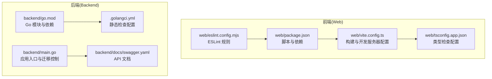
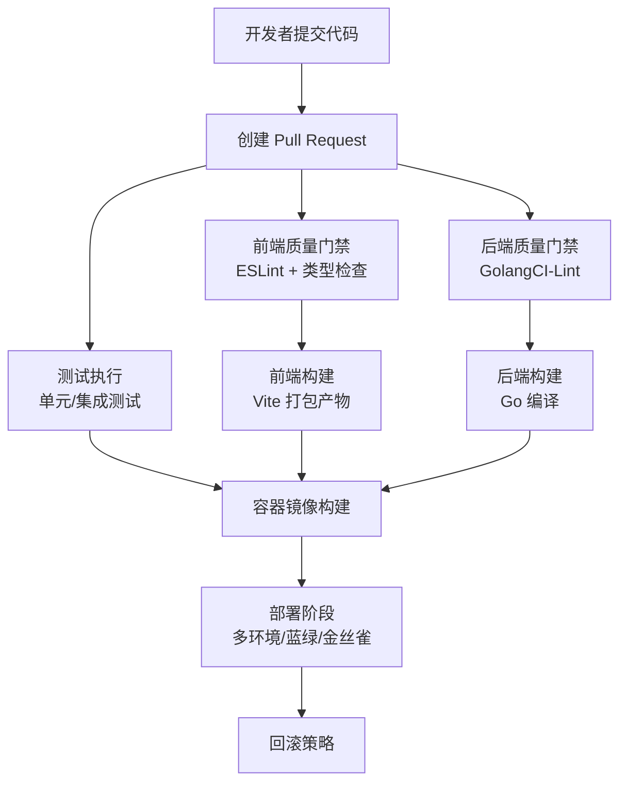
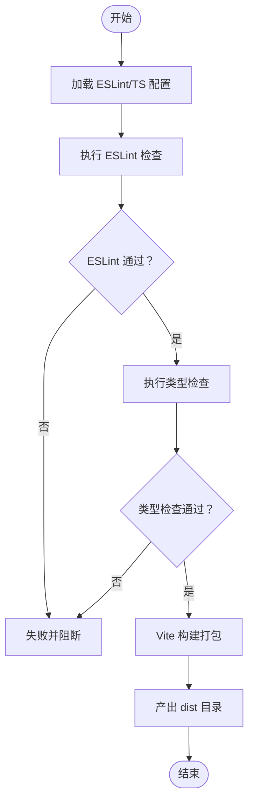
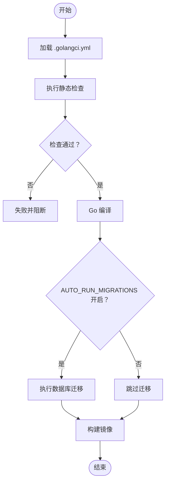
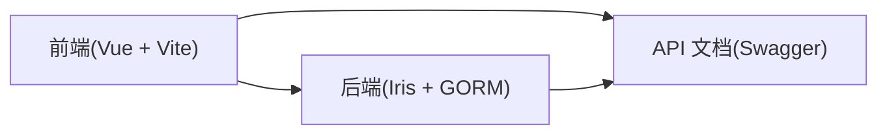

# CI/CD 流水线

<cite>
**本文引用的文件**
- [package.json](file://web/package.json)
- [vite.config.ts](file://web/vite.config.ts)
- [tsconfig.app.json](file://web/tsconfig.app.json)
- [eslint.config.mjs](file://web/eslint.config.mjs)
- [go.mod](file://backend/go.mod)
- [.golangci.yml](file://backend/.golangci.yml)
- [main.go](file://backend/main.go)
- [swagger.yaml](file://backend/docs/swagger.yaml)
- [justfile](file://backend/justfile)
</cite>

## 目录
1. [简介](#简介)
2. [项目结构](#项目结构)
3. [核心组件](#核心组件)
4. [架构总览](#架构总览)
5. [详细组件分析](#详细组件分析)
6. [依赖分析](#依赖分析)
7. [性能考虑](#性能考虑)
8. [故障排查指南](#故障排查指南)
9. [结论](#结论)
10. [附录](#附录)

## 简介
本文件面向 Poprako 项目的 CI/CD 流水线设计与实施，覆盖以下方面：
- 代码质量检查（前端 ESLint、后端 GolangCI-Lint）
- 单元测试与集成测试自动化
- 前后端独立构建与打包策略
- 自动化部署（多环境、蓝绿与金丝雀发布思路）
- 代码扫描、安全检查与依赖审计
- 部署回滚、版本管理与发布日志自动化
- 环境变量与 Secrets 管理最佳实践

## 项目结构
Poprako 采用前后端分离架构：
- 前端：基于 Vite + Vue 3 + TypeScript 的单页应用，使用 pnpm 管理依赖与脚本。
- 后端：基于 Go 语言的 Iris 框架服务，使用 GORM 连接 PostgreSQL，支持自动数据库迁移。

图表来源
- [package.json:1-36](file://web/package.json#L1-L36)
- [vite.config.ts:1-44](file://web/vite.config.ts#L1-L44)
- [tsconfig.app.json:1-9](file://web/tsconfig.app.json#L1-L9)
- [eslint.config.mjs:1-40](file://web/eslint.config.mjs#L1-L40)
- [go.mod:1-114](file://backend/go.mod#L1-L114)
- [.golangci.yml:1-31](file://backend/.golangci.yml#L1-L31)
- [main.go:1-170](file://backend/main.go#L1-L170)
- [swagger.yaml](file://backend/docs/swagger.yaml)

章节来源
- [package.json:1-36](file://web/package.json#L1-L36)
- [vite.config.ts:1-44](file://web/vite.config.ts#L1-L44)
- [tsconfig.app.json:1-9](file://web/tsconfig.app.json#L1-L9)
- [eslint.config.mjs:1-40](file://web/eslint.config.mjs#L1-L40)
- [go.mod:1-114](file://backend/go.mod#L1-L114)
- [.golangci.yml:1-31](file://backend/.golangci.yml#L1-L31)
- [main.go:1-170](file://backend/main.go#L1-L170)

## 核心组件
- 前端构建与质量门禁
  - 使用 pnpm 脚本组合 ESLint 类型检查与构建，确保在合并前通过质量门禁。
  - Vite 提供开发与预览端口配置，便于本地与流水线一致化运行。
- 后端质量与安全
  - GolangCI-Lint 配置启用 vet、staticcheck、gosec、gocritic 等检查器，结合 gofmt/goimports 格式化输出。
  - main.go 中包含自动迁移开关，便于在不同环境控制迁移行为。
- 文档与 API
  - Swagger 文档用于 API 变更追踪与回归验证的基础依据。

章节来源
- [package.json:6-12](file://web/package.json#L6-L12)
- [vite.config.ts:21-42](file://web/vite.config.ts#L21-L42)
- [.golangci.yml:7-24](file://backend/.golangci.yml#L7-L24)
- [main.go:158-169](file://backend/main.go#L158-L169)
- [swagger.yaml](file://backend/docs/swagger.yaml)

## 架构总览
下图展示从代码提交到部署的关键阶段：质量门禁、构建打包、测试、镜像构建与部署。

## 详细组件分析

### 前端流水线组件
- 质量门禁
  - ESLint：基于配置文件定义规则集，忽略生成目录与 JS 类型声明文件。
  - 类型检查：基于 tsconfig.app.json 的编译选项，确保 DOM 与 ES2022 能力可用。
- 构建与打包
  - Vite 配置支持开发与预览端口动态解析，便于流水线注入环境变量。
  - package.json 的 build 脚本串联 lint、类型检查与打包，保证一致性。
- 最佳实践
  - 在流水线中固定 Node 与 pnpm 版本，避免工具链漂移。
  - 将构建产物 dist 作为部署 artifact，配合 CDN 或静态托管。

图表来源
- [eslint.config.mjs:7-39](file://web/eslint.config.mjs#L7-L39)
- [tsconfig.app.json:1-9](file://web/tsconfig.app.json#L1-L9)
- [package.json:6-12](file://web/package.json#L6-L12)
- [vite.config.ts:21-42](file://web/vite.config.ts#L21-L42)

章节来源
- [eslint.config.mjs:1-40](file://web/eslint.config.mjs#L1-L40)
- [tsconfig.app.json:1-9](file://web/tsconfig.app.json#L1-L9)
- [package.json:6-12](file://web/package.json#L6-L12)
- [vite.config.ts:1-44](file://web/vite.config.ts#L1-L44)

### 后端流水线组件
- 质量门禁
  - GolangCI-Lint：启用 vet、staticcheck、errcheck、ineffassign、unused、gosec、gocritic、misspell 等检查器；格式化器启用 gofmt 与 goimports。
  - 输出格式支持带颜色的行号格式，便于定位问题。
- 构建与迁移
  - main.go 中通过环境变量控制是否自动执行数据库迁移，便于在不同环境（开发、测试、生产）灵活切换。
- 最佳实践
  - 在流水线中固定 Go 版本与模块代理，确保依赖可复现。
  - 将二进制产物与配置文件打包为容器镜像，便于部署。

图表来源
- [.golangci.yml:1-31](file://backend/.golangci.yml#L1-L31)
- [main.go:158-169](file://backend/main.go#L158-L169)

章节来源
- [.golangci.yml:1-31](file://backend/.golangci.yml#L1-L31)
- [main.go:1-170](file://backend/main.go#L1-L170)

### 测试与验证
- 前端测试建议
  - 在流水线中添加单元测试与端到端测试步骤，结合覆盖率报告。
  - 使用缓存加速 pnpm 安装，减少流水线时间。
- 后端测试建议
  - 使用 Go 内置 testing 包与数据库测试容器，确保迁移与业务逻辑正确性。
  - 结合 Swagger 文档进行接口回归验证，确保变更不破坏契约。

章节来源
- [swagger.yaml](file://backend/docs/swagger.yaml)

### 部署策略与回滚
- 多环境部署
  - 通过环境变量区分开发、测试、预发与生产环境，镜像标签按分支/版本命名。
- 蓝绿部署
  - 新版本部署至备用实例，健康检查通过后切换流量并回收旧版本。
- 金丝雀发布
  - 逐步将部分流量导入新版本，观察指标与日志后再扩大比例。
- 回滚策略
  - 记录镜像标签与部署时间，出现异常时快速回滚至上一个稳定版本。
- 版本管理与发布日志
  - 使用 Git 标签与变更日志记录每次发布内容，结合 CI 日志定位问题。

章节来源
- [main.go:158-169](file://backend/main.go#L158-L169)

### 代码扫描、安全检查与依赖审计
- 代码扫描
  - 前端：ESLint 规则集与类型检查。
  - 后端：GolangCI-Lint 的 gosec、gocritic 等安全与风格检查。
- 依赖审计
  - 前端：pnpm install 后生成锁定文件，流水线中校验锁定文件未被篡改。
  - 后端：go mod tidy 与 go list -m all 输出依赖树，结合第三方漏洞扫描工具。
- 最佳实践
  - 将依赖扫描与安全检查纳入质量门禁，失败即阻断。

章节来源
- [eslint.config.mjs:1-40](file://web/eslint.config.mjs#L1-L40)
- [.golangci.yml:7-24](file://backend/.golangci.yml#L7-L24)
- [go.mod:1-114](file://backend/go.mod#L1-L114)

### 环境变量与 Secrets 管理
- 环境变量
  - 前端：通过 Vite 的 loadEnv 加载，支持 FRONTEND_PORT、FRONTEND_PREVIEW_PORT、FRONTEND_HOST 等。
  - 后端：通过 godotenv 加载 .env，结合 AUTO_RUN_MIGRATIONS 控制迁移。
- Secrets 管理
  - 在 CI 平台中以密钥形式存储数据库密码、API 密钥等敏感信息，流水线中仅注入必要变量。
  - 避免将 .env 与锁定文件提交到仓库，使用加密或平台 Secret 管理功能。

章节来源
- [vite.config.ts:21-25](file://web/vite.config.ts#L21-L25)
- [main.go:29-31](file://backend/main.go#L29-L31)
- [main.go:158-169](file://backend/main.go#L158-L169)

## 依赖分析
- 前端依赖
  - Vue 3、Vite、TypeScript、ESLint、Ant Design Vue 等，构建链路清晰，便于流水线标准化。
- 后端依赖
  - Iris、GORM、PostgreSQL 驱动、JWT、Zap 日志等，模块化良好，适合容器化部署。
- 关键耦合点
  - 前后端通过 API 文档（Swagger）约定契约，变更需同步更新文档与测试。

图表来源
- [swagger.yaml](file://backend/docs/swagger.yaml)
- [go.mod:5-18](file://backend/go.mod#L5-L18)
- [package.json:13-34](file://web/package.json#L13-L34)

章节来源
- [go.mod:1-114](file://backend/go.mod#L1-L114)
- [package.json:1-36](file://web/package.json#L1-L36)
- [swagger.yaml](file://backend/docs/swagger.yaml)

## 性能考虑
- 构建缓存
  - pnpm 锁定文件与缓存目录持久化，减少重复安装时间。
  - Go 构建缓存与模块缓存结合，提升二次构建速度。
- 并行化
  - 质量门禁与测试阶段尽量并行执行，缩短整体流水线时长。
- 镜像优化
  - 使用多阶段构建减少镜像体积，分层缓存命中率更高。

## 故障排查指南
- 前端
  - ESLint 报错：检查规则配置与文件路径，确保忽略项正确。
  - 类型检查失败：根据 tsconfig.app.json 的 lib/types 配置补齐类型或调整规则。
- 后端
  - GolangCI-Lint 失败：逐条修复 vet/staticcheck/gosec 等检查项，必要时在规则集中临时放宽并设置到期修复。
  - 迁移失败：检查数据库连接与权限，确认 AUTO_RUN_MIGRATIONS 设置与环境一致。
- 通用
  - 查看流水线日志中的格式化输出与错误堆栈，结合“章节来源”定位具体文件与行号。

章节来源
- [.golangci.yml:20-31](file://backend/.golangci.yml#L20-L31)
- [eslint.config.mjs:7-39](file://web/eslint.config.mjs#L7-L39)
- [tsconfig.app.json:3-6](file://web/tsconfig.app.json#L3-L6)
- [main.go:158-169](file://backend/main.go#L158-L169)

## 结论
通过将前端 ESLint/类型检查、后端 GolangCI-Lint 与构建打包纳入统一的 CI 流水线，并结合容器化部署与多环境策略，Poprako 可实现高质量、可追溯、可回滚的持续交付。建议在现有基础上补充测试与依赖审计步骤，完善发布日志与版本管理机制，进一步提升交付稳定性与安全性。

## 附录
- 快速参考
  - 前端构建脚本：参见 [package.json:6-12](file://web/package.json#L6-L12)
  - Vite 端口配置：参见 [vite.config.ts:21-25](file://web/vite.config.ts#L21-L25)
  - 后端静态检查：参见 [.golangci.yml:7-24](file://backend/.golangci.yml#L7-L24)
  - 自动迁移开关：参见 [main.go:158-169](file://backend/main.go#L158-L169)
  - API 文档：参见 [swagger.yaml](file://backend/docs/swagger.yaml)