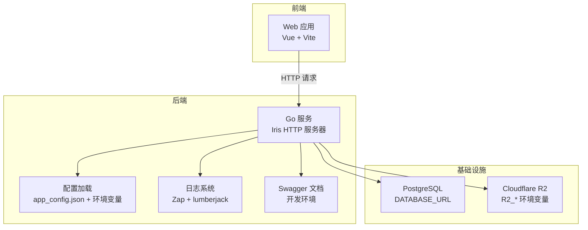
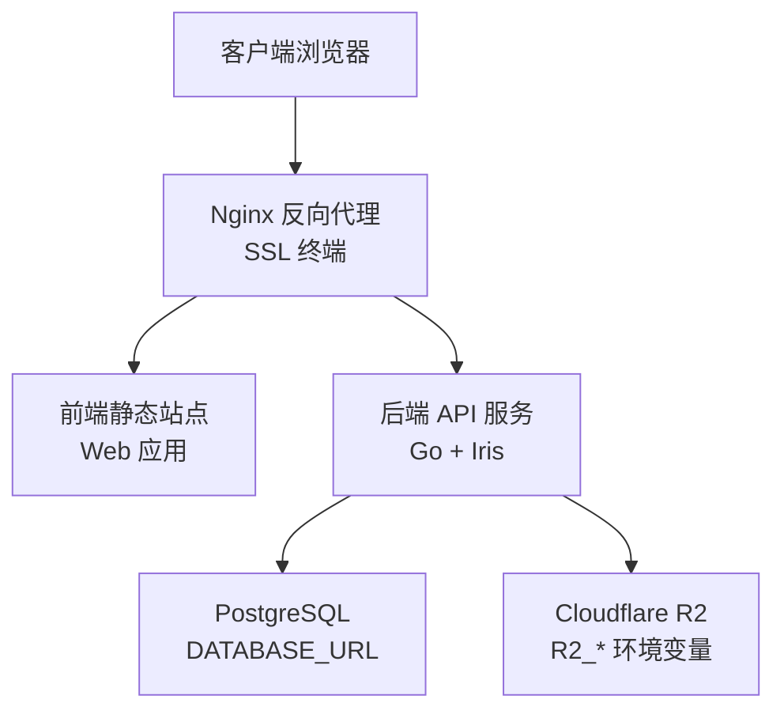
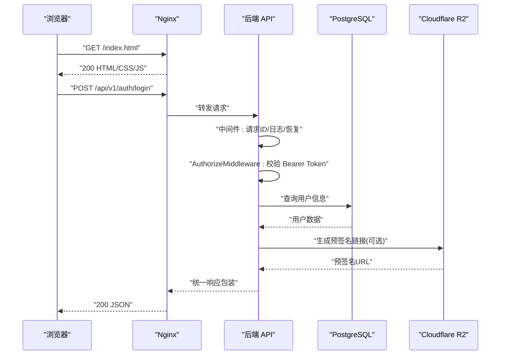
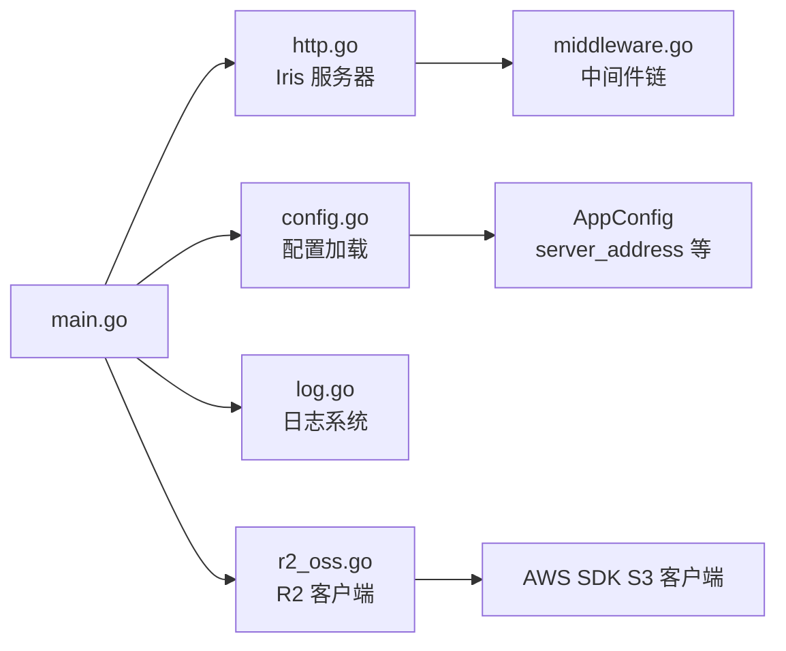

# 容器化部署

<cite>
**本文引用的文件**
- [backend/main.go](file://backend/backend-v1/main.go)
- [backend/go.mod](file://backend/backend-v1/go.mod)
- [backend/app_config.json](file://backend/backend-v1/app_config.json)
- [backend/config.go](file://backend/backend-v1/internal/config/config.go)
- [backend/http.go](file://backend/backend-v1/internal/api/http/http.go)
- [backend/middleware.go](file://backend/backend-v1/internal/api/http/middleware.go)
- [backend/log.go](file://backend/backend-v1/internal/log/log.go)
- [backend/r2_oss.go](file://backend/backend-v1/internal/infrastructure/external/r2_oss.go)
- [web/vite.config.ts](file://web/vite.config.ts)
- [web/package.json](file://web/package.json)
</cite>

## 目录
1. [简介](#简介)
2. [项目结构](#项目结构)
3. [核心组件](#核心组件)
4. [架构总览](#架构总览)
5. [详细组件分析](#详细组件分析)
6. [依赖关系分析](#依赖关系分析)
7. [性能考虑](#性能考虑)
8. [故障排查指南](#故障排查指南)
9. [结论](#结论)
10. [附录](#附录)

## 简介
本指南面向 Poprako 项目的容器化部署，覆盖后端 Go 服务与前端 Vue 应用的镜像构建、docker-compose 编排、前后端分离通信、Nginx 反向代理与 SSL 自动配置、健康检查与重启策略、资源限制、日志与监控等最佳实践。文档基于仓库中现有代码与配置进行说明，帮助读者快速搭建稳定、可观测且易于维护的容器化环境。

## 项目结构
Poprako 采用前后端分离架构：
- 后端：Go 语言实现，基于 Iris 框架提供 REST API，支持 Swagger 文档（开发环境），内置日志与中间件。
- 前端：Vue 3 + Vite，提供开发与预览端口配置，构建产物静态托管于反向代理或静态服务器。
- 共享基础设施：PostgreSQL 数据库（通过 DATABASE_URL 连接）、Cloudflare R2 对象存储（通过 R2_* 环境变量配置）。

图表来源
- [backend/http.go:16-24](file://backend/backend-v1/internal/api/http/http.go#L16-L24)
- [backend/config.go:11-59](file://backend/backend-v1/internal/config/config.go#L11-L59)
- [backend/log.go:53-83](file://backend/backend-v1/internal/log/log.go#L53-L83)
- [backend/r2_oss.go:29-59](file://backend/backend-v1/internal/infrastructure/external/r2_oss.go#L29-L59)

章节来源
- [backend/main.go:25-145](file://backend/backend-v1/main.go#L25-L145)
- [backend/http.go:16-167](file://backend/backend-v1/internal/api/http/http.go#L16-L167)
- [backend/config.go:11-101](file://backend/backend-v1/internal/config/config.go#L11-L101)
- [backend/app_config.json:1-11](file://backend/backend-v1/app_config.json#L1-L11)
- [backend/log.go:53-83](file://backend/backend-v1/internal/log/log.go#L53-L83)
- [backend/r2_oss.go:29-59](file://backend/backend-v1/internal/infrastructure/external/r2_oss.go#L29-L59)
- [web/vite.config.ts:21-42](file://web/vite.config.ts#L21-L42)
- [web/package.json:6-12](file://web/package.json#L6-L12)

## 核心组件
- 后端 HTTP 服务器：基于 Iris 初始化路由、中间件与 Swagger（开发环境），监听配置中的地址。
- 配置系统：优先读取 app_config.json，再由环境变量覆盖关键参数（APP_ENVIRONMENT、DATABASE_URL、JWT_SECRET_KEY 等）。
- 日志系统：生产环境使用 JSON 结构化日志与日志轮转，输出至 stdout 与本地文件。
- 存储集成：通过 Cloudflare R2 客户端封装 S3 兼容接口，支持预签名链接与桶域名配置。
- 前端构建：Vite 提供开发与预览端口配置，脚本统一通过 package.json 管理。

章节来源
- [backend/http.go:16-167](file://backend/backend-v1/internal/api/http/http.go#L16-L167)
- [backend/config.go:11-101](file://backend/backend-v1/internal/config/config.go#L11-L101)
- [backend/app_config.json:1-11](file://backend/backend-v1/app_config.json#L1-L11)
- [backend/log.go:53-83](file://backend/backend-v1/internal/log/log.go#L53-L83)
- [backend/r2_oss.go:29-59](file://backend/backend-v1/internal/infrastructure/external/r2_oss.go#L29-L59)
- [web/vite.config.ts:21-42](file://web/vite.config.ts#L21-L42)
- [web/package.json:6-12](file://web/package.json#L6-L12)

## 架构总览
下图展示容器化部署的典型拓扑：Nginx 作为反向代理与 SSL 终端，前端静态资源由 Nginx 提供，后端 Go 服务通过内网网络暴露 API；数据库与对象存储作为外部依赖。

图表来源
- [backend/http.go:16-24](file://backend/backend-v1/internal/api/http/http.go#L16-L24)
- [backend/config.go:85-100](file://backend/backend-v1/internal/config/config.go#L85-L100)
- [backend/r2_oss.go:30-56](file://backend/backend-v1/internal/infrastructure/external/r2_oss.go#L30-L56)

## 详细组件分析

### 后端镜像构建与多阶段优化
- 基础镜像选择：建议使用官方 Golang 构建镜像与精简运行时镜像（如 alpine 或 distroless）组合，减少镜像体积。
- 多阶段构建要点：
  - 第一阶段：安装构建依赖，拉取 go.mod 依赖缓存层，编译二进制。
  - 第二阶段：仅复制编译产物与必要运行时文件，避免打包源码与开发工具。
- 镜像大小控制：
  - 使用 .dockerignore 排除 node_modules、dist、.git 等无关目录。
  - 运行时镜像选择静态二进制或最小基础镜像，禁用 shell 与包管理器。
  - 合理分层缓存：将变更频率低的依赖安装步骤放在靠前层。
- 进程与健康检查：
  - 容器入口命令指向编译后的二进制，监听地址来自配置（默认 127.0.0.1:8080）。
  - 健康检查：对 /api/v1/auth/login 发起轻量请求验证服务可用性；或通过本地 TCP 探针探测监听端口。
  - 重启策略：生产环境建议 unless-stopped 或 on-failure，结合资源限制与日志轮转。
- 环境变量注入：
  - APP_ENVIRONMENT、DATABASE_URL、JWT_SECRET_KEY、R2_* 等通过 compose secrets 或 env 文件注入。
- 日志与审计：
  - 生产环境启用 JSON 日志与日志轮转，输出到 stdout，便于容器日志采集系统统一收集。

章节来源
- [backend/go.mod:1-18](file://backend/backend-v1/go.mod#L1-L18)
- [backend/config.go:29-59](file://backend/backend-v1/internal/config/config.go#L29-L59)
- [backend/app_config.json:1-11](file://backend/backend-v1/app_config.json#L1-L11)
- [backend/log.go:53-83](file://backend/backend-v1/internal/log/log.go#L53-L83)

### 前端镜像构建与静态托管
- 构建流程：
  - 使用 Node.js 基础镜像安装依赖并执行构建脚本，生成 dist 目录。
  - 将 dist 目录复制到 Nginx 镜像的静态站点根目录，或单独使用 nginx:alpine 镜像提供静态托管。
- 开发与预览端口：
  - Vite 支持通过环境变量配置开发端口与预览端口，容器运行时可通过环境变量覆盖。
- 资源优化：
  - 构建产物启用压缩与缓存头；CDN 加速静态资源（可选）。

章节来源
- [web/package.json:6-12](file://web/package.json#L6-L12)
- [web/vite.config.ts:21-42](file://web/vite.config.ts#L21-L42)

### docker-compose 服务编排、网络与卷
- 服务编排：
  - web：前端静态站点服务，暴露 80 端口；或与 Nginx 合并为单一容器。
  - api：后端服务，映射 8080 端口（或使用内部端口配合 Nginx）。
  - db：PostgreSQL 服务，持久化数据卷。
  - nginx：反向代理与 SSL 终端，挂载证书与站点配置。
- 网络配置：
  - 自定义桥接网络，前端与后端通过服务名互相发现；数据库与对象存储作为外部依赖。
- 卷挂载：
  - PostgreSQL 数据卷：/var/lib/postgresql/data
  - 日志卷：后端日志目录 logs/（若启用文件落盘）
  - Nginx 证书与站点配置：/etc/nginx/ssl 与 /etc/nginx/conf.d

章节来源
- [backend/http.go:16-24](file://backend/backend-v1/internal/api/http/http.go#L16-L24)
- [backend/app_config.json:1-11](file://backend/backend-v1/app_config.json#L1-L11)
- [backend/log.go:53-83](file://backend/backend-v1/internal/log/log.go#L53-L83)

### 前后端分离部署与通信机制
- 前端通过 Nginx 提供静态资源，API 请求转发至后端服务。
- 后端中间件链路：请求 ID -> 日志 -> 权限校验 -> 业务处理 -> 统一响应包装。
- 跨域与鉴权：
  - Nginx 层设置 CORS 与安全头；后端中间件负责 Bearer Token 校验。
- 内部服务发现：
  - 使用服务名访问后端 API（如 http://api:8080/api/v1/...）。

图表来源
- [backend/http.go:38-167](file://backend/backend-v1/internal/api/http/http.go#L38-L167)
- [backend/middleware.go:15-79](file://backend/backend-v1/internal/api/http/middleware.go#L15-L79)
- [backend/r2_oss.go:29-59](file://backend/backend-v1/internal/infrastructure/external/r2_oss.go#L29-L59)

### Nginx 反向代理与 SSL 自动配置
- 反向代理：
  - 将静态资源路径映射到前端构建目录；将 /api/v1/* 转发到后端服务。
  - 设置必要的安全头与缓存策略。
- SSL 证书：
  - 使用 Let’s Encrypt 自动签发与续期（certbot + cron），证书挂载到 /etc/letsencrypt。
  - Nginx 配置 HTTPS 监听与重定向。
- 动态配置：
  - 通过环境变量或配置模板渲染 Nginx 配置，避免硬编码主机名与端口。

章节来源
- [backend/http.go:38-167](file://backend/backend-v1/internal/api/http/http.go#L38-L167)
- [backend/r2_oss.go:50-56](file://backend/backend-v1/internal/infrastructure/external/r2_oss.go#L50-L56)

### 健康检查、重启策略与资源限制
- 健康检查：
  - 后端：对 /api/v1/auth/login 发起轻量请求，或 TCP 探针探测 8080 端口。
  - 前端/Nginx：对 / 返回 200。
- 重启策略：
  - unless-stopped 或 on-failure，避免在资源不足时无限重启。
- 资源限制：
  - CPU/内存配额与 OOM 保护；数据库连接池参数与后端并发数协同调整。

章节来源
- [backend/http.go:16-24](file://backend/backend-v1/internal/api/http/http.go#L16-L24)
- [backend/config.go:85-100](file://backend/backend-v1/internal/config/config.go#L85-L100)

### 日志收集、监控指标与性能调优
- 日志：
  - 后端生产环境使用 JSON 日志与 lumberjack 轮转，输出到 stdout，便于容器平台统一采集。
- 监控：
  - 后端中间件记录请求耗时与状态码；结合 Prometheus/Grafana 展示关键指标。
  - Nginx 提供访问日志与请求统计。
- 性能调优：
  - 后端：合理设置数据库连接池（min_idle_connections、max_open_connections），启用连接复用。
  - 前端：开启 Gzip/Brotli 压缩与缓存；CDN 加速静态资源。
  - Nginx：启用 keepalive、限流与安全头。

章节来源
- [backend/log.go:53-83](file://backend/backend-v1/internal/log/log.go#L53-L83)
- [backend/config.go:85-100](file://backend/backend-v1/internal/config/config.go#L85-L100)
- [web/vite.config.ts:21-42](file://web/vite.config.ts#L21-L42)

## 依赖关系分析
后端服务的关键依赖与运行时关系如下：

图表来源
- [backend/main.go:25-145](file://backend/backend-v1/main.go#L25-L145)
- [backend/http.go:16-167](file://backend/backend-v1/internal/api/http/http.go#L16-L167)
- [backend/config.go:11-101](file://backend/backend-v1/internal/config/config.go#L11-L101)
- [backend/log.go:53-83](file://backend/backend-v1/internal/log/log.go#L53-L83)
- [backend/r2_oss.go:29-59](file://backend/backend-v1/internal/infrastructure/external/r2_oss.go#L29-L59)
- [backend/middleware.go:15-79](file://backend/backend-v1/internal/api/http/middleware.go#L15-L79)

章节来源
- [backend/main.go:25-145](file://backend/backend-v1/main.go#L25-L145)
- [backend/http.go:16-167](file://backend/backend-v1/internal/api/http/http.go#L16-L167)
- [backend/config.go:11-101](file://backend/backend-v1/internal/config/config.go#L11-L101)
- [backend/log.go:53-83](file://backend/backend-v1/internal/log/log.go#L53-L83)
- [backend/r2_oss.go:29-59](file://backend/backend-v1/internal/infrastructure/external/r2_oss.go#L29-L59)
- [backend/middleware.go:15-79](file://backend/backend-v1/internal/api/http/middleware.go#L15-L79)

## 性能考虑
- 构建阶段：利用 Go 模块缓存与多阶段构建减少镜像体积与构建时间。
- 运行阶段：数据库连接池参数与后端并发需匹配容器资源；启用连接复用与合理的超时设置。
- 前端：静态资源压缩与缓存；CDN 加速与 HTTPS 强缓存。
- Nginx：启用 gzip/keepalive、限流与安全头；证书与配置热更新。

## 故障排查指南
- 启动失败：
  - 检查环境变量是否完整（APP_ENVIRONMENT、DATABASE_URL、JWT_SECRET_KEY、R2_*）。
  - 查看后端日志（stdout/stderr）与本地日志文件（logs/main-service.log）。
- 认证失败：
  - 确认 Authorization 头格式为 Bearer Token；核对 JWT_SECRET_KEY 是否一致。
- 数据库连接问题：
  - 核对 DATABASE_URL 与网络连通性；确认数据库已初始化并具备相应权限。
- 对象存储上传异常：
  - 核对 R2_ACCOUNT_ID、R2_ACCESS_KEY_ID、R2_SECRET_ACCESS_KEY、R2_BUCKET_NAME、R2_CUSTOM_DOMAIN。
- 健康检查失败：
  - 使用 curl 测试 /api/v1/auth/login；检查容器端口映射与防火墙规则。

章节来源
- [backend/config.go:44-56](file://backend/backend-v1/internal/config/config.go#L44-L56)
- [backend/config.go:74-83](file://backend/backend-v1/internal/config/config.go#L74-L83)
- [backend/config.go:91-100](file://backend/backend-v1/internal/config/config.go#L91-L100)
- [backend/r2_oss.go:30-56](file://backend/backend-v1/internal/infrastructure/external/r2_oss.go#L30-L56)
- [backend/log.go:53-83](file://backend/backend-v1/internal/log/log.go#L53-L83)

## 结论
通过多阶段构建与精简运行时镜像，结合合理的健康检查、重启策略与资源限制，Poprako 的前后端可以稳定地在容器环境中运行。配合 Nginx 反向代理与 SSL 自动配置，可实现高可用、易维护的生产级部署方案。建议在 CI/CD 中自动化镜像构建与发布，并持续完善日志与监控体系。

## 附录
- 关键环境变量清单：
  - APP_ENVIRONMENT：运行环境（development/production）
  - DATABASE_URL：PostgreSQL 连接字符串
  - JWT_SECRET_KEY：JWT 密钥
  - R2_ACCOUNT_ID、R2_ACCESS_KEY_ID、R2_SECRET_ACCESS_KEY、R2_REGION、R2_BUCKET_NAME、R2_CUSTOM_DOMAIN：Cloudflare R2 配置
- 前端端口配置：
  - FRONTEND_PORT、FRONTEND_PREVIEW_PORT、FRONTEND_HOST：Vite 开发与预览端口与主机

章节来源
- [backend/config.go:44-56](file://backend/backend-v1/internal/config/config.go#L44-L56)
- [backend/config.go:74-83](file://backend/backend-v1/internal/config/config.go#L74-L83)
- [backend/config.go:91-100](file://backend/backend-v1/internal/config/config.go#L91-L100)
- [backend/r2_oss.go:30-56](file://backend/backend-v1/internal/infrastructure/external/r2_oss.go#L30-L56)
- [web/vite.config.ts:21-42](file://web/vite.config.ts#L21-L42)