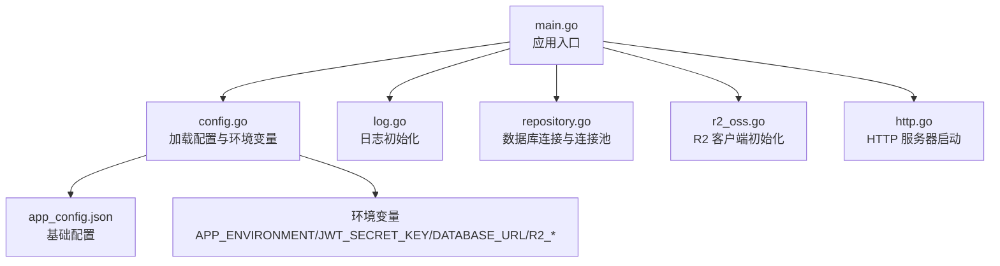
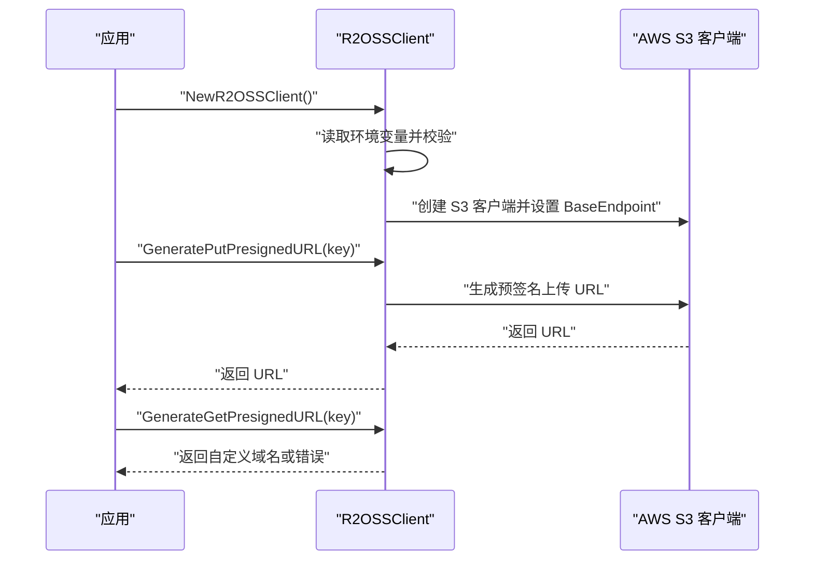
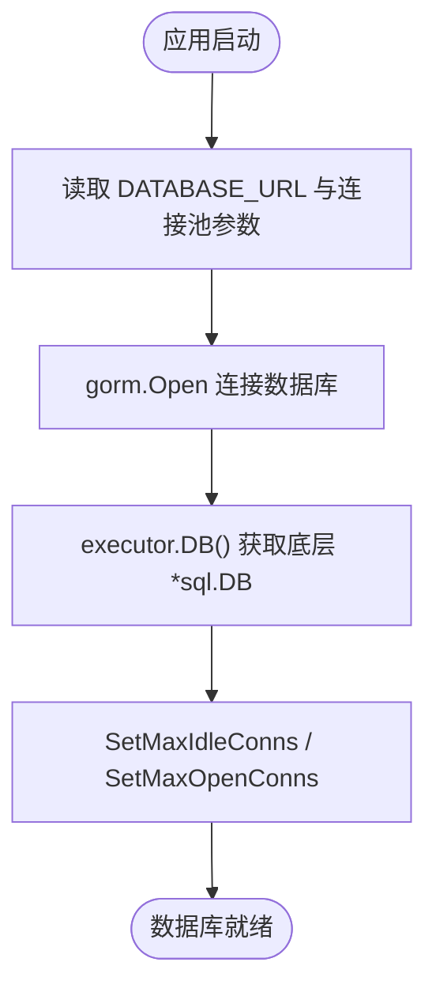
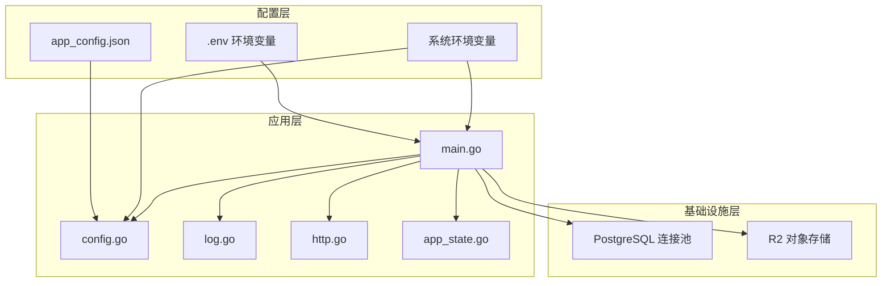

# 环境配置

<cite>
**本文引用的文件**
- [app_config.json](file://backend/backend-v1/app_config.json)
- [config.go](file://backend/backend-v1/internal/config/config.go)
- [r2_oss.go](file://backend/backend-v1/internal/infrastructure/external/r2_oss.go)
- [repository.go](file://backend/backend-v1/internal/infrastructure/repository/repository.go)
- [main.go](file://backend/backend-v1/main.go)
- [http.go](file://backend/backend-v1/internal/api/http/http.go)
- [log.go](file://backend/backend-v1/internal/log/log.go)
- [app_state.go](file://backend/backend-v1/internal/state/app_state.go)
- [go.mod](file://backend/backend-v1/go.mod)
</cite>

## 目录
1. [简介](#简介)
2. [项目结构与配置入口](#项目结构与配置入口)
3. [核心配置项与参数说明](#核心配置项与参数说明)
4. [环境变量与配置优先级](#环境变量与配置优先级)
5. [不同环境的配置示例与最佳实践](#不同环境的配置示例与最佳实践)
6. [Cloudflare R2 对象存储配置](#cloudflare-r2-对象存储配置)
7. [PostgreSQL 数据库连接与连接池](#postgresql-数据库连接与连接池)
8. [配置验证与故障排除](#配置验证与故障排除)
9. [架构概览](#架构概览)
10. [结论](#结论)

## 简介
本文件面向 Poprako 后端服务的运维与开发人员，系统性说明应用的环境配置方式与关键参数，涵盖：
- 应用配置文件结构与参数含义
- 环境变量的设置方法与配置优先级
- 不同环境（开发、测试、生产）的配置示例与最佳实践
- Cloudflare R2 对象存储的密钥、域名与访问权限配置
- PostgreSQL 数据库连接、SSL 连接与连接池优化参数
- 配置验证与常见问题排查

## 项目结构与配置入口
后端采用 Go 语言实现，主要配置由 JSON 文件与环境变量共同驱动，运行时通过 Viper 加载 JSON 配置，并从环境变量中读取敏感或环境相关参数。主程序入口负责加载 .env、初始化配置、日志、数据库与外部服务客户端，并启动 HTTP 服务器。

图表来源
- [main.go:25-145](file://backend/backend-v1/main.go#L25-L145)
- [config.go:11-59](file://backend/backend-v1/internal/config/config.go#L11-L59)
- [app_config.json:1-11](file://backend/backend-v1/app_config.json#L1-L11)
- [log.go:13-30](file://backend/backend-v1/internal/log/log.go#L13-L30)
- [repository.go:11-29](file://backend/backend-v1/internal/infrastructure/repository/repository.go#L11-L29)
- [r2_oss.go:29-79](file://backend/backend-v1/internal/infrastructure/external/r2_oss.go#L29-L79)
- [http.go:16-24](file://backend/backend-v1/internal/api/http/http.go#L16-L24)

章节来源
- [main.go:25-145](file://backend/backend-v1/main.go#L25-L145)
- [config.go:11-59](file://backend/backend-v1/internal/config/config.go#L11-L59)
- [app_config.json:1-11](file://backend/backend-v1/app_config.json#L1-L11)

## 核心配置项与参数说明
- 服务器地址
  - 来源：JSON 配置文件中的 server_address 字段
  - 作用：HTTP 服务器监听地址
  - 示例值：127.0.0.1:8080
- 认证配置
  - expiration_hours：令牌有效期（小时）
  - JWT 密钥：通过环境变量注入
- 数据库配置
  - min_idle_connections：最小空闲连接数
  - max_open_connections：最大打开连接数
  - DATABASE_URL：数据库连接字符串（含凭据与主机信息）

章节来源
- [app_config.json:2-9](file://backend/backend-v1/app_config.json#L2-L9)
- [config.go:69-83](file://backend/backend-v1/internal/config/config.go#L69-L83)
- [config.go:85-100](file://backend/backend-v1/internal/config/config.go#L85-L100)

## 环境变量与配置优先级
- 配置加载顺序
  1) 读取 .env 文件（通过 godotenv 加载）
  2) 读取 JSON 配置文件 app_config.json
  3) 从环境变量覆盖敏感或运行时参数
- 关键环境变量
  - APP_ENVIRONMENT：决定运行环境（development/production），用于控制日志级别与 Swagger UI 的启用
  - JWT_SECRET_KEY：JWT 签名密钥
  - DATABASE_URL：PostgreSQL 连接字符串
  - R2_ACCOUNT_ID、R2_ACCESS_KEY_ID、R2_SECRET_ACCESS_KEY、R2_REGION、R2_BUCKET_NAME、R2_CUSTOM_DOMAIN：R2 对象存储相关
- 优先级说明
  - 环境变量优先于 JSON 配置文件
  - 若缺少必要环境变量，应用会直接报错并终止

章节来源
- [main.go:26-28](file://backend/backend-v1/main.go#L26-L28)
- [config.go:29-59](file://backend/backend-v1/internal/config/config.go#L29-L59)
- [config.go:74-82](file://backend/backend-v1/internal/config/config.go#L74-L82)
- [config.go:91-99](file://backend/backend-v1/internal/config/config.go#L91-L99)
- [r2_oss.go:30-53](file://backend/backend-v1/internal/infrastructure/external/r2_oss.go#L30-L53)

## 不同环境的配置示例与最佳实践
- 开发环境（development）
  - APP_ENVIRONMENT=development
  - 日志：开发模式，控制台彩色输出，Debug 级别
  - Swagger UI：启用
  - 建议：使用本地或测试数据库，开启详细日志便于调试
- 测试环境（test）
  - APP_ENVIRONMENT=test
  - 日志：生产模式，但可降低日志级别以便问题定位
  - Swagger UI：禁用
  - 建议：使用独立测试数据库，连接池参数适中
- 生产环境（production）
  - APP_ENVIRONMENT=production
  - 日志：生产模式，JSON 输出，文件轮转，Warn 级别及以上
  - Swagger UI：禁用
  - 建议：使用高可用数据库与对象存储，严格限制密钥与网络访问

章节来源
- [log.go:16-82](file://backend/backend-v1/internal/log/log.go#L16-L82)
- [http.go:154-166](file://backend/backend-v1/internal/api/http/http.go#L154-L166)
- [config.go:61-67](file://backend/backend-v1/internal/config/config.go#L61-L67)

## Cloudflare R2 对象存储配置
- 必需环境变量
  - R2_ACCOUNT_ID：账户标识
  - R2_ACCESS_KEY_ID：访问密钥 ID
  - R2_SECRET_ACCESS_KEY：访问密钥
  - R2_REGION：区域，默认 auto
  - R2_BUCKET_NAME：存储桶名称
  - R2_CUSTOM_DOMAIN：自定义域名（可选）
- 行为说明
  - 使用 AWS SDK v2 for Go 的 S3 客户端兼容接口
  - 自动拼接 R2 终端地址：https://{account_id}.r2.cloudflarestorage.com
  - 支持生成上传/下载预签名 URL
  - 删除操作具备重试机制与 NoSuchKey 特殊处理
- 访问权限建议
  - 仅授予最小权限（如仅允许 Put/Delete/Get）
  - 使用自定义域名时确保 DNS 解析与证书配置正确

图表来源
- [r2_oss.go:29-79](file://backend/backend-v1/internal/infrastructure/external/r2_oss.go#L29-L79)
- [r2_oss.go:81-107](file://backend/backend-v1/internal/infrastructure/external/r2_oss.go#L81-L107)

章节来源
- [r2_oss.go:29-79](file://backend/backend-v1/internal/infrastructure/external/r2_oss.go#L29-L79)
- [r2_oss.go:81-107](file://backend/backend-v1/internal/infrastructure/external/r2_oss.go#L81-L107)
- [r2_oss.go:109-198](file://backend/backend-v1/internal/infrastructure/external/r2_oss.go#L109-L198)

## PostgreSQL 数据库连接与连接池
- 连接字符串
  - 通过 DATABASE_URL 环境变量提供，建议包含主机、端口、数据库名、用户、密码与查询参数（如 SSL 模式）
- 连接池参数
  - min_idle_connections：最小空闲连接
  - max_open_connections：最大打开连接
  - 应用在初始化时调用 sqlDB.SetMaxIdleConns 与 sqlDB.SetMaxOpenConns 设置
- SSL 连接
  - 可通过 DATABASE_URL 中的查询参数启用（例如 sslmode=prefer/require/disable 等）
  - 建议生产环境使用 require 或 disable（视部署环境而定），并配合网络层安全策略

图表来源
- [repository.go:11-29](file://backend/backend-v1/internal/infrastructure/repository/repository.go#L11-L29)
- [config.go:91-99](file://backend/backend-v1/internal/config/config.go#L91-L99)

章节来源
- [repository.go:11-29](file://backend/backend-v1/internal/infrastructure/repository/repository.go#L11-L29)
- [config.go:85-100](file://backend/backend-v1/internal/config/config.go#L85-L100)

## 配置验证与故障排除
- 常见错误与排查
  - 未设置 APP_ENVIRONMENT：应用启动即报错
  - 未设置 JWT_SECRET_KEY：认证模块加载失败
  - 未设置 DATABASE_URL：数据库初始化失败
  - 未设置 R2_* 环境变量：R2 客户端初始化直接 panic
  - R2 自定义域名未配置：生成 Get 预签名 URL 返回错误
- 排查步骤
  - 确认 .env 文件存在且包含必要键值
  - 使用 echo 或 shell 打印环境变量进行核对
  - 尝试在命令行使用 DATABASE_URL 连接数据库验证连通性
  - 通过预签名 URL 生成接口验证 R2 凭据与桶权限
  - 查看日志输出（开发模式控制台彩色，生产模式文件轮转）
- 性能与稳定性建议
  - 生产环境建议开启连接池上限与合理的空闲连接数
  - R2 删除操作具备重试，但应避免频繁批量删除导致的延迟
  - 日志级别按环境调整，生产环境使用 Warn 及以上级别

章节来源
- [config.go:44-47](file://backend/backend-v1/internal/config/config.go#L44-L47)
- [config.go:74-78](file://backend/backend-v1/internal/config/config.go#L74-L78)
- [config.go:92-95](file://backend/backend-v1/internal/config/config.go#L92-L95)
- [r2_oss.go:30-53](file://backend/backend-v1/internal/infrastructure/external/r2_oss.go#L30-L53)
- [r2_oss.go:101-107](file://backend/backend-v1/internal/infrastructure/external/r2_oss.go#L101-L107)
- [log.go:13-30](file://backend/backend-v1/internal/log/log.go#L13-L30)

## 架构概览
下图展示应用启动时的关键组件交互与配置来源。

图表来源
- [main.go:25-145](file://backend/backend-v1/main.go#L25-L145)
- [config.go:11-59](file://backend/backend-v1/internal/config/config.go#L11-L59)
- [log.go:13-30](file://backend/backend-v1/internal/log/log.go#L13-L30)
- [http.go:16-24](file://backend/backend-v1/internal/api/http/http.go#L16-L24)
- [app_state.go:23-49](file://backend/backend-v1/internal/state/app_state.go#L23-L49)
- [repository.go:11-29](file://backend/backend-v1/internal/infrastructure/repository/repository.go#L11-L29)
- [r2_oss.go:29-79](file://backend/backend-v1/internal/infrastructure/external/r2_oss.go#L29-L79)

## 结论
- 应用通过 JSON 配置文件与环境变量协同工作，环境变量具有更高优先级
- 开发、测试、生产三类环境通过 APP_ENVIRONMENT 切换，影响日志与 Swagger UI
- R2 与数据库均依赖环境变量进行初始化，务必确保密钥与域名配置正确
- 建议在生产环境启用严格的日志级别与连接池参数，并定期验证连接与权限