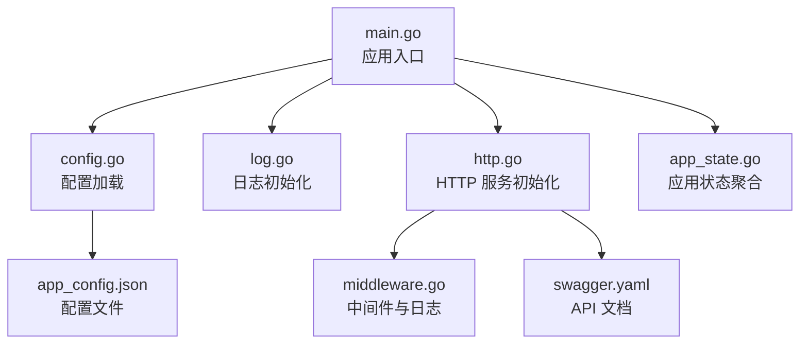
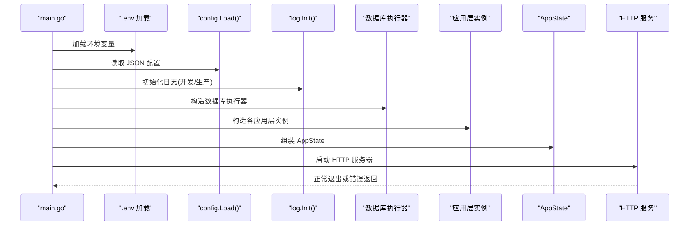
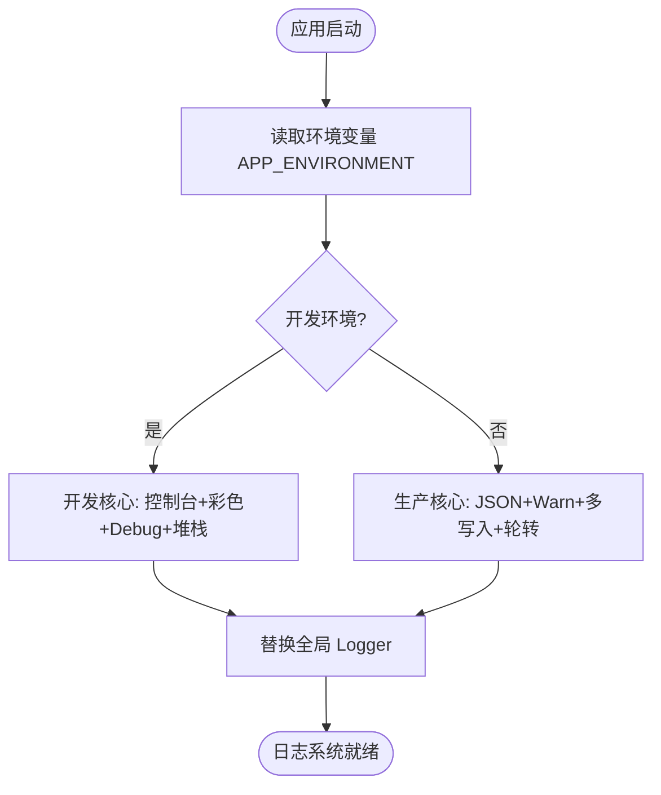
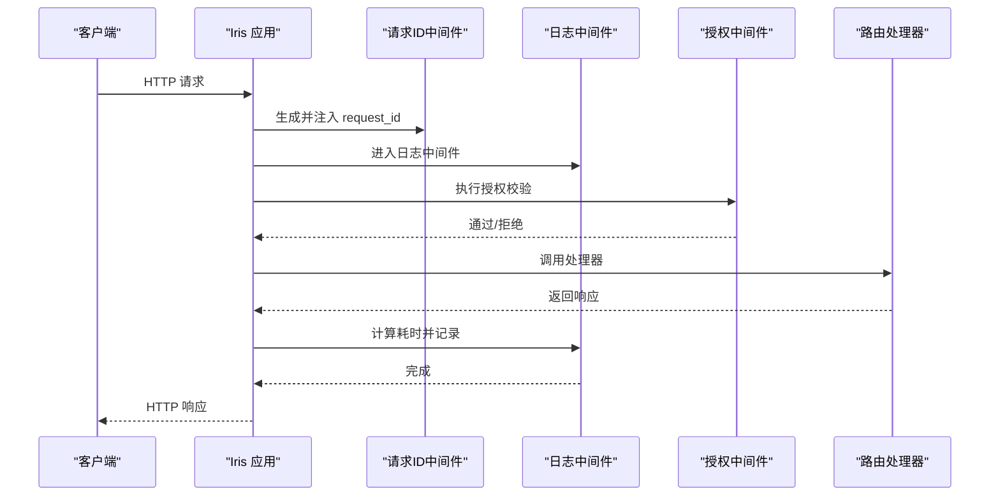
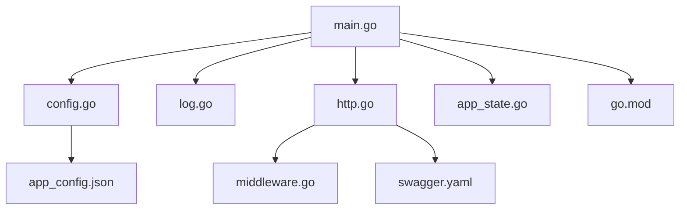

# 监控运维

<cite>
**本文引用的文件**
- [main.go](file://backend/backend-v1/main.go)
- [config.go](file://backend/backend-v1/internal/config/config.go)
- [log.go](file://backend/backend-v1/internal/log/log.go)
- [http.go](file://backend/backend-v1/internal/api/http/http.go)
- [middleware.go](file://backend/backend-v1/internal/api/http/middleware.go)
- [app_state.go](file://backend/backend-v1/internal/state/app_state.go)
- [app_config.json](file://backend/backend-v1/app_config.json)
- [swagger.yaml](file://backend/backend-v1/docs/swagger.yaml)
- [go.mod](file://backend/backend-v1/go.mod)
</cite>

## 目录
1. [简介](#简介)
2. [项目结构](#项目结构)
3. [核心组件](#核心组件)
4. [架构总览](#架构总览)
5. [详细组件分析](#详细组件分析)
6. [依赖关系分析](#依赖关系分析)
7. [性能考虑](#性能考虑)
8. [故障排查指南](#故障排查指南)
9. [结论](#结论)
10. [附录](#附录)

## 简介
本文件面向 Poprako 项目的监控与运维团队，围绕应用日志系统、性能监控、数据库与连接池状态、系统与容器资源监控、网络监控、故障诊断与性能调优、备份与灾难恢复、以及安全与合规等维度，提供可操作的配置方法与最佳实践。文档基于代码仓库中的现有实现进行提炼与扩展建议，确保读者能够快速落地。

## 项目结构
后端采用 Go 语言与 Iris 框架，整体结构按领域与层次划分：
- 应用入口与生命周期管理位于根目录入口文件
- 配置加载与环境变量解析集中在配置模块
- 日志初始化与开发/生产差异化策略位于日志模块
- HTTP 服务初始化、路由与中间件位于 HTTP 层
- 应用状态对象承载各业务应用层实例
- Swagger 文档用于 API 可观测性与调试辅助

**图表来源**
- [main.go:25-145](file://backend/backend-v1/main.go#L25-L145)
- [config.go:11-59](file://backend/backend-v1/internal/config/config.go#L11-L59)
- [log.go:13-30](file://backend/backend-v1/internal/log/log.go#L13-L30)
- [http.go:16-24](file://backend/backend-v1/internal/api/http/http.go#L16-L24)
- [middleware.go:15-45](file://backend/backend-v1/internal/api/http/middleware.go#L15-L45)
- [app_state.go:23-49](file://backend/backend-v1/internal/state/app_state.go#L23-L49)
- [app_config.json:1-11](file://backend/backend-v1/app_config.json#L1-L11)
- [swagger.yaml:1-20](file://backend/backend-v1/docs/swagger.yaml#L1-L20)

**章节来源**
- [main.go:25-145](file://backend/backend-v1/main.go#L25-L145)
- [config.go:11-59](file://backend/backend-v1/internal/config/config.go#L11-L59)
- [log.go:13-30](file://backend/backend-v1/internal/log/log.go#L13-L30)
- [http.go:16-24](file://backend/backend-v1/internal/api/http/http.go#L16-L24)
- [middleware.go:15-45](file://backend/backend-v1/internal/api/http/middleware.go#L15-L45)
- [app_state.go:23-49](file://backend/backend-v1/internal/state/app_state.go#L23-L49)
- [app_config.json:1-11](file://backend/backend-v1/app_config.json#L1-L11)
- [swagger.yaml:1-20](file://backend/backend-v1/docs/swagger.yaml#L1-L20)

## 核心组件
- 应用入口与生命周期
  - 加载 .env 环境变量
  - 解析 JSON 配置文件
  - 初始化日志系统
  - 构造仓储与应用层实例
  - 启动 HTTP 服务器
- 配置系统
  - 通过 Viper 从 JSON 文件加载配置
  - 通过环境变量注入敏感配置（如密钥、数据库地址）
  - 提供开发/生产环境判断能力
- 日志系统
  - 开发环境：控制台彩色编码、本地时间戳、Debug 级别、带调用栈
  - 生产环境：JSON 结构化输出、lumberjack 日志轮转、同时输出至控制台与文件、Warn 级别及以上
- HTTP 服务与中间件
  - 初始化 Iris 应用，注册路由与中间件
  - 记录请求耗时、状态码、远程地址、请求 ID 等关键指标
  - JWT 授权中间件校验访问令牌
- 应用状态
  - 聚合所有应用层实例，便于在中间件与路由中使用

**章节来源**
- [main.go:25-145](file://backend/backend-v1/main.go#L25-L145)
- [config.go:11-59](file://backend/backend-v1/internal/config/config.go#L11-L59)
- [log.go:13-83](file://backend/backend-v1/internal/log/log.go#L13-L83)
- [http.go:16-24](file://backend/backend-v1/internal/api/http/http.go#L16-L24)
- [middleware.go:15-45](file://backend/backend-v1/internal/api/http/middleware.go#L15-L45)
- [app_state.go:8-21](file://backend/backend-v1/internal/state/app_state.go#L8-L21)

## 架构总览
下图展示了启动流程与关键组件交互：

**图表来源**
- [main.go:25-145](file://backend/backend-v1/main.go#L25-L145)
- [config.go:11-59](file://backend/backend-v1/internal/config/config.go#L11-L59)
- [log.go:13-30](file://backend/backend-v1/internal/log/log.go#L13-L30)
- [http.go:16-24](file://backend/backend-v1/internal/api/http/http.go#L16-L24)

## 详细组件分析

### 日志系统与日志级别
- 初始化逻辑
  - 根据环境变量选择开发或生产核心
  - 开发：控制台输出、彩色级别、ISO 时间、Debug 级别、堆栈追踪
  - 生产：JSON 编码、lumberjack 轮转、同时输出到 stdout 与文件、Warn 级别及以上
- 结构化日志
  - 生产环境采用 JSON 编码，便于日志采集与检索
- 日志轮转
  - 文件路径：logs/main-service.log
  - 轮转策略：最大文件大小 50MB、保留 3 个备份数、保留 7 天、开启压缩
- 日志采样与级别建议
  - 开发：Debug 级别，便于问题定位
  - 生产：Warn 级别起步，结合业务关键事件提升到 Info/Warn，避免噪声
- 日志字段建议
  - 基础字段：level、ts、msg、caller、stacktrace
  - 业务字段：request_id、method、path、status_code、duration、remote_addr、component、span_id（如引入链路追踪）

**图表来源**
- [log.go:13-83](file://backend/backend-v1/internal/log/log.go#L13-L83)
- [config.go:61-67](file://backend/backend-v1/internal/config/config.go#L61-L67)

**章节来源**
- [log.go:13-83](file://backend/backend-v1/internal/log/log.go#L13-L83)
- [config.go:61-67](file://backend/backend-v1/internal/config/config.go#L61-L67)

### HTTP 服务与中间件
- 服务初始化
  - 使用 Iris 默认配置，启用 panic 恢复中间件
  - 注册自定义日志中间件与请求 ID 中间件
  - 注册路由与授权中间件
- 日志中间件
  - 记录请求耗时、状态码、远程地址、请求 ID
  - 开发环境下输出 Debug 级别日志
- 授权中间件
  - 校验 Authorization 头部格式与有效性
  - 解析 JWT 并将用户标识注入上下文

**图表来源**
- [http.go:16-24](file://backend/backend-v1/internal/api/http/http.go#L16-L24)
- [middleware.go:15-45](file://backend/backend-v1/internal/api/http/middleware.go#L15-L45)
- [middleware.go:47-79](file://backend/backend-v1/internal/api/http/middleware.go#L47-L79)

**章节来源**
- [http.go:16-24](file://backend/backend-v1/internal/api/http/http.go#L16-L24)
- [http.go:26-151](file://backend/backend-v1/internal/api/http/http.go#L26-L151)
- [middleware.go:15-45](file://backend/backend-v1/internal/api/http/middleware.go#L15-L45)
- [middleware.go:47-79](file://backend/backend-v1/internal/api/http/middleware.go#L47-L79)

### 数据库与连接池状态监控
- 配置项
  - 最小空闲连接数
  - 最大打开连接数
- 连接池状态观测建议
  - 通过数据库驱动提供的统计接口定期采集指标（如打开连接数、空闲连接数、等待计数、最大峰值等）
  - 将指标暴露为文本协议或 Prometheus 指标端点，纳入统一监控面板
- 调优要点
  - 根据并发与 QPS 动态调整 max_open_connections
  - 监控连接池等待时间，避免过长导致请求排队
  - 结合慢查询日志与事务超时阈值优化 SQL

**章节来源**
- [config.go:85-100](file://backend/backend-v1/internal/config/config.go#L85-L100)
- [app_config.json:6-9](file://backend/backend-v1/app_config.json#L6-L9)

### 性能监控与告警
- 指标采集
  - HTTP 请求耗时直方图、成功率、错误率
  - 连接池指标（打开/空闲/等待/最大峰值）
  - 数据库慢查询计数与耗时
- 告警规则示例
  - P95/P99 请求延迟超过阈值
  - 错误率异常升高
  - 连接池等待时间持续偏高
  - 数据库慢查询数量激增
- 基准测试
  - 使用压测工具对关键路径（登录、漫画列表、章节详情、页面上传等）进行基准测试
  - 对比不同连接池配置下的吞吐与延迟

**章节来源**
- [middleware.go:15-45](file://backend/backend-v1/internal/api/http/middleware.go#L15-L45)
- [config.go:85-100](file://backend/backend-v1/internal/config/config.go#L85-L100)

### 系统与容器资源监控
- 系统资源
  - CPU 使用率、内存占用、磁盘空间与 IO
  - 网络收发字节数与连接数
- 容器监控
  - 容器 CPU/内存/IO 指标
  - 容器重启次数与健康检查状态
- 建议
  - 使用系统级监控 Agent（如 Prometheus Node Exporter、cAdvisor）
  - 将指标统一接入时序数据库与可视化面板

[本节为通用指导，不直接分析具体文件]

### 网络监控
- 关键观测点
  - 出入站流量、连接建立与重试、DNS 解析时延
  - 与外部服务（如对象存储）的连通性与延迟
- 建议
  - 部署网络探测与链路质量监控
  - 对外部依赖增加超时与熔断策略

[本节为通用指导，不直接分析具体文件]

### 故障诊断与性能调优
- 诊断步骤
  - 查看应用日志（生产 JSON，开发彩色），定位错误与堆栈
  - 检查 HTTP 中间件记录的请求耗时与状态码
  - 核对数据库连接池状态与慢查询
- 调优方向
  - 优化热点接口与 SQL
  - 调整连接池参数与并发限制
  - 引入缓存与异步处理

**章节来源**
- [log.go:13-83](file://backend/backend-v1/internal/log/log.go#L13-L83)
- [middleware.go:15-45](file://backend/backend-v1/internal/api/http/middleware.go#L15-L45)
- [config.go:85-100](file://backend/backend-v1/internal/config/config.go#L85-L100)

### 备份、恢复与灾难恢复
- 备份策略
  - 数据库全量与增量备份计划
  - 对象存储（OSS）关键数据的版本与生命周期管理
- 恢复演练
  - 定期进行 RTO/RPO 回归测试
- 自动化
  - 通过 CI/CD 或调度器编排备份任务
  - 将恢复脚本与配置一并纳入版本管理

[本节为通用指导，不直接分析具体文件]

### 安全监控、访问审计与合规
- 安全监控
  - 异常登录行为、频繁失败的授权请求
  - 对外 API 的异常模式检测
- 访问审计
  - 记录关键操作（创建/删除/修改）与操作人
  - 保留审计日志以便追溯
- 合规
  - 数据最小化、传输加密、访问最小权限
  - 定期安全扫描与漏洞修复

[本节为通用指导，不直接分析具体文件]

## 依赖关系分析
- 外部依赖
  - 日志：Zap + lumberjack
  - 配置：Viper
  - Web：Iris
  - ORM：GORM + Postgres 驱动
- 内部模块耦合
  - main 依赖 config、log、http、state
  - http 依赖 state 与中间件
  - config 依赖环境变量与 JSON 配置文件

**图表来源**
- [main.go:25-145](file://backend/backend-v1/main.go#L25-L145)
- [config.go:11-59](file://backend/backend-v1/internal/config/config.go#L11-L59)
- [log.go:13-30](file://backend/backend-v1/internal/log/log.go#L13-L30)
- [http.go:16-24](file://backend/backend-v1/internal/api/http/http.go#L16-L24)
- [middleware.go:15-45](file://backend/backend-v1/internal/api/http/middleware.go#L15-L45)
- [app_state.go:23-49](file://backend/backend-v1/internal/state/app_state.go#L23-L49)
- [app_config.json:1-11](file://backend/backend-v1/app_config.json#L1-L11)
- [swagger.yaml:1-20](file://backend/backend-v1/docs/swagger.yaml#L1-L20)
- [go.mod:1-113](file://backend/backend-v1/go.mod#L1-L113)

**章节来源**
- [go.mod:1-113](file://backend/backend-v1/go.mod#L1-L113)
- [main.go:25-145](file://backend/backend-v1/main.go#L25-L145)

## 性能考虑
- 日志级别与开销
  - 生产环境使用 Warn 级别与 JSON 结构化，降低解析成本
  - 控制台与文件双写需关注磁盘 IO
- HTTP 中间件
  - 日志中间件仅在开发环境输出详细字段，生产环境建议通过外部日志系统集中采集
- 数据库连接池
  - 合理设置 min_idle 与 max_open，避免过度连接导致资源争用
- API 文档
  - Swagger 在生产环境默认关闭，避免暴露内部细节与潜在风险

[本节为通用指导，不直接分析具体文件]

## 故障排查指南
- 启动失败
  - 检查 .env 是否正确加载
  - 确认 app_config.json 存在且可解析
  - 校验环境变量（APP_ENVIRONMENT、JWT_SECRET_KEY、DATABASE_URL）
- 日志异常
  - 开发环境：确认终端支持彩色输出
  - 生产环境：检查 logs/main-service.log 是否存在、权限是否允许写入
- HTTP 服务异常
  - 查看中间件日志与状态码分布
  - 核对授权中间件是否正确解析 JWT
- 数据库连接问题
  - 检查 DATABASE_URL 与网络连通性
  - 监控连接池指标，排查等待与峰值

**章节来源**
- [main.go:25-35](file://backend/backend-v1/main.go#L25-L35)
- [config.go:11-59](file://backend/backend-v1/internal/config/config.go#L11-L59)
- [log.go:64-82](file://backend/backend-v1/internal/log/log.go#L64-L82)
- [middleware.go:47-79](file://backend/backend-v1/internal/api/http/middleware.go#L47-L79)
- [config.go:91-100](file://backend/backend-v1/internal/config/config.go#L91-L100)

## 结论
Poprako 的监控运维体系以“开发友好、生产稳健”为核心原则：开发环境强调可观测性与易诊断，生产环境强调结构化日志与稳定输出。结合 HTTP 中间件的指标采集、数据库连接池状态监控与外部系统（对象存储）的可用性观测，可构建完整的运行时视图。建议在此基础上补充指标导出、告警规则与自动化演练，持续完善可观测性闭环。

## 附录
- 配置文件位置与关键字段
  - server_address：监听地址
  - auth.expiration_hours：令牌有效期
  - database.min_idle_connections / max_open_connections：连接池参数
- Swagger 文档
  - 非生产环境自动启用，便于 API 调试与文档查阅

**章节来源**
- [app_config.json:1-11](file://backend/backend-v1/app_config.json#L1-L11)
- [http.go:153-166](file://backend/backend-v1/internal/api/http/http.go#L153-L166)
- [swagger.yaml:1-20](file://backend/backend-v1/docs/swagger.yaml#L1-L20)