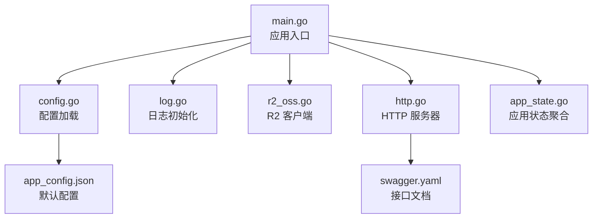
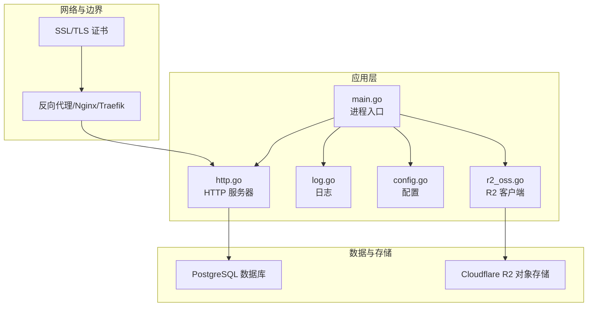
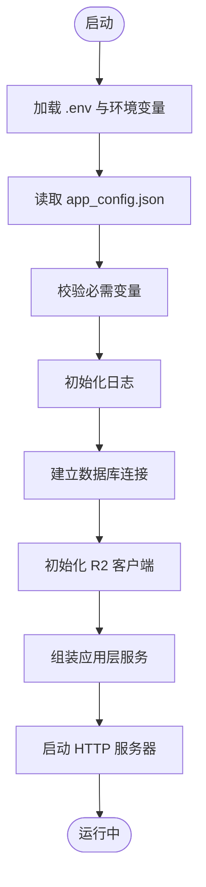
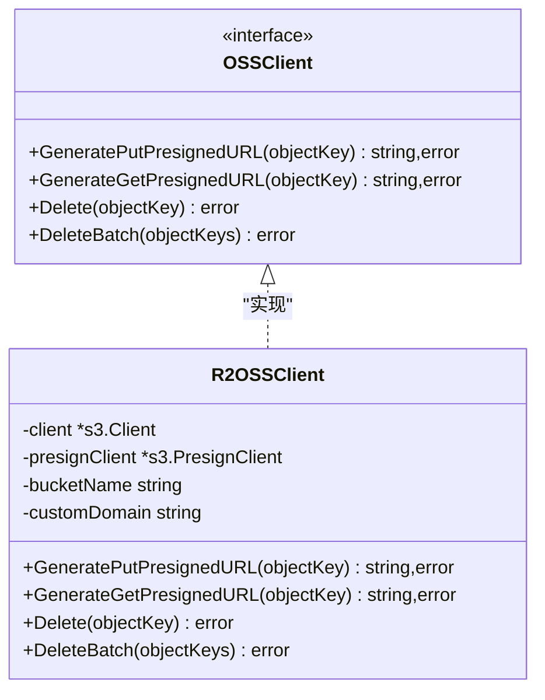
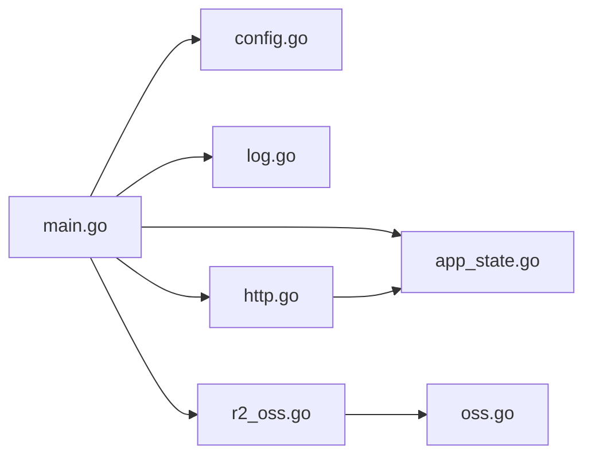

# 部署指南

<cite>
**本文引用的文件**
- [main.go](file://backend/backend-v1/main.go)
- [app_config.json](file://backend/backend-v1/app_config.json)
- [config.go](file://backend/backend-v1/internal/config/config.go)
- [r2_oss.go](file://backend/backend-v1/internal/infrastructure/external/r2_oss.go)
- [oss.go](file://backend/backend-v1/internal/domain/external/oss.go)
- [http.go](file://backend/backend-v1/internal/api/http/http.go)
- [log.go](file://backend/backend-v1/internal/log/log.go)
- [app_state.go](file://backend/backend-v1/internal/state/app_state.go)
- [.gitignore](file://backend/backend-v1/.gitignore)
- [go.mod](file://backend/backend-v1/go.mod)
- [swagger.yaml](file://backend/backend-v1/docs/swagger.yaml)
- [swagger.json](file://backend/backend-v1/docs/swagger.json)
- [docs.go](file://backend/backend-v1/docs/docs.go)
</cite>

## 目录
1. [简介](#简介)
2. [项目结构](#项目结构)
3. [核心组件](#核心组件)
4. [架构总览](#架构总览)
5. [详细组件分析](#详细组件分析)
6. [依赖分析](#依赖分析)
7. [性能考虑](#性能考虑)
8. [故障排除指南](#故障排除指南)
9. [结论](#结论)
10. [附录](#附录)

## 简介
本指南面向生产环境部署 Poprako 后端服务，覆盖环境变量与配置、数据库连接、Cloudflare R2 对象存储集成、容器化与编排、CI/CD 自动化、负载均衡与反向代理、SSL 证书、监控与日志、性能优化、故障排除、备份与灾难恢复以及安全加固与合规性要求。内容基于仓库中的实际实现进行提炼与落地化说明。

## 项目结构
后端采用 Go 语言与 Iris 框架，按领域驱动设计分层组织：配置、基础设施、应用、领域模型与仓储、API 层等。核心入口负责加载环境变量与配置、初始化日志、数据库连接、对象存储客户端、应用层服务与 HTTP 服务器。

图表来源
- [main.go:25-145](file://backend/backend-v1/main.go#L25-L145)
- [config.go:11-59](file://backend/backend-v1/internal/config/config.go#L11-L59)
- [log.go:13-30](file://backend/backend-v1/internal/log/log.go#L13-L30)
- [r2_oss.go:29-79](file://backend/backend-v1/internal/infrastructure/external/r2_oss.go#L29-L79)
- [http.go:16-24](file://backend/backend-v1/internal/api/http/http.go#L16-L24)
- [app_state.go:23-49](file://backend/backend-v1/internal/state/app_state.go#L23-L49)
- [app_config.json:1-11](file://backend/backend-v1/app_config.json#L1-L11)
- [swagger.yaml:1-60](file://backend/backend-v1/docs/swagger.yaml#L1-L60)

章节来源
- [main.go:25-145](file://backend/backend-v1/main.go#L25-L145)
- [config.go:11-59](file://backend/backend-v1/internal/config/config.go#L11-L59)
- [log.go:13-30](file://backend/backend-v1/internal/log/log.go#L13-L30)
- [r2_oss.go:29-79](file://backend/backend-v1/internal/infrastructure/external/r2_oss.go#L29-L79)
- [http.go:16-24](file://backend/backend-v1/internal/api/http/http.go#L16-L24)
- [app_state.go:23-49](file://backend/backend-v1/internal/state/app_state.go#L23-L49)
- [app_config.json:1-11](file://backend/backend-v1/app_config.json#L1-L11)
- [swagger.yaml:1-60](file://backend/backend-v1/docs/swagger.yaml#L1-L60)

## 核心组件
- 应用入口与生命周期
  - 加载 .env 环境变量
  - 读取 app_config.json 并通过 Viper 解析
  - 初始化日志系统
  - 建立数据库连接与仓储实例
  - 初始化对象存储客户端（R2）
  - 组装应用层服务并启动 HTTP 服务器
- 配置管理
  - 环境变量：APP_ENVIRONMENT、DATABASE_URL、JWT_SECRET_KEY
  - JSON 配置：server_address、auth.expiration_hours、database.min_idle_connections、database.max_open_connections
- 日志系统
  - 开发环境：控制台彩色编码、调试级别
  - 生产环境：JSON 输出、日志轮转、告警级别以上输出
- 对象存储（R2）
  - 通过 AWS SDK for Go v2 兼容 S3 接口
  - 支持预签名上传/下载 URL 生成、删除与批量删除
  - 支持自定义域名回源访问
- HTTP 服务器
  - Iris 框架，启用请求 ID、panic 恢复、Swagger UI（非生产）

章节来源
- [main.go:25-145](file://backend/backend-v1/main.go#L25-L145)
- [config.go:11-59](file://backend/backend-v1/internal/config/config.go#L11-L59)
- [log.go:13-83](file://backend/backend-v1/internal/log/log.go#L13-L83)
- [r2_oss.go:29-79](file://backend/backend-v1/internal/infrastructure/external/r2_oss.go#L29-L79)
- [http.go:16-24](file://backend/backend-v1/internal/api/http/http.go#L16-L24)

## 架构总览
下图展示生产部署的关键组件与交互：应用进程、数据库、对象存储、反向代理与外部客户端。

图表来源
- [main.go:25-145](file://backend/backend-v1/main.go#L25-L145)
- [http.go:16-24](file://backend/backend-v1/internal/api/http/http.go#L16-L24)
- [log.go:13-83](file://backend/backend-v1/internal/log/log.go#L13-L83)
- [config.go:11-59](file://backend/backend-v1/internal/config/config.go#L11-L59)
- [r2_oss.go:29-79](file://backend/backend-v1/internal/infrastructure/external/r2_oss.go#L29-L79)

## 详细组件分析

### 配置与环境变量
- 必需环境变量
  - APP_ENVIRONMENT：production 或 development
  - DATABASE_URL：PostgreSQL 连接字符串
  - JWT_SECRET_KEY：JWT 密钥
  - R2_ACCOUNT_ID、R2_ACCESS_KEY_ID、R2_SECRET_ACCESS_KEY、R2_BUCKET_NAME、R2_REGION（可选，默认 auto）、R2_CUSTOM_DOMAIN（可选）
- 默认配置文件
  - server_address：监听地址
  - auth.expiration_hours：令牌过期小时数
  - database.min_idle_connections、database.max_open_connections：连接池参数
- 加载顺序
  - 读取 app_config.json
  - 读取环境变量并校验
  - 初始化日志与应用状态

图表来源
- [main.go:25-145](file://backend/backend-v1/main.go#L25-L145)
- [config.go:29-59](file://backend/backend-v1/internal/config/config.go#L29-L59)
- [app_config.json:1-11](file://backend/backend-v1/app_config.json#L1-L11)

章节来源
- [main.go:25-145](file://backend/backend-v1/main.go#L25-L145)
- [config.go:29-59](file://backend/backend-v1/internal/config/config.go#L29-L59)
- [app_config.json:1-11](file://backend/backend-v1/app_config.json#L1-L11)

### 数据库连接与连接池
- 连接字符串来自 DATABASE_URL 环境变量
- 连接池参数来自 app_config.json 的 database 节点
- 建议在生产环境根据并发与资源限制调整 min_idle_connections 与 max_open_connections

章节来源
- [config.go:91-99](file://backend/backend-v1/internal/config/config.go#L91-L99)
- [app_config.json:6-9](file://backend/backend-v1/app_config.json#L6-L9)

### Cloudflare R2 对象存储集成
- 客户端初始化
  - 从环境变量读取账户与凭据
  - 使用自定义 BaseEndpoint 指向 R2
  - 可配置自定义域名用于下载
- 功能支持
  - 生成上传/下载预签名 URL
  - 删除单个或批量对象（带重试与 NoSuchKey 容错）
  - 自动识别图片类型并设置 Content-Type

图表来源
- [oss.go:3-8](file://backend/backend-v1/internal/domain/external/oss.go#L3-L8)
- [r2_oss.go:21-79](file://backend/backend-v1/internal/infrastructure/external/r2_oss.go#L21-L79)

章节来源
- [r2_oss.go:29-79](file://backend/backend-v1/internal/infrastructure/external/r2_oss.go#L29-L79)
- [oss.go:3-8](file://backend/backend-v1/internal/domain/external/oss.go#L3-L8)

### HTTP 服务器与路由
- 监听地址由 app_config.json.server_address 提供
- 非生产环境启用 Swagger UI
- 中间件：请求 ID、panic 恢复

章节来源
- [http.go:16-24](file://backend/backend-v1/internal/api/http/http.go#L16-L24)
- [http.go:26-50](file://backend/backend-v1/internal/api/http/http.go#L26-L50)
- [http.go:153-166](file://backend/backend-v1/internal/api/http/http.go#L153-L166)

### 日志系统
- 开发：控制台彩色编码、调试级别
- 生产：JSON 编码、日志轮转（大小、备份数、保留天数、压缩）、告警级别以上输出

章节来源
- [log.go:13-83](file://backend/backend-v1/internal/log/log.go#L13-L83)

### 应用状态与依赖注入
- AppState 聚合所有应用层服务，便于统一注入与管理

章节来源
- [app_state.go:8-21](file://backend/backend-v1/internal/state/app_state.go#L8-L21)
- [app_state.go:23-49](file://backend/backend-v1/internal/state/app_state.go#L23-L49)

## 依赖分析
- 外部依赖
  - Iris：Web 框架
  - Viper：配置读取
  - Zap + Lumberjack：日志
  - AWS SDK for Go v2：R2/S3 兼容
  - GORM + Postgres 驱动：ORM 与数据库
  - Swag：接口文档
- 内部模块耦合
  - main.go 依赖 config、log、repository、external、state、http
  - http 层依赖 state 注入的应用服务
  - R2 客户端实现 domain/external/OSSClient 接口

图表来源
- [main.go:25-145](file://backend/backend-v1/main.go#L25-L145)
- [config.go:11-59](file://backend/backend-v1/internal/config/config.go#L11-L59)
- [log.go:13-30](file://backend/backend-v1/internal/log/log.go#L13-L30)
- [http.go:16-24](file://backend/backend-v1/internal/api/http/http.go#L16-L24)
- [app_state.go:23-49](file://backend/backend-v1/internal/state/app_state.go#L23-L49)
- [r2_oss.go:29-79](file://backend/backend-v1/internal/infrastructure/external/r2_oss.go#L29-L79)
- [oss.go:3-8](file://backend/backend-v1/internal/domain/external/oss.go#L3-L8)

章节来源
- [go.mod:5-18](file://backend/backend-v1/go.mod#L5-L18)
- [main.go:25-145](file://backend/backend-v1/main.go#L25-L145)

## 性能考虑
- 连接池调优
  - 根据并发与数据库性能调整 min_idle_connections 与 max_open_connections
- 日志级别
  - 生产环境使用 Warn 级别及以上，避免过多 I/O
- 对象存储
  - 使用预签名上传降低服务端压力；合理设置过期时间
- HTTP
  - 启用反向代理缓存静态资源；开启 gzip/压缩传输
- 监控
  - 结合指标与日志采集，关注 P95/P99 延迟与错误率

## 故障排除指南
- 启动失败
  - 检查 .env 与环境变量是否正确加载
  - 确认 app_config.json 是否存在且可解析
- 数据库连接失败
  - 校验 DATABASE_URL 格式与可达性
- R2 访问异常
  - 校验 R2_* 环境变量与权限
  - 若使用自定义域名，确认 R2_CUSTOM_DOMAIN 配置
- 日志问题
  - 开发环境应输出到控制台；生产环境检查 logs 文件夹权限与磁盘空间
- 接口文档
  - 非生产环境可通过 /swagger 访问 Swagger UI

章节来源
- [main.go:25-28](file://backend/backend-v1/main.go#L25-L28)
- [config.go:36-59](file://backend/backend-v1/internal/config/config.go#L36-L59)
- [r2_oss.go:30-53](file://backend/backend-v1/internal/infrastructure/external/r2_oss.go#L30-L53)
- [log.go:64-82](file://backend/backend-v1/internal/log/log.go#L64-L82)
- [http.go:153-166](file://backend/backend-v1/internal/api/http/http.go#L153-L166)

## 结论
本指南基于仓库现有实现，给出了生产环境部署的完整路径：环境变量与配置、数据库与对象存储、日志与监控、反向代理与 SSL、CI/CD 自动化、性能优化与安全加固。建议结合业务规模与合规要求进一步细化参数与流程。

## 附录

### 环境变量清单
- APP_ENVIRONMENT：运行环境（production/development）
- DATABASE_URL：PostgreSQL 连接串
- JWT_SECRET_KEY：JWT 密钥
- R2_ACCOUNT_ID、R2_ACCESS_KEY_ID、R2_SECRET_ACCESS_KEY、R2_BUCKET_NAME、R2_REGION、R2_CUSTOM_DOMAIN：R2 凭据与配置

章节来源
- [config.go:44-47](file://backend/backend-v1/internal/config/config.go#L44-L47)
- [config.go:74-82](file://backend/backend-v1/internal/config/config.go#L74-L82)
- [config.go:91-99](file://backend/backend-v1/internal/config/config.go#L91-L99)
- [r2_oss.go:30-56](file://backend/backend-v1/internal/infrastructure/external/r2_oss.go#L30-L56)

### 配置文件示例字段
- server_address：监听地址
- auth.expiration_hours：令牌过期小时数
- database.min_idle_connections、database.max_open_connections：连接池参数

章节来源
- [app_config.json:1-11](file://backend/backend-v1/app_config.json#L1-L11)

### Docker 容器化部署建议
- 基础镜像：官方 Go 运行时或 Alpine
- 构建步骤：编译二进制 → 复制至运行时镜像 → 设置工作目录与用户
- 启动命令：直接运行编译产物
- 挂载卷：日志目录 logs（生产）
- 环境变量：通过镜像构建或编排平台注入
- 健康检查：暴露 /swagger 或轻量探针端点

[本节为通用容器化建议，不直接分析具体文件，故无“章节来源”]

### CI/CD 流水线与自动化部署
- 触发条件：主分支推送、标签发布
- 步骤建议：代码检查（golangci-lint）、单元测试、构建二进制、扫描镜像、推送镜像、编排部署（Kubernetes/Helm/Docker Compose）
- 发布策略：蓝绿/滚动发布，配合就绪/存活探针
- 安全：镜像漏洞扫描、只读根文件系统、最小权限

[本节为通用流水线建议，不直接分析具体文件，故无“章节来源”]

### 负载均衡、反向代理与 SSL
- 反向代理：Nginx/Traefik/Caddy 将流量转发至后端服务
- 负载均衡：多实例部署，健康检查与自动扩缩容
- SSL：Let’s Encrypt 自动签发与续期，强制 HTTPS
- 静态资源：由反向代理缓存与压缩

[本节为通用网络与安全建议，不直接分析具体文件，故无“章节来源”]

### 监控、日志与性能优化
- 指标：QPS、延迟、错误率、连接池使用率、R2 请求耗时
- 日志：生产环境 JSON + 日志轮转，集中收集与检索
- 性能：连接池与缓存、异步任务、CDN 加速

[本节为通用运维建议，不直接分析具体文件，故无“章节来源”]

### 备份与灾难恢复
- 数据库：定期逻辑/物理备份，异地容灾
- 对象存储：版本控制、跨区域复制（如适用）
- 配置与密钥：密钥管理服务，定期轮换
- 测试恢复：周期性演练，验证恢复时间与数据一致性

[本节为通用运维建议，不直接分析具体文件，故无“章节来源”]

### 安全加固与合规
- 最小权限：数据库与对象存储仅授予必要权限
- 传输加密：TLS 1.3，禁用弱密码套件
- 输入校验与限流：防止滥用与注入
- 审计日志：操作审计与访问日志
- 合规：GDPR/CCPA 等数据保护要求下的数据处理与删除机制

[本节为通用安全建议，不直接分析具体文件，故无“章节来源”]