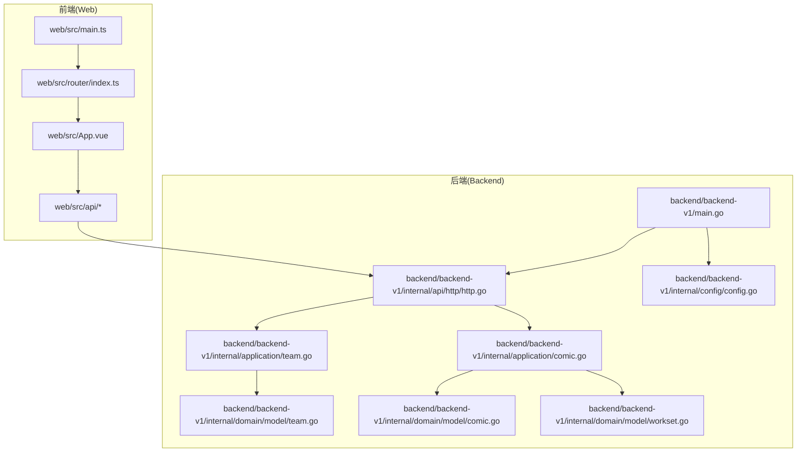
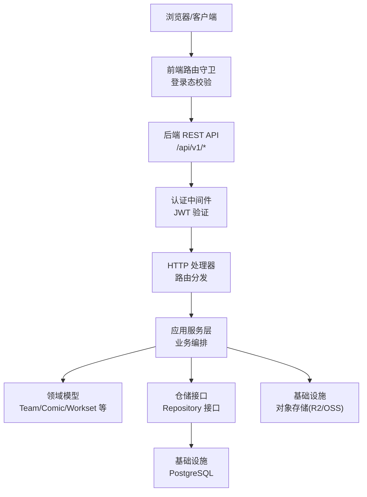
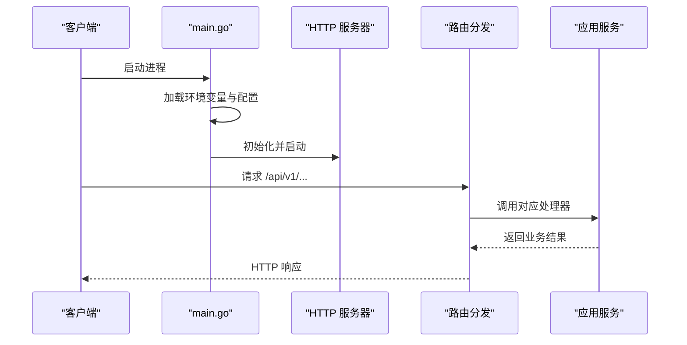
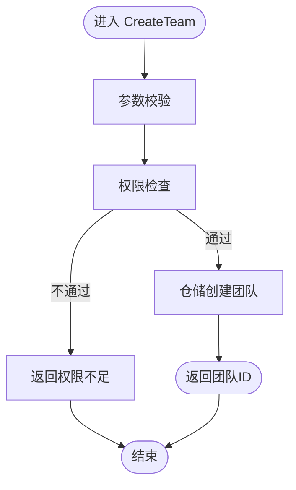
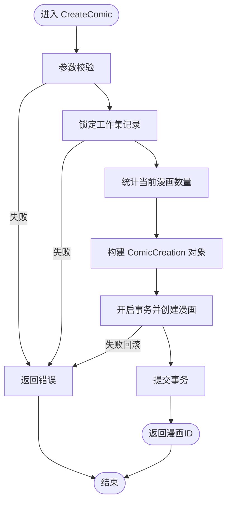
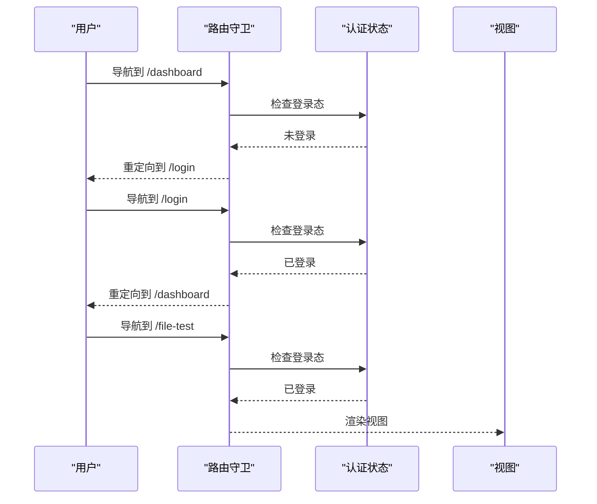
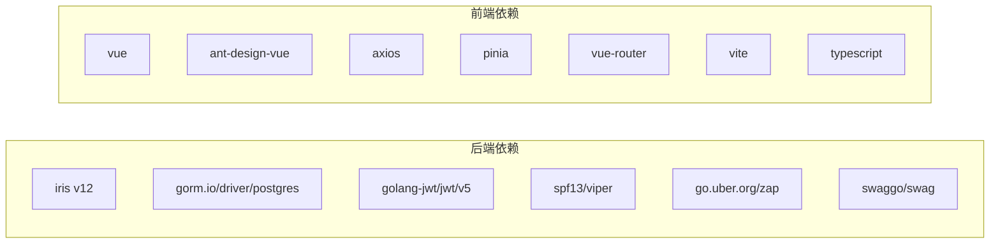

# 项目概述

<cite>
**本文引用的文件**
- [后端主入口 main.go](file://backend/backend-v1/main.go)
- [后端 HTTP 路由 http.go](file://backend/backend-v1/internal/api/http/http.go)
- [后端配置 config.go](file://backend/backend-v1/internal/config/config.go)
- [后端团队应用服务 team.go](file://backend/backend-v1/internal/application/team.go)
- [后端漫画应用服务 comic.go](file://backend/backend-v1/internal/application/comic.go)
- [后端团队领域模型 team.go](file://backend/backend-v1/internal/domain/model/team.go)
- [后端漫画领域模型 comic.go](file://backend/backend-v1/internal/domain/model/comic.go)
- [后端工作集领域模型 workset.go](file://backend/backend-v1/internal/domain/model/workset.go)
- [前端入口 main.ts](file://web/src/main.ts)
- [前端根组件 App.vue](file://web/src/App.vue)
- [前端路由配置 index.ts](file://web/src/router/index.ts)
- [前端包配置 package.json](file://web/package.json)
- [后端模块清单 go.mod](file://backend/backend-v1/go.mod)
- [后端 README](file://backend/backend-v1/README.md)
- [前端 README](file://web/README.md)
</cite>

## 目录
1. [引言](#引言)
2. [项目结构](#项目结构)
3. [核心组件](#核心组件)
4. [架构总览](#架构总览)
5. [详细组件分析](#详细组件分析)
6. [依赖关系分析](#依赖关系分析)
7. [性能考量](#性能考量)
8. [故障排查指南](#故障排查指南)
9. [结论](#结论)
10. [附录](#附录)

## 引言
Poprako 是一个面向漫画汉化团队的协作管理平台，采用前后端分离架构：后端基于 Go 语言与 Iris 框架构建 REST API，前端基于 Vue 3 + TypeScript + Vite 构建单页应用。系统围绕“汉化组（Team）—工作集（Workset）—漫画（Comic）—章节（Chapter）—页面（Page）—任务分配（Assignment）”的业务链条设计，提供从资源编目到任务分派的全链路协作能力。

本项目旨在解决传统汉化团队在资源管理、成员协作、进度跟踪与文件分发方面的痛点，通过清晰的权限模型、可扩展的应用层与稳定的基础设施层，支撑中小型至中型规模的汉化团队高效运转。

## 项目结构
项目采用典型的分层架构与 DDD 思想：
- 后端 backend/backend-v1
  - internal/api/http：HTTP 路由与中间件
  - internal/application：应用服务层，编排业务流程
  - internal/domain：领域模型与仓库接口
  - internal/infrastructure：基础设施实现（数据库、外部存储等）
  - internal/config：配置加载与环境变量解析
  - internal/state：应用状态聚合
  - internal/log：日志初始化
  - migrations：数据库迁移脚本
- 前端 web
  - src：Vue 3 应用源码（路由、状态、API、视图）
  - dist：构建产物
  - vite.config.ts：构建配置

图表来源
- [后端主入口 main.go:25-145](file://backend/backend-v1/main.go#L25-L145)
- [后端 HTTP 路由 http.go:16-151](file://backend/backend-v1/internal/api/http/http.go#L16-L151)
- [后端配置 config.go:11-59](file://backend/backend-v1/internal/config/config.go#L11-L59)
- [后端团队应用服务 team.go:65-90](file://backend/backend-v1/internal/application/team.go#L65-L90)
- [后端漫画应用服务 comic.go:49-74](file://backend/backend-v1/internal/application/comic.go#L49-L74)
- [前端入口 main.ts:16-26](file://web/src/main.ts#L16-L26)
- [前端路由配置 index.ts:39-59](file://web/src/router/index.ts#L39-L59)
- [前端根组件 App.vue:1-45](file://web/src/App.vue#L1-L45)

章节来源
- [后端主入口 main.go:25-145](file://backend/backend-v1/main.go#L25-L145)
- [后端 HTTP 路由 http.go:16-151](file://backend/backend-v1/internal/api/http/http.go#L16-L151)
- [前端入口 main.ts:16-26](file://web/src/main.ts#L16-L26)
- [前端路由配置 index.ts:39-59](file://web/src/router/index.ts#L39-L59)

## 核心组件
- 后端 HTTP 服务器与路由
  - 初始化 Iris 应用、注册中间件（请求追踪、日志、恢复），划分 /api/v1 命名空间与认证、团队、成员、邀请、漫画、工作集、章节、页面、任务分配、单元等子路由。
- 应用服务层（Application）
  - 团队应用服务：创建/查询/更新/删除汉化组，头像预签名上传与确认。
  - 漫画应用服务：按工作集列出漫画、创建/更新/删除漫画，含事务与并发保护。
- 领域模型（Domain）
  - TeamInfo/TeamCreation/TeamUpdate：汉化组数据结构与构造。
  - ComicInfo/ComicCreation/ComicUpdate：漫画数据结构与构造。
  - WorksetInfo/WorksetCreation/WorksetUpdate：工作集数据结构与构造。
- 前端应用
  - Vue 3 + Ant Design Vue + Pinia + Vue Router，提供登录态守卫与基础视图。
- 配置与运行
  - 通过 app_config.json 与环境变量加载配置；支持开发/生产环境差异。

章节来源
- [后端 HTTP 路由 http.go:16-151](file://backend/backend-v1/internal/api/http/http.go#L16-L151)
- [后端团队应用服务 team.go:20-56](file://backend/backend-v1/internal/application/team.go#L20-L56)
- [后端漫画应用服务 comic.go:19-40](file://backend/backend-v1/internal/application/comic.go#L19-L40)
- [后端团队领域模型 team.go:5-35](file://backend/backend-v1/internal/domain/model/team.go#L5-L35)
- [后端漫画领域模型 comic.go:5-58](file://backend/backend-v1/internal/domain/model/comic.go#L5-L58)
- [后端工作集领域模型 workset.go:5-42](file://backend/backend-v1/internal/domain/model/workset.go#L5-L42)
- [前端入口 main.ts:16-26](file://web/src/main.ts#L16-L26)
- [前端路由配置 index.ts:47-56](file://web/src/router/index.ts#L47-L56)

## 架构总览
系统采用前后端分离与多层架构：
- 表现层：Vue 3 SPA，Ant Design Vue 组件库，Pinia 状态管理，Vue Router 路由守卫。
- 应用层：Go 应用服务，封装业务规则与跨仓库协调。
- 领域层：DDD 领域模型与仓库接口，职责清晰。
- 基础设施层：PostgreSQL 数据库与 R2 兼容的对象存储（OSS），通过适配器与装配器解耦。
- 网关与安全：Iris 中间件链，JWT 鉴权（通过应用层与中间件集成），Swagger 文档（开发环境）。

图表来源
- [后端 HTTP 路由 http.go:16-151](file://backend/backend-v1/internal/api/http/http.go#L16-L151)
- [后端团队应用服务 team.go:58-90](file://backend/backend-v1/internal/application/team.go#L58-L90)
- [后端漫画应用服务 comic.go:42-74](file://backend/backend-v1/internal/application/comic.go#L42-L74)
- [前端路由配置 index.ts:47-56](file://web/src/router/index.ts#L47-L56)

## 详细组件分析

### 后端 HTTP 服务器与路由
- 初始化流程：加载 .env、读取 app_config.json、初始化日志、构建各仓储与应用服务实例、启动 HTTP 服务器。
- 路由组织：/api/v1 下按资源划分子路由，公开认证接口，其余接口需登录；非生产环境启用 Swagger UI。
- 中间件：请求 ID、日志、panic 恢复等。

图表来源
- [后端主入口 main.go:25-145](file://backend/backend-v1/main.go#L25-L145)
- [后端 HTTP 路由 http.go:16-151](file://backend/backend-v1/internal/api/http/http.go#L16-L151)

章节来源
- [后端主入口 main.go:25-145](file://backend/backend-v1/main.go#L25-L145)
- [后端 HTTP 路由 http.go:16-151](file://backend/backend-v1/internal/api/http/http.go#L16-L151)

### 团队管理（Team）应用服务
- 能力范围：创建团队、列出团队、列出我的团队、头像预留与确认、更新团队信息、删除团队。
- 权限模型：基于 PermTeam* 规则进行鉴权，结合用户、成员、角色信息判断。
- 存储集成：团队头像通过对象存储预签名 URL 完成上传与访问。

图表来源
- [后端团队应用服务 team.go:92-130](file://backend/backend-v1/internal/application/team.go#L92-L130)

章节来源
- [后端团队应用服务 team.go:20-56](file://backend/backend-v1/internal/application/team.go#L20-L56)
- [后端团队应用服务 team.go:92-130](file://backend/backend-v1/internal/application/team.go#L92-L130)

### 漫画管理（Comic）应用服务
- 能力范围：按工作集列出漫画、创建漫画（带索引并发保护）、更新/删除漫画。
- 并发与一致性：通过工作集级锁与数据库唯一约束保障索引一致性。
- 鉴权：根据目标漫画所属工作集的团队进行权限校验。

图表来源
- [后端漫画应用服务 comic.go:149-246](file://backend/backend-v1/internal/application/comic.go#L149-L246)

章节来源
- [后端漫画应用服务 comic.go:76-147](file://backend/backend-v1/internal/application/comic.go#L76-L147)
- [后端漫画应用服务 comic.go:149-246](file://backend/backend-v1/internal/application/comic.go#L149-L246)

### 前端应用与路由
- 入口初始化：创建 Vue 应用、注册 Pinia、Ant Design Vue、路由。
- 路由守卫：未登录访问受保护路由跳转登录；已登录访问登录页跳转仪表盘。
- 根组件：提供全局主题 Provider 与暗/亮主题切换。

图表来源
- [前端路由配置 index.ts:47-56](file://web/src/router/index.ts#L47-L56)
- [前端入口 main.ts:16-26](file://web/src/main.ts#L16-L26)
- [前端根组件 App.vue:19-28](file://web/src/App.vue#L19-L28)

章节来源
- [前端入口 main.ts:16-26](file://web/src/main.ts#L16-L26)
- [前端路由配置 index.ts:47-56](file://web/src/router/index.ts#L47-L56)
- [前端根组件 App.vue:19-28](file://web/src/App.vue#L19-L28)

## 依赖关系分析
- 后端依赖
  - Web 框架：Iris v12
  - ORM：GORM PostgreSQL 驱动
  - JWT：golang-jwt
  - 配置：spf13/viper
  - 日志：zap
  - 文档：swaggo
- 前端依赖
  - 运行时：Vue 3、Ant Design Vue、Axios、Pinia、Vue Router
  - 构建：Vite、TypeScript、ESLint、Sass

图表来源
- [后端模块清单 go.mod:5-18](file://backend/backend-v1/go.mod#L5-L18)
- [前端包配置 package.json:13-34](file://web/package.json#L13-L34)

章节来源
- [后端模块清单 go.mod:5-18](file://backend/backend-v1/go.mod#L5-L18)
- [前端包配置 package.json:13-34](file://web/package.json#L13-L34)

## 性能考量
- 数据库连接池：通过配置最小空闲与最大打开连接数，平衡吞吐与资源占用。
- 查询优化：应用层按需 Includes 与分页参数，避免 N+1 查询与过度加载。
- 并发控制：漫画创建时对工作集加锁，结合数据库唯一约束保证索引一致性。
- 缓存与对象存储：头像与大文件通过预签名 URL 直传对象存储，降低后端压力。
- 前端懒加载：路由按需加载视图组件，提升首屏性能。

## 故障排查指南
- 启动失败
  - 环境变量缺失：检查 APP_ENVIRONMENT、JWT_SECRET_KEY、DATABASE_URL 是否正确设置。
  - 配置文件：确认 app_config.json 存在且可被加载。
- 认证问题
  - 登录后仍被重定向：确认前端认证状态与后端 JWT 密钥一致。
- 路由与页面
  - 受保护路由无法访问：检查路由守卫逻辑与登录态。
- 数据库
  - 连接失败：核对 DATABASE_URL 与网络连通性。
- Swagger 文档
  - 开发环境不可见：确认非生产环境变量与 Swagger 初始化逻辑。

章节来源
- [后端配置 config.go:11-59](file://backend/backend-v1/internal/config/config.go#L11-L59)
- [前端路由配置 index.ts:47-56](file://web/src/router/index.ts#L47-L56)

## 结论
Poprako 以清晰的分层架构与 DDD 设计，提供了从团队到任务的完整协作能力。后端通过应用服务编排业务、领域模型表达实体、基础设施解耦存储；前端以 Vue 3 为基础，配合路由守卫与状态管理，提供良好的用户体验。项目具备良好的扩展性与可维护性，适合持续演进与团队协作。

## 附录
- 版本与状态
  - 后端：Go 1.25，Iris v12，GORM PostgreSQL，Swagger 文档（开发环境）。
  - 前端：Vue 3、TypeScript、Vite、Ant Design Vue。
- 发展历程与规划
  - 当前处于核心功能完善阶段，后续建议引入更细粒度的任务状态机、审计日志、通知系统与更丰富的报表能力。
- 目标用户
  - 漫画汉化团队、翻译小组、本地化协作团队。