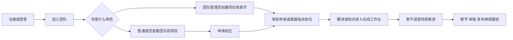
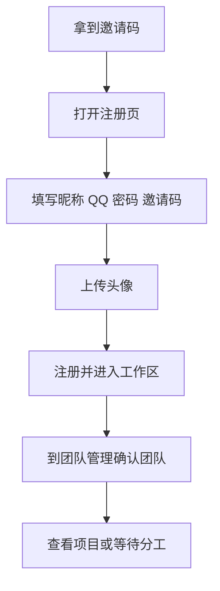
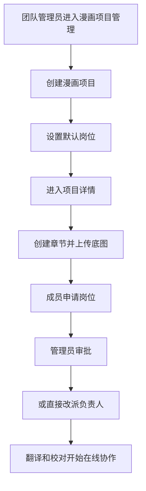

# Poprako 网站角色与流程说明

这份文档面向第一次接触 Poprako 的成员，重点回答 3 个问题：

- 你在系统里属于什么角色
- 你进来以后要做什么
- 你应该去哪个页面、点哪个按钮

如果你只想先记住一句话，可以先看这句：

> 先加入团队，再进入漫画项目，再按岗位参与章节，翻译和校对会进入在线工作台，管理员负责搭项目、分岗位和推进流程。

## 1. 先认识这个系统

Poprako 里的核心对象可以按下面这条线理解：

1. 团队：人和权限都先归到团队里。
2. 漫画项目：团队下面的作品容器，代码里也叫工作集。
3. 章节：项目下面的每一话。
4. 岗位：翻译、校对、嵌字、审稿等职责。
5. 在线工作台：翻译和校对真正干活的地方。

还有一个补充概念：

- 本地项目：保存在当前浏览器里的离线项目，适合单机整理和翻校，不等同于团队在线协作章节。

## 2. 总流程图

## 3. 角色总览

| 角色 | 你主要负责什么 | 常用入口 |
| --- | --- | --- |
| 新用户 | 注册、加入团队、确认自己在哪个团队 | 登录/注册页、团队管理 |
| 普通成员 | 看团队成员、看项目、申请适合自己的岗位 | 团队管理、漫画项目管理、项目详情 |
| 翻译 | 进入在线翻译页，处理章节里的翻译文本 | 工作区、项目详情 |
| 校对 | 进入在线校对页，检查翻译并给出校对结果 | 工作区、项目详情 |
| 嵌字 | 领取章节岗位，跟进章节进入嵌字阶段 | 项目详情 |
| 审稿/监修 | 领取岗位，跟进章节质量与最终推进 | 项目详情 |
| 团队管理员 | 管成员、发邀请码、建项目、建章节、分配岗位 | 团队管理、漫画项目管理、项目详情 |
| 超级管理员 | 管全部团队和全部用户，创建团队 | 超级管理员页面 |

需要特别注意两件事：

- 团队管理员和超级管理员不是一回事。团队管理员只管理当前团队，超级管理员管理整个系统。
- 团队角色里还有图源、发布两个角色，但当前网站上最完整的在线协作流程主要集中在翻译和校对，嵌字与审稿当前更偏向岗位管理和流程推进。

## 4. 第一次使用怎么开始

### 4.1 完全新用户

如果你还没有账号，标准流程是：

1. 向管理员拿到邀请码。
2. 打开注册页。
3. 填写昵称、QQ 号、密码、邀请码。
4. 上传头像。
5. 点击“注册并进入工作区”。
6. 进入系统后，再去“团队管理”确认自己当前所在团队。

这里有两个新手最容易漏掉的点：

- 注册必须有邀请码。
- 注册时必须上传头像。

### 4.2 已有账号，想加入新的团队

如果你已经有账号，不需要重新注册，直接走“加入团队”流程：

1. 进入“团队管理”。
2. 点击“加入团队”。
3. 输入邀请码。
4. 点击“立即加入”。
5. 加入成功后，新的团队会出现在团队切换器里。
6. 切到新团队后，再查看成员、项目和章节。

## 5. 按角色看自己要做什么

### 5.1 普通成员

普通成员最常见的事情有 4 件：

1. 找到自己当前所在团队。
2. 查看团队里都有哪些人。
3. 打开漫画项目，找到自己想参与的章节。
4. 申请适合自己的岗位。

具体怎么做：

1. 进入“团队管理”，先用顶部“团队切换”确认当前团队。
2. 在“公共成员区”查看当前团队的成员名单和角色。
3. 进入“漫画项目管理”，选择团队后查看所有项目。
4. 点击某个项目卡片，进入项目详情页。
5. 在章节卡片里找到“翻译”“校对”“嵌字”“审稿”岗位条。
6. 如果你具备对应团队角色，就会看到“申请”按钮。
7. 点“申请”后，等待管理员审批。
8. 如果你后悔了，在审批前可以点“撤回”。

你申请不了岗位，通常是下面几个原因：

- 你在团队里没有对应角色。
- 这个岗位已经有人了，而且它不是多人岗位。
- 你已经提交过申请，还在等待审批。
- 你当前看的不是正确的团队。

补充说明：

- 当前前台里，翻译岗位支持多人同时占位。
- 校对、嵌字、审稿通常按单人岗位来管理。

### 5.2 翻译

翻译的目标非常直接：

- 进入自己负责的章节。
- 逐页处理标记文本。
- 持续推进翻译进度。

你通常有两种进入方式：

1. 在“工作区”的“在线参与章节”里点“进入翻译”。
2. 在项目详情页的章节岗位条里，自己已经被指派后，点击“进入”。

进入在线翻译页以后，可以按这个顺序操作：

1. 用顶部页码选择器切页。
2. 在图片空白处点击，创建标记。
3. 左键创建“框内”标记，右键创建“框外”标记。
4. 点击某个标记，右侧会展开该条目的编辑区。
5. 在“翻译”文本框里输入内容。
6. 需要特殊字符时，可以点下面的快捷符号按钮。
7. 做完当前页后，继续切到下一页。

翻译页里还有几个实用点：

- 右键现有标记可以删除。
- 顶部会显示当前页协作者。
- 页面里有快捷键帮助菜单。
- 页面会持续保存当前编辑，不是那种必须手动点“保存”的老式表单。

### 5.3 校对

校对和翻译用的是同一套在线页面，只是进入时模式不同。

校对要做的事：

1. 进入“在线校对工作台”。
2. 查看原翻译文本。
3. 判断是直接通过，还是写入校对稿。
4. 让条目进入“已校”状态。

最简单的理解方式是：

- 翻译模式负责先写内容。
- 校对模式负责确认、修正和通过内容。

校对时可以这样做：

1. 从“工作区”点“进入校对”，或者从章节岗位条点“进入”。
2. 选中标记后，先看“翻译”区内容。
3. 如果需要修改，就在“校对”文本框里输入更合适的版本。
4. 如果翻译内容本身没问题，可以直接把该条目标记为已校。
5. 条目完成后，会看到相应的已校状态提示。

### 5.4 嵌字

嵌字成员目前在网站里的核心动作，主要还是岗位领取和流程协作。

你要做的事情通常是：

1. 在项目详情页查看章节是否进入适合嵌字的阶段。
2. 申请或接受管理员分配的嵌字岗位。
3. 与翻译、校对、管理员配合推进章节。
4. 在章节看板里确认负责人是否正确、进度是否同步。

需要说明的是：

- 当前网站已经有嵌字岗位的申请、指派和展示。
- 但它不像翻译和校对那样，已经明确提供独立的在线编辑工作台入口。
- 所以嵌字角色在当前前台更偏向“岗位管理 + 流程跟进”。

### 5.5 审稿/监修

审稿/监修角色和嵌字类似，目前在网站里更偏向管理流程和确认章节状态。

你通常会做这些事：

1. 在章节岗位区申请或接受审稿岗位。
2. 关注章节当前状态、进度和负责人是否完整。
3. 和管理员协同确认章节是否可以继续推进。

同样要注意：

- 当前前台对审稿岗位已经支持申请、指派、展示。
- 但没有像翻译/校对那样单独暴露一个在线审稿页面。

### 5.6 团队管理员

团队管理员是整个网站流程里最关键的执行角色之一。你负责把“人”和“项目”组织起来。

管理员平时最常做的事情有两大类：

1. 管团队。
2. 管项目和章节。

#### 管团队

入口在“团队管理”。

你可以做这些事：

1. 切到自己要管理的团队。
2. 打开“邀请码中心”。
3. 点击“新建邀请码”，填写被邀请人 QQ 和团队角色。
4. 复制邀请码，发给对方。
5. 在成员表里编辑成员角色，或者移除成员。
6. 在“团队设置”里修改团队头像。
7. 必要时删除团队。

管理员有一个很实用的工作建议：

- 如果你不知道对方的 user_id，优先用邀请码邀请，而不是直接“添加成员”。

#### 管项目和章节

入口主要在“漫画项目管理”和“项目详情”。

标准流程是：

1. 打开“漫画项目管理”。
2. 先选团队。
3. 点击“新建漫画项目”。
4. 填写项目名称、简介、作者、状态。
5. 需要的话，设置默认翻译、默认校对、默认嵌字、默认审稿。
6. 创建成功后，点击项目卡片进入详情页。
7. 点击“添加新话次/章节”。
8. 填写章节编号和副标题，上传整话底图。
9. 章节建好以后，等待成员申请，或者你直接指定负责人。

这里有一个很重要的规则：

- 如果你在创建项目时配置了默认负责人，那么新章节创建后会自动继承这些默认岗位。

#### 审批和改派岗位

管理员在项目详情页里还能做两件很重要的事：

1. 审批岗位申请。
2. 直接改派负责人。

怎么做：

1. 进入项目详情页。
2. 找到章节卡片标题旁边的审批按钮。
3. 打开后可以看到所有待审批申请。
4. 对每条申请点“通过”或“拒绝”。
5. 如果不想走申请流程，也可以点岗位条旁边的编辑按钮，直接指定、改派或清空负责人。

### 5.7 超级管理员

超级管理员处理的是系统级工作，不是某一个团队内部的日常协作。

你主要会在“超级管理员”页面做这些事：

1. 查看全部团队。
2. 创建团队。
3. 选中任意团队，查看它的成员和邀请码。
4. 为当前选中团队创建邀请码。
5. 查看全部用户。
6. 按名字或 QQ 搜索用户。
7. 修改用户昵称。
8. 删除指定用户。

要特别区分：

- 团队角色里的“管理”只表示这个人能管理某个团队。
- “超级管理员”是系统层权限，范围更大。

## 6. 页面速查表

| 页面 | 谁最常用 | 主要作用 |
| --- | --- | --- |
| 登录/注册 | 新用户、老用户 | 登录账号，或用邀请码注册新账号 |
| 工作区 | 全部成员 | 看在线参与章节，也能管理本地项目 |
| 团队管理 | 全部成员、管理员 | 切团队、看成员；管理员还能管理邀请码和团队设置 |
| 漫画项目管理 | 管理员、普通成员 | 查看项目列表；管理员可以新建项目 |
| 项目详情 | 全部参与者 | 看章节进度、申请岗位、审批岗位、进入在线协作 |
| 在线翻译/校对 | 翻译、校对 | 逐页编辑文本，进行协作 |
| 超级管理员 | 超管 | 管全部团队和全部用户 |

## 7. 两种工作方式不要混淆

### 7.1 在线章节

这是团队正式协作主流程。

特点是：

- 来自团队项目和章节。
- 有岗位分配。
- 有在线协作状态。
- 适合翻译和校对实时协作。

### 7.2 本地项目

这是保存在当前浏览器里的本地数据。

特点是：

- 从“工作区”可以直接新建。
- 更像个人离线项目。
- 不等于团队章节主流程。

如果你是新手，而且你已经在团队里协作，建议优先使用在线章节，不要先被本地项目分散注意力。

## 8. 新手一定要记住的规则

1. 先确认你当前切到的是哪个团队，再做任何管理或申请操作。
2. 团队角色决定你能申请什么岗位。
3. 翻译岗位允许多人并行，其他当前主要岗位通常按单人管理。
4. 注册新账号时必须有邀请码和头像。
5. 已有账号加入新团队，不用重新注册，直接走“加入团队”。
6. 当前最完整的在线工作台主要是翻译和校对。
7. 管理员创建章节时，如果项目已经设置默认负责人，新章节会自动继承。
8. 添加成员功能需要 user_id；如果不知道对方 user_id，邀请码通常更稳。

## 9. 常见问题

### 9.1 为什么我看不到管理员按钮

通常有三种原因：

- 你没有切到正确团队。
- 你在当前团队里不是管理员。
- 你是普通成员，所以页面只显示成员视图。

### 9.2 为什么我看得到章节，但点不了“申请”

常见原因是：

- 你没有对应团队角色。
- 该岗位已有人负责。
- 你已经申请过，还在待审批。

### 9.3 为什么我不能进入在线工作台

当前网站里，能直接进入在线页面的主要是：

- 已被分配为翻译的人
- 已被分配为校对的人

如果你只是普通成员，或者你负责的是嵌字、审稿，就不一定会看到“进入”按钮。

### 9.4 为什么没有看到“创建团队”按钮

创建团队是超级管理员入口，不在普通团队管理页里常驻显示。

### 9.5 为什么嵌字和审稿没有像翻译那样的在线页面

因为当前前台已经明确提供独立在线入口的，主要是翻译和校对。嵌字、审稿目前更多体现在岗位管理和流程推进上。

## 10. 最后给新手的最短路径

如果你只想知道自己下一步该干什么，可以直接套下面这条：

1. 先确认自己有没有账号。
2. 没账号就拿邀请码注册，有账号就去“团队管理”里加入团队。
3. 切到正确团队。
4. 去“漫画项目管理”找到项目。
5. 进项目详情页看章节。
6. 按自己的团队角色申请岗位。
7. 审批通过后，从“工作区”或章节岗位条进入在线翻译/校对。
8. 如果你是管理员，就继续负责邀请码、成员、项目、章节和岗位分配。

这样理解就不会乱：

- 成员先入团队。
- 管理员先搭项目。
- 章节再分岗位。
- 翻译和校对最后进工作台干活。